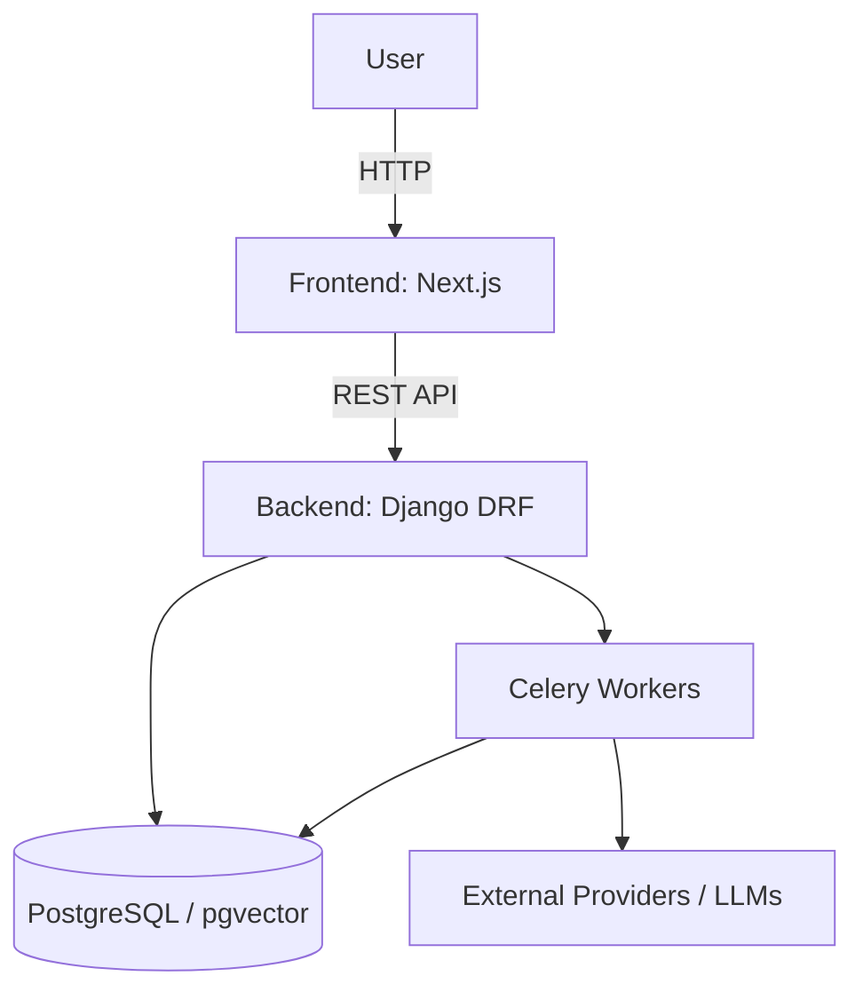

# Runtime Architecture
## Startup Flow
1. User hits Next.js frontend, `layout.tsx` initializes `QueryProvider` and `AuthProvider`.
2. Frontend makes requests to Django backend via DRF endpoints.
3. Backend authenticates via SimpleJWT.
4. Heavy tasks (AI generation, reference enrichment) are offloaded to Celery.

## System Context Diagram

