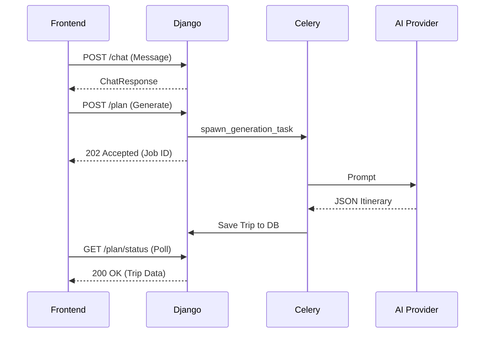

# Planner End-to-End Flow
## Lifecycle Trace
1. **Load:** User opens planner, frontend hits `GET /api/planner/workspaces/`.
2. **Chat:** User sends message `POST /api/planner/workspaces/{id}/chat/`.
3. **Generation:** Backend verifies draft state and starts async generation `POST /api/planner/workspaces/{id}/plan/`.
4. **Poll:** Frontend polls `GET /api/planner/workspaces/{id}/plan/status/`.
5. **Render:** Canvas displays generated trip.
6. **Mutate:** User drag-and-drops or changes items `PATCH /api/planner/workspaces/{id}/plan/`.
7. **Book:** Final booking request `POST /api/planner/workspaces/{id}/book/`.

## Sequence Diagram

