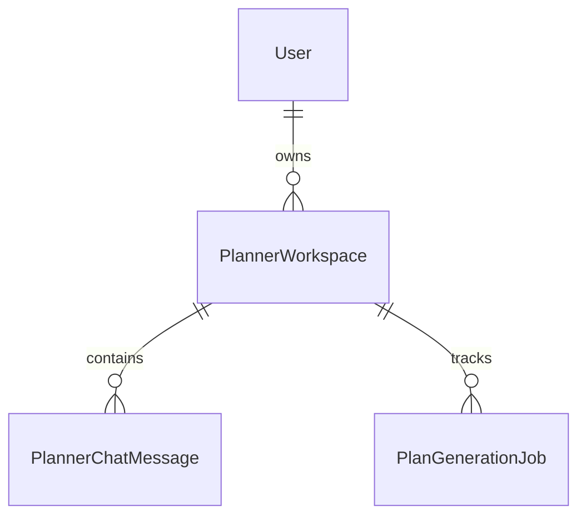

# Data Model & Reference Data
## Planner Models
- `PlannerWorkspace`: The root container for a user's trip planning session.
- `PlannerChatMessage`: Conversation history within a workspace.
- `PlanGenerationJob`: Tracks async celery generation status.

## Reference Models
- Core geographic: `Country`, `State`, `City`, `Airport`, `RailwayStation`.
- Inventory: `HotelMaster`, `RestaurantMaster`, `AttractionMaster`.

## ER Diagram

