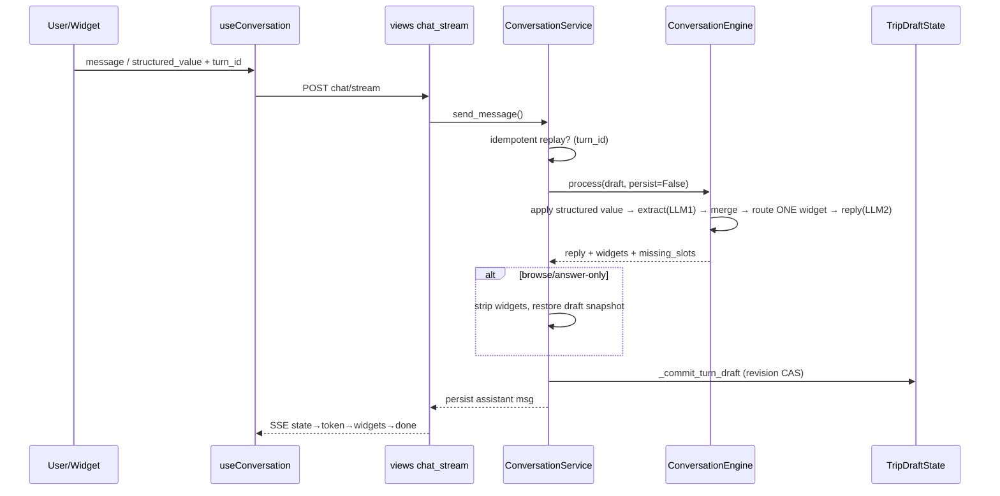
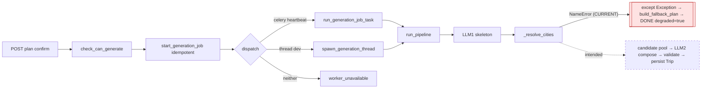
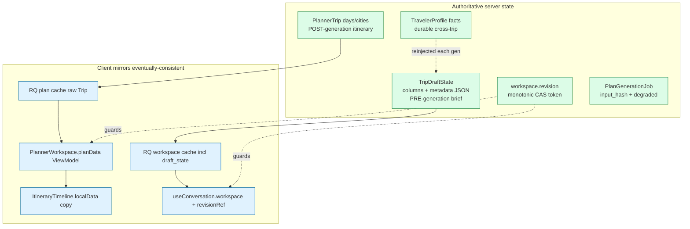
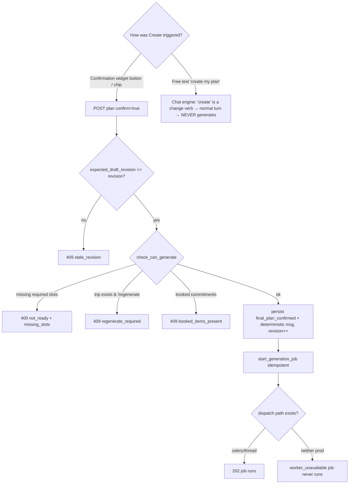

# NeuralNomad Planner — Complete Current-State Audit & Repair Plan

_Audit date: 2026-07-18 · Static code read of the current working tree (uncommitted refactor); no app/tests/LLM/providers were run. All post-generation judgements are provisional until a non-degraded plan is observed (Phase B)._

---

## Context — why this audit exists

The user asked for a principal-architect audit of what the planner **actually does at runtime today**, not what the docs claim. The investigation found that the repository is in the middle of a **large, uncommitted refactor** (the "Output Generation Architecture" + "AI Chat" + "Intelligence Engine" plans from memory are being executed on disk right now): ~30 new backend service files, 5 new migrations, ~20 new frontend widgets, **all planner docs deleted**, and **the entire planner test suite deleted**. The newest docs referenced in memory (`planner-complete-audit-fix-plan.md`, `planner-output-generation-architecture.md`) exist in **neither git history nor disk** — memory is stale about them. Code is therefore the only source of truth.

The central discovery: the new architecture **appears well-designed and, on static reading, addresses most of the previously-"confirmed" root causes** — *except* that a scoping bug in one refactored function (`_resolve_cities`) makes the entire AI-composed generation pipeline **unreachable**, so every trip currently degrades to a curated placeholder fallback. Because no non-degraded plan has actually run, every downstream judgement in this document (place quality, transport selection, personalization, "the architecture is sound") is **provisional** until a real generated plan is observed. The immediate work is therefore narrow: revive generation, then let the owner read one real output before touching anything else.

> **Scope guardrail (owner-directed):** This revision does **not** propose restoring the previous large automated test suite, and does not add conversation simulations, browser/Playwright tests, external-API/provider tests, replay tests, or large pytest workflows. Verification is limited to `python manage.py check`, migration discovery, frontend type-check, import/startup validation, at most one tiny deterministic regression check, and the owner's manual planner run.

---

## 1. Repository Baseline

| Item | Value |
|---|---|
| Current commit | `a386842` "Add Docker dev environment: live-reload, correct DB, fix image/AI auth" |
| Branch | `main` |
| Working tree | **Large uncommitted refactor in progress** (dirty) |
| Planner entry points (URLs) | `apps/planner/urls.py`: `POST chat/` (`lazy_chat`), `POST chat/stream/` (`lazy_chat_stream`), `POST workspaces/<id>/chat/stream/` (`workspace_chat_stream`), DRF `PlannerWorkspaceViewSet`/`TripViewSet` (incl. `@action plan`, `legs/compare/`, `distances/`, `profile/`, `recommendations/explain/`, `trip-prep/`) |
| Frontend entry points | `app/planner/page.tsx` (`PlannerChat workspaceId={null}`), `app/planner/[workspaceId]/page.tsx` (branches on `hasGeneratedPlan` → `PlannerChat` or `PlannerWorkspace`) |

**Uncommitted changes of note**
- **New backend services (untracked, but WIRED via function-level imports):** `foundation.py`, `plan_context.py`, `planner_state.py`, `turn_intent.py`, `widget_orchestrator.py`, `journey_resolver.py`, `ranking.py`, `scoring.py`, `validation.py`, `refinement.py`, `diff_engine.py`, `plan_mutations.py`, `fallback_plan.py`, `geocoding.py`, `currency.py`, `weather_service.py`, `preference_learner.py`, `turn_log.py`, `capabilities/*`, `intelligence/*`.
- **New migrations:** planner `0013`–`0017` (degraded/usage, scorecard, workspace.revision, chat turn_id, foundation contracts); reference `0009`–`0011` (provenance, city image_url, railwaystation coordinates).
- **DELETED: the whole planner test suite** (`test_plan_generation`, `test_chat_stream`, `test_conversation_api`, `test_insight_engine`, `test_lifecycle_api`, `test_transport_compare`, `test_traveler_profile_api`, `test_trip_api`, `test_chat_edit_intents`) plus `accounts/tests/test_user.py`, `travelpass` tests, `pytest.ini`, `config/settings/testing.py`. Recorded as a **factual observation only** — per owner direction, restoring this large suite is **out of scope**; verification here relies on Django check / migration discovery / type-check / startup validation / manual runs.
- **DELETED: all planner docs** (`docs/` now holds only `SETUP.md`).

**Documents inspected vs ignored**
- Inspected: the *code* (authoritative). Memory-index summaries used only as a map of intent.
- Ignored as outdated/contradictory: every `docs/*.md` at HEAD (deleted on disk), and the memory pointers to docs that don't exist.

**Areas requiring owner verification (runtime, not read here):** live Google Places / geocoding keys, whether a Celery worker actually runs in the user's Docker dev env, anonymous-session cookie continuity, and the two same-client stale-overwrite timing windows in the canvas.

---

## 2. Current Component Map

```mermaid
flowchart TD
  subgraph FE[Frontend Next.js]
    Page[/planner + /planner/:id/]:::fe
    Chat[PlannerChat / DockedChat]:::fe
    UC[useConversation.ts]:::fe
    WR[WidgetRenderer + WIDGET_REGISTRY]:::fe
    PW[PlannerWorkspace = Plan Canvas]:::fe
    IT[ItineraryTimeline localData]:::fe
    HC[Helper Canvases: Flight/Train/Bus/Cab/Hotel/Visa/Forex]:::fe
    RQ[(React Query cache: workspace, plan, ledger...)]:::fe
  end
  subgraph API[Django REST]
    V[views.py]:::be
    CS[ConversationService]:::be
    CE[ConversationEngine 1794L]:::be
    WO[WidgetOrchestrator + clusters ladders]:::be
    PS[planner_state.resolve_state / check_can_generate]:::be
    PG[plan_generation.run_pipeline 2028L]:::be
    JR[journey_resolver]:::be
    PC[PlanContextBuilder anti-leak]:::be
    RANK[ranking + scoring + validation + refinement]:::be
    KE[KnowledgeEngine → places_explore → Google Places]:::be
    PROV[provenance.exclude_unverified]:::be
    TASKS[tasks.py Celery + worker heartbeat]:::be
  end
  subgraph DB[(Postgres + Cache)]
    WS[(PlannerWorkspace + revision)]:::db
    DS[(TripDraftState canonical)]:::db
    TR[(PlannerTrip days/cities/scorecard)]:::db
    JOB[(PlanGenerationJob input_hash)]:::db
    REF[(reference masters: City/Airport/Station/Hotel/Restaurant/Attraction/Activity)]:::db
    WARM[(cache: progressive warm artifact)]:::db
  end
  Chat-->UC-->V
  WR-->UC
  PW-->IT
  PW-->HC
  PW-->RQ
  V-->CS-->CE-->WO
  CE-->PC
  V-->PS
  V-->PG-->JR
  PG-->PC
  PG-->RANK
  PG-->KE-->PROV-->REF
  V-->TASKS-->PG
  CS-->DS
  PG-->TR
  PG-->JOB
  PG-->WARM
  classDef fe fill:#e0f2fe,stroke:#0369a1;
  classDef be fill:#dcfce7,stroke:#15803d;
  classDef db fill:#fef9c3,stroke:#a16207;
```

**Live vs dormant vs dead**
- **Live (executes on a normal turn/generation):** the entire "new" stack — `ConversationService → ConversationEngine → WidgetOrchestrator/clusters → foundation → planner_state`; `plan_generation.run_pipeline → journey_resolver → PlanContextBuilder → candidate pool → ranking → compose`.
- **Dormant (flag-gated OFF):** `PlannerQuestionBank` read/write (`PLANNER_QUESTION_BANK_ENABLED=False`); live providers (`LIVE_PROVIDERS_ENABLED=False`); mock inventory in prod (`BOOKINGS_ALLOW_MOCK_INVENTORY=False` in prod).
- **Dead code:** `conversation_service.py:154-177` (unreachable `if targeted_scopes:` after `= []`); FE `TravelersWidget`/`BudgetWidget` (exported, not in `WIDGET_REGISTRY`); `lib/mock-provider-results.ts` (no importers); duplicate `ReferenceProvenanceMixin.save` def; duplicated settings lines (`base.py:289/292`, `290/293`).

---

## 3. Complete Runtime Trace

Labels: **[C]** confirmed from code · **[SI]** strongly indicated · **[FIX]** already fixed in working tree · **[V]** requires owner runtime verification.

| Step | Current behaviour | State owner | Data source | Fallback | Failure mode | Evidence |
|---|---|---|---|---|---|---|
| 1 Page init | `/planner` mounts chat with `workspaceId=null`; `/planner/:id` loads `useWorkspace`, branches on `hasGeneratedPlan`. Identity: JWT (authed) or Django session cookie (anon). | RQ cache + `useConversation` local + Zustand auth | `GET workspace/:id`, `listMessages`, `usePlan` | new-conversation | Dual token keys; auth-provider gates on legacy `accessToken` | `app/planner/*`, `api.ts:113-135`, `auth.store.ts` **[C/SI]** |
| 2 New plan | No explicit button; navigating to `/planner` resets client state; backend workspace created **lazily** on first message; URL rewritten to `/planner/:id`. | server (`TripDraftState`) | `sendLazyMessage`/stream | — | client fully resets; leakage (if any) is backend-origin | `useConversation.ts:89-97,156-158` **[C]** |
| 3 Chat submit | `{message, structured_value, turn_id}` → `send_message`; turn-idempotent on `turn_id`; snapshot draft; `engine.process(persist=False)`; revision-CAS commit; assistant message persisted. | `TripDraftState` + `workspace.revision` | `ConversationEngine` (2 LLM calls) | answer-only restore | CAS conflict → `planner_turn_conflict` | `conversation_service.py:22-336` **[C]** |
| 4 Widget lifecycle | Ladder picks the **first unsatisfied step's widget**; reply is generated *for that widget*; `decorate_widget` + semantic self-check; unregistered FE type → placeholder card. | server picks; FE `WIDGET_REGISTRY` renders | `INTENT_LADDERS`, `clusters.cluster_satisfied` | re-decorate empty payload / fallback reply | browse-only turn strips widget in service | `widget_orchestrator.py`, `foundation.py`, `conversation_service.py:147` **[C]** |
| 5 Readiness | `missing_required_slots()` gates generation (dest/origin/dates/travelers for full_trip); `missing_slots()` (superset incl. `optional_details`,`nearby_cities`) drives asks; ladder `cluster_satisfied` is a **third, stricter** notion. | `TripDraftState` | `INTENT_REQUIRED/RECOMMENDED/OPTIONAL_FIELDS` | — | three systems disagree | `models.py:99-311`, `clusters.py` **[C]** |
| 6 Create Plan | `PlanConfirmationWidget` / "Create my plan ✨" chip → `POST workspaces/:id/plan {confirm, regenerate, expected_draft_revision}` — one atomic, deterministic (no-LLM) confirm+generate; idempotent job. | server | `check_can_generate` + `start_generation_job` | 400 not_ready / 409 stale / 409 booked | free-text "create my plan" routes through engine (no gen); 0-exec if no worker+no thread | `views.py:280-402`, `useConversation.ts:355`, `planner.service.ts:61` **[C]** |
| 7 Generation job | `select_for_update` idempotent create; input_hash = fingerprint; dispatch Celery-if-heartbeat else thread(dev) else `worker_unavailable`; stalled job superseded; degraded fallback flagged. | `PlanGenerationJob` | `PlanContextBuilder.fingerprint_payload` | curated fallback (`degraded=True`) | reuse within 90s binds older snapshot | `plan_generation.py:184-383`, `tasks.py` **[C]** |
| 8 AI planning | LLM#1 skeleton (city seq + day themes, **no named places**) → resolve cities → DB candidate pool → LLM#2 compose (sequences candidate ids only). | — | Gemini `gemini-3.5-flash` + DB masters | — | **`_resolve_cities` NameError → whole pipeline degrades** | `plan_generation.py:388-522,698-847` **[C]** |
| 9 Transport | `resolve_journey_options` deterministic, **before** compose; nearest hubs by haversine within country + road feeders; feasible preferred wins else max suitability; `full_trip` w/ no journey → `needs_input`. | — | reference Airport/Station + `JourneyRouteCache` | estimated `hub_geometry` (conf 0.35) | null city coords → no hubs → full-distance cab | `journey_resolver.py`, `plan_generation.py:413-437,1471-1601` **[C]** |
| 10 Place/hotel | Pool = `exclude_unverified(masters)`; grow via Google Places only if `<12` verified; rank (`PreferenceScorer`) + `diversify`; compose picks ids. | reference masters | DB-cache → Places on miss → re-query | greedy heuristic fill | small pool + weak diversity → repetition | `plan_generation.py:869-953`, `ranking.py`, `places_explore.py` **[C]** |
| 11 Validation | Temporal (overlap/backwards-time), empty-day, red-eye only; deterministic `repair_plan`; whole-plan AI re-compose if score<85. | `PlanGenerationJob.scorecard` | `validation.py` | gaps recorded | no dates/nights/hours/travel-time/budget/dup checks | `validation.py`, `refinement.py`, `plan_generation.py:566-636` **[C]** |
| 12 Persistence | `_persist_trip`; `workspace.revision` monotonic CAS; `PlannerTripOriginal` snapshot; PATCH via `patch_trip` with `expected_revision`+`mutation_id`. | `PlannerTrip` + revision | — | 409 stale_revision → reload | 2 same-client overwrite windows | `plan_generation.py:1928`, `views.py:407-451`, `plan_mutations.py` **[C]** |
| 13 Plan Canvas | Renders a **derived copy** (`planData`→`ItineraryTimeline.localData`); edits funnel through `handlePlanDataChange`→debounced `persistPlan`. | server authoritative; client mirrors | `usePlan` → `transformTripData` | 409 → refetch+rebuild | debounce race can clobber unsaved edit | `PlannerWorkspace.tsx`, `ItineraryTimeline.tsx` **[C/SI]** |
| 14 Helper canvases | Search → `Add to Trip`/Replace → `select_item` mutation → same server trip, bumps revision, persists. Visa/Forex read-only. | server | explore/search services (`source` stamped) | silent no-op if no active node | mock inventory banner when `source=mock_inventory` | `PlannerWorkspace.tsx:784-877`, canvases **[C/SI]** |
| 15 Refinement | UI edits PATCH whole `days` but revision-guarded, server reconciles; NL chat-edit intents propose diffs; helper replace patches one block. | server | `patch_trip`, `chat_edit_intents` | 409 guard | positional index merge can mis-attach flags | `plan_mutations.py`, `chat_edit_intents.py` **[C/SI]** |
| 16 Recovery | LLM#1 fail → proceed on prior draft; LLM#2 fail → deterministic reply; pipeline fail → curated fallback `degraded=True`; needs_input surfaced; stalled job → FAILED+retryable. | — | — | many best-effort swallow-all blocks | REST CAS conflict → uncaught 500 | `plan_generation.py:306-361`, `views.py:1139` **[C]** |

---

## 4. Current Data-Flow Diagrams

**Chat turn (one message)**


**Generation (Create Plan)** — *what actually happens today vs intended*


---

## 5. Current State-Ownership Diagram



**Duplication hotspots**
- **Backend:** `origin` and `budget` are double-stored (`TripDraftState.origin_text`/`origin_city` **and** `metadata["origin"]`; `budget_amount` **and** `metadata["budget_inr"]`); writers mirror both but readers are inconsistent (readiness reads columns; confirmation/progress read metadata first).
- **Frontend:** the same trip lives in RQ `plan`, `planData`, and `localData` — three copies, reconciled only by `expected_revision`/`mutation_id`.

---

## 6. Chat & Widget Audit

- **Reply/widget coupling [C]:** inside the engine, reply and widget derive from the **same post-merge draft** (the CH-01 fix), so they cannot diverge there. Divergence is produced by the **service-level browse strip**: a browse-only phrase (e.g. "hotels in Goa", no `?`, no change verb) still routes a cluster widget + writes a *planning* reply inside the engine (`_call_gemini_reply` only checks `is_answer_only_turn`, not `is_browse_only_turn`), then `send_message` strips the widget and restores the draft → the text asks a planning question while **no widget renders**. *(Symptom 1/2.)*
- **Widget decision is widget→question, not question→widget [C]:** the ladder picks the widget first (`determine_next_widget` over `INTENT_LADDERS`); the reply is then generated against `_WIDGET_STEP_DESCRIPTIONS`. Semantic guards (`widget_semantically_matches`, `reply_semantically_matches`) are self-consistency checks that only ever swap in an empty payload or a deterministic reply — they never suppress or change a widget's type.
- **Why a question can lack its widget [C]:** the ladder auto-skipped the step (`cluster_satisfied`), or a `nearby_cities` step yielded no suggestions, or the browse/answer-only strip removed it, or the step resolved to `None` post-confirmation.
- **Structured values are applied first-thing in the turn [C]** (`_apply_structured_value` before extraction/merge/route/reply) — so they reach state *that* turn. **But they can be dropped** by (a) a revision-CAS conflict aborting the whole commit, (b) an unhandled `field` name silently no-op'd, or (c) `cluster_submit` `touched`-gating omitting an unlisted budget. *(Symptom 5.)*
- **State ownership [C]:** `TripDraftState` is canonical; `turn_id` gives idempotent replay; `workspace.revision` is the CAS token.

---

## 7. Create Plan Audit

**Decision tree (current)**


- **The dedicated button/chip are correctly wired to `/plan`, not chat [C].** Confirmation and generation are one atomic operation; a double-click cannot create a second job (idempotent under row lock); a stalled job is superseded.
- **Why "Create My Plan continues the conversation" (Symptom 4) [SI]:** two mechanisms — (1) typing the phrase as free text goes through the engine and never generates; (2) more importantly, the ladder shows the confirmation card (the only in-widget Create affordance) **only after every cluster is satisfied**, which is *stricter* than `is_ready_for_plan`, so a ready user keeps being asked cluster questions and answers one instead of generating. The "Create my plan ✨" **chip** appears as soon as `is_ready_for_plan` (serializer), creating a mismatch between chip and card.
- **0-execution risk [C]:** in production `PLANNER_ALLOW_THREAD_FALLBACK=False` and no Celery worker ships by default → job is created but marked `worker_unavailable` and never runs (surfaced as retryable FAILED by `serialize_job`).

---

## 8. AI Generation Audit

- **Is AI creating the base plan, or is the DB? — HYBRID, and currently BROKEN [C]:** intended order is LLM#1 skeleton (strategy + city sequence + day *themes*, explicitly instructed **not to name any hotels/places**) → deterministic `resolve_journey_options` → DB candidate pool → LLM#2 compose (may only sequence real candidate ids). So the AI owns **structure and sequencing**; concrete venues, coords, ratings, images, and transport all come from DB/deterministic code. This is a sound anti-hallucination design.
- **CRITICAL: the pipeline never reaches compose today [C].** `_resolve_cities` (`plan_generation.py:831-847`) references `usage_budget` and `response` that aren't in scope and puts the `city_objs[...]=...` write outside the `for` loop → **`NameError` on every call**. It's on both live paths (main pipeline `:482`, warm-up `progressive.py:74`). Warm-up therefore never caches an artifact (always miss), and the main path throws → caught by the broad `except Exception` → `build_fallback_plan` → `status=DONE, degraded=True`. **Net: every `full_trip` currently yields the curated placeholder fallback ("Verified accommodation needed"), never the AI-composed plan.** This defect plausibly explains "copies template/fallback content" (Symptom 7) and much of "ignores latest inputs" (Symptom 6) — but that causal link is **provisional**: it can only be confirmed once a revived plan is observed to honor the latest inputs. The exact broken function, the exact proposed diff, every caller, and every affected variable are in **§19 Phase A**.
- **User facts that reach the AI [C]:** dest, dates, adults/children, budget **tier**, interests, purpose, pace, intensity, nearby/multi-city (skeleton); plus the full normalized `prefs_prompt_block` (dietary/cuisine/ambiance/meal/pace/intensity/group/stay/transport-mode+classes/accessibility/pets/special-notes/values/avoid), traveler-profile facts, and the resolved journey (compose).
- **Facts collected but OMITTED from prompts [C]:** numeric `budget_amount`/`budget_currency` (only the coarse tier is sent; the cap is enforced post-hoc), `infants` (never used in party math or prompts), the `international` block (passport/visa/forex — normalized but not emitted by `prefs_prompt_block`), and `origin` (reaches compose but not the skeleton prompt).
- **Anti-leak boundary is real and enforced [FIX]:** `PlanContextBuilder`/`prefs_prompt_block` is the single place a preference can reach the LLM; the warm-hash uses the *same* `fingerprint_payload`, so a changed widget flips the hash (the old GEN-04 "stale warm silently drops inputs" is fixed).

---

## 9. Transport Audit

- **Architecture is correct and defensive [C]:** transport is resolved deterministically **before** composition; the LLM can only sequence the resolved journey; `_transport_infra_gaps` injects "use the resolver's viable nearby hub plus a road feeder; **never substitute a full-distance cab** for missing local infrastructure"; `_transport_block` re-checks hubs and only downgrades to cab when a *known* city genuinely has no station/airport, adding an honest "No X access — road transfer used instead" note.
- **Nearby-hub + long-distance-cab options genuinely exist [C]:** `_nearest_hubs` ranks Airport/RailwayStation by haversine within the destination's country and builds first/last-mile road connectors; `_resolve_road_mode` produces cab (feasible ≤1500 km / ≤24 h) and self-drive (gated on `mobility.can_drive & license_ready`, ≤`max(450, hours×75)` km).
**Candidate causes of a wrong full-distance cab — ALL RETAINED (none dismissed until a real plan runs and the owner reports the transport it actually produced).** The transport symptom was reported against the *degraded fallback* (GEN-01), which does its own transport handling; the resolver's real behaviour on a live plan has not been observed. Each of the following can independently produce, or contribute to, a full-distance cab and must stay on the list:

1. **Missing city coordinates [C]:** `_nearest_hubs` returns `[]` when `_coords(city)` is `None`; a city created without a successful geocode has null coords → every hub is discarded → scheduled modes return `None` → only cab/bus remain (`journey_resolver.py:91-93`, `geocoding.py`).
2. **Missing hub coordinates [C]:** `_coords(hub)` falls back to the hub's city coords; an Airport/RailwayStation row with null lat/lng *and* a null-coord city is skipped in the ranking loop (`journey_resolver.py:96-99`) — the hub exists but is invisible to distance ranking (migration `0011` only recently added station coordinates).
3. **Incorrect country / name matching [C]:** `_nearest_hubs` filters `city__country=city.country` (a genuinely-near cross-border hub is excluded); `_resolve_city`/`_transport_block.resolve_hub`/`distance_service`/`live_price` all use `name__icontains` first-match, which can bind the wrong same-named city/country entirely.
4. **Route availability [C]:** `_resolve_scheduled_mode` skips a hub pair whose `_route_evidence` returns `booking_availability == "unavailable"` (`journey_resolver.py:121`); if all top-5 pairs read unavailable, the scheduled mode yields nothing and road modes win.
5. **Preferred-mode substitution [C]:** when the preferred mode is infeasible, `recommended` silently falls to the max-suitability feasible mode with no explicit "your chosen mode is unavailable" surfaced (`journey_resolver.py:60-65`; Symptom 11).
6. **Suitability scoring [C]:** the score can rank a long cab (base 55, −5 unverified) above an awkward long-connector, low-confidence flight/train (connector penalty capped at −20, unverified −5), so cab can win even when a scheduled option resolved.
7. **Provider availability [C]:** `LIVE_PROVIDERS_ENABLED=False` by default → no live route evidence; scheduled modes rely on cached/DB/`hub_geometry` estimates (confidence 0.35, no price) that both weaken their suitability and render with the same visual weight as a verified leg (Symptom 16 residual).

**Owner runtime input needed (Phase C):** for a hub-less-destination trip, which of the seven fired — was there a resolved scheduled option at all, what was the `decision_trace` (`journey_candidate`/`mode_unavailable` entries), and did the plan use a nearby hub + road feeder or a whole-trip cab.

---

## 10. Database / Cache / API Audit

- **Order is correct [C]:** DB-cache → external API on miss → DB write → **re-query DB** → AI. `_build_candidate_pool` queries `exclude_unverified(masters.filter(city))`; only if `<12` verified rows does it call `_grow_pool_via_places → KnowledgeEngine.resolve → explore_places`, which reads cache (`MIN_CACHE_RESULTS=5`), fetches Google Places `searchText` on miss, creates rows keyed by real `place_id` with `verification_status="verified"`, then **re-queries** with `exclude_unverified` and a 15 km radius filter.
- **Fabrication defense is real [C/FIX]:** master rows are created **only** in `explore_places` keyed by a real Google `place_id`; `exclude_unverified` drops `source="google_places"` rows lacking a `place_id` (the legacy LLM-poisoning signature) or `verification_status != verified`/quarantined. **AI enrichment writes to `PlaceInsight`/`LocalTip`, not master tables**, so it cannot poison candidate pools. The "hotel DB poisoning" concern is largely mitigated at read time.
- **Residual data-integrity issues [C]:** `resolve_or_create_city` can create `City` rows with null coords / no `place_id` (unverified, coordinate-less — the transport root cause); `TransferProfile` stores LLM `source="general_knowledge"` orientation notes in a reference table (low-stakes, not surfaced as verified); `name__icontains` matching is wrong-country-prone; `_grow_pool_via_places` result is not re-passed through `exclude_unverified` in `plan_generation` (relies on `explore_places` already having filtered).
- **Caching:** `JourneyRouteCache` (TTL 15 min live / stale tiers), progressive warm artifact (20 min, hash-keyed), no candidate-pool caching (deliberate — cheap indexed queries).

---

## 11. Recommendation Audit

- **Why the same hotel/place wins repeatedly [C]:**
  1. **Deterministic, rating-dominant scoring:** `score = 0.30·rating_norm + 0.25·pref + 0.25·budget + 0.10·party + 0.10·location`, with Bayesian shrinkage — the top verified row is sticky.
  2. **Weak diversity:** `diversify_ranked_candidates` rotation contributes only `±0.01` and a `0.12` duplicate-signature penalty within a 5-window — far smaller than the rating gap.
  3. **Small verified pools:** capped at 12/category; if a city has few verified rows, diversity has no room.
  4. **Cross-trip recency isn't tracked:** the `−0.08` recency penalty uses `_recent_choice_ids` from *this* trip's last generation only; different trips to the same city re-surface the same winners.
  5. Compose forces the *same* hotel for a city's whole stay (correct for one trip, but reinforces stickiness across trips).
- **Mitigations that exist [FIX]:** rejection penalty (−0.35), per-workspace rotation seed (`sha256(revision:workspace_id)`), preference-weighted matching so a vegetarian and a steakhouse-lover no longer get identical shortlists.

---

## 12. Plan Canvas Audit

- **Authoritative? No — it renders a derived copy [C].** Data path: `usePlan` (RQ) → `transformTripData` → `PlannerWorkspace.planData` → `ItineraryTimeline.localData`. The server `PlannerTrip`+revision is the authority; `planTransform.ts` is the sole in/out boundary.
- **Edits** all funnel through one choke point (`handlePlanDataChange` → debounced 1200 ms `persistPlan`), which PATCHes `serializePlanUpdate` with `expected_revision`+`mutation_id`. A `409 stale_revision` refetches and rebuilds from server — a stale local write **cannot silently win across clients**.
- **Two same-client stale-overwrite windows [SI]:** (a) the `trip→planData` re-sync effect rebuilds `planData` whenever RQ `trip` changes; a background refetch (pending-tips / live-events) landing inside the 1200 ms debounce can clobber an unsaved edit (mitigated for Add/VerifyPrice via `flushPendingPersist`, but not for plain timeline edits); (b) `ItineraryTimeline`'s `data→localData` merge is **positional/index-based**, so a server-side reorder/add/remove of a city or day can mis-attach `isDeleting/isInactive` flags to the wrong block.
- **`PlanSyncBanner`** is a soft advisory (targeted-regeneration pending/failed per dependency scope from `trip.metadata.targeted_regeneration`), not a lock.

---

## 13. Helper-Canvas Audit

- **Selections mutate the ONE server trip [C]:** `Add to Trip`/Replace → `select_item` mutation (`POST …/mutations/`) with `target_block_id`+`expected_revision`+`mutation_id`+`provenance` → bumps revision, re-seeds `planData` from the returned trip, invalidates ledger/insights. **Persists across reload.**
- **Symptom 14 (selections don't persist) [SI]:** the wiring is correct **except** when `activeNodePayload` is null and there's no hovered/default target — `targetNodeId` is undefined and `handleAddToPlan` silently returns (the "Add" appears to no-op). Inter-city transit replacement correctness depends on the backend resolving `target_block_id` for a `transitToNext` block.
- **Provenance honesty [C]:** booking canvases render `SampleInventoryBanner` only when `source==='mock_inventory'`; explore canvases show a `TierBadge` from `source` and "No live rate yet". Visa/Forex are read-only (no plan writes). `brandDedup` is presentation-only.

---

## 14. Persistence & Recovery Audit

- **Revision safety is strong [FIX]:** monotonic `workspace.revision`; turn commit CAS (`_commit_turn_draft`), generation snapshot (draft read once, never re-fetched mid-run), PATCH `expected_revision` guards, idempotent job creation. A newer change cannot be overwritten by an older one **across clients/requests**.
- **Recovery [C]:** LLM#1 fail → proceed on prior draft; LLM#2 fail/guard → deterministic reply; pipeline fail → curated fallback with `degraded=True` (loading screen can distinguish); `GenerationNeedsInput` → `needs_input` + blockers; stalled job (>90 s silence) → FAILED + retryable, superseded on next request.
- **Gaps [SI]:** Celery task declares `max_retries=2` but never calls `self.retry` and the pipeline swallows its own exceptions, so Celery auto-retry never fires; a REST (non-stream) CAS conflict raises an **uncaught 500** (`lazy_chat`/`chat`); job reuse within 90 s binds the older draft snapshot (newer edits ignored by that run, though the confirm path guards with `expected_draft_revision`).

---

## 15. Security, Performance & Cost Audit

- **Auth/ownership [C/SI]:** planner chat + `plan` endpoints are `AllowAny` and use `get_planner_user` (authed JWT or per-session anon). Cost-bearing LLM/Places calls are reachable unauthenticated — acceptable for a demo, but **anonymous, session-scoped, and rate-unlimited**; verify session continuity and consider a per-session budget/rate limit. Dual token keys (`accessToken` vs `neuralnomad-auth`) are a latent identity inconsistency.
- **Cost controls that exist [FIX]:** `UsageBudget` ceilings (`PLANNER_MAX_AI_CALLS=3`, `MAX_REFINEMENT_CALLS=1`, `MAX_AI_TOKENS=30000`, `MAX_PROVIDER_CALLS=20`, wall-time 120 s); per-turn LLM calls bounded to 2; per-generation bounded by budget; token usage now recorded on the job.
- **Performance [C]:** progressive warm-up is currently **wasted work** (always throws via `_resolve_cities`, never caches); `_nearest_hubs` iterates all hubs in a country per mode per side; the candidate pool is a handful of indexed queries. No obvious N+1 in the hot path beyond hub iteration.
- **Reliability [C]:** the refactor currently has no automated coverage (suite deleted), which is how the `_resolve_cities` `NameError` reached the working tree unnoticed. Per owner direction this is **not** treated as a work item to restore a large suite; the mitigation is the lightweight-check + manual-run discipline in §19/§20, plus (optionally) one tiny deterministic regression check for the specific `_resolve_cities` contract.

---

## 16. Complete Issue Register

Severity: **P0** data/security/broken core · **P1** major failure · **P2** significant · **P3** minor · **P4** future.

> **Status (updated after Phase C reconciliation, 2026-07-18):** **GEN-01 is RESOLVED and confirmed by a real generation run** — workspace `be504346-2f80-489d-965f-c93c4112d3bb` (Kolkata→Gangtok/Pelling, 8 days, 2 adults, ₹50,000 budget): job `status=done`, `degraded=false`, `internal_score=81.5`, all requested cities present, every non-transport block a real named `verified_database` venue, and honest transport provenance. TRANS-01, REC-01, and CTX-01 are refined below with that same real evidence (full detail in §20 Phase B Evidence). Every other row remains a catalogued, static-read finding pending further owner-directed verification before implementation.

| ID | Sev | Area | Verify | Symptom | First incorrect decision | Root cause | Evidence | Impact | Direction | Deps |
|---|---|---|---|---|---|---|---|---|---|---|
| GEN-01 | ~~P0~~ **RESOLVED** | Generation | [C], confirmed by a real run | Was: every plan is a generic placeholder | Phase-2 city resolve threw | `_resolve_cities` refs out-of-scope `usage_budget`/`response`; dict write outside loop → `NameError` every call | `plan_generation.py:831-847` (fixed); confirmed by workspace `be504346…`: `degraded=false`, all cities present, real venues | Was: AI pipeline entirely unreachable | Fixed in §19 Phase A; verified by Phase B evidence (§20) | — |
| STATE-01 | ~~P1~~ **DONE** | Chat readiness | [C], fixed and statically verified (§19 R3) | Was: kept asking after enough info; Create seemed to "continue conversation" | Ladder `cluster_satisfied` was stricter than `is_ready_for_plan` | 3 disagreeing readiness notions; confirmation card gated on all clusters | `widget_orchestrator.py` (fixed) | Was: users couldn't reach the Create card when ready | Fixed: confirmation card now surfaces at `is_ready_for_plan`; optional clusters no longer gate it | — |
| CHAT-01 | P1 | Chat/widget | [C] | Asks one thing, renders unrelated/no widget | Browse-only turn writes planning reply, then service strips widget | `_call_gemini_reply` checks only `is_answer_only_turn`; service strips on `is_browse_only_turn` | `conversation_engine.py:990`, `conversation_service.py:128,147` | Reply/widget mismatch on browse turns | Make engine browse-aware so the reply matches the (stripped) widget state | — |
| TRANS-01 | P2 (downgraded from P1) | Transport/data | [C] mechanism; **NOT reproduced** on one real hub-less trip | Full-distance cab when a hub exists | `_nearest_hubs` returns `[]` on null city coords (when it happens) | Cities created without coordinates; geocode failures leave null | `journey_resolver.py:91`, `geocoding.py`, `plan_generation.py:835`; **real evidence**: Kolkata→Gangtok (Gangtok has no railway station) correctly resolved train-to-nearest-hub (Siliguri Jn, 77.6km away) + cab last-mile, honestly labeled `confidence:0.35/provenance:estimated` — not a full-distance cab | One real data point shows the resolver working as designed; other city pairs or a city that fails geocoding entirely could still hit this | Downgrade from blocking to a monitored risk; keep the coordinate-backfill fix queued but not urgent | GEN-01 (satisfied) |
| GEN-02 | ~~P1~~ **DONE for dev-compose** | Dispatch | [C], confirmed already correct — no code change needed | Was: Create Plan does nothing (prod) | No worker + thread fallback off | `PLANNER_ALLOW_THREAD_FALLBACK=False` in `production.py` — but a genuine production deployment target (VM/k8s/PaaS) doesn't exist in this repo yet, so "prod" here means "the dev-compose reference." | `docker-compose.yml` already ships `celery_worker`+`celery_beat`; `CELERY_BEAT_SCHEDULE` (`base.py:363-366`) already schedules `worker_heartbeat` every 45s; **Phase B evidence already proved this works live** — the Kolkata→Gangtok job dispatched via a real `celery_worker` container and completed. Frontend already surfaces `worker_unavailable` honestly: `useConversation.ts` polling stops on any terminal status, `PlanLoadingScreen.tsx` renders the exact backend error with a working retry button. | Was: generation silently never runs — **not observed**; both halves (executor + honest UI) were already correctly built | Owner chose to scope this to the dev-compose reference only (not an undefined real prod target); nothing further to do here | — |
| REC-01 | **P2, confirmed** | Recommendations | [C], **directly confirmed** — the pipeline's own scorecard flagged it | Same hotels/places repeat | Rating-dominant deterministic score; cross-trip recency untracked | Weak ±0.01 diversity; per-trip-only recency; small verified pools | `ranking.py:60,145`, `plan_context.py:148`; **real evidence**: workspace `be504346…` scorecard reason `"duplicate or near-duplicate recommendations remain"`, `flagged_for_review=true` | Repetitive, non-personal feel — now observed within a single real trip, not just theorized | Track cross-trip choices in TravelerProfile; stronger diversity; grow pools | GEN-01 (satisfied) |
| CTX-01 | P2, refined | AI context | [C], **partially confirmed, partially revised** | Budget/other prefs ignored in the plan | Numeric budget never enters LLM *prompt text* | Only coarse `budget_tier` sent to prompts; `infants`/international omitted — **but** `budget_amount` does reach deterministic hotel ranking (`ranking._budget_fit`) | `plan_generation.py:746`, `plan_context.py:216`, `ranking.py:78-91`; **real evidence**: scorecard reason `"supplied budget needs more verified prices before fit can be confirmed"` — the real gap is most non-transport items have no live price to check against the budget (`LIVE_PROVIDERS_ENABLED=False`), not that budget is wholly ignored | Plan doesn't fully verify against budget, but isn't blind to it either | Emit numeric budget + international block into prompts; separately, budget-fit needs price coverage, not just prompt visibility | GEN-01 (satisfied) |
| STATE-02 | P2 | Backend state | [C] | Origin/budget summaries disagree | Double storage (column + metadata) with inconsistent readers | Legacy metadata mirrors retained | `conversation_engine.py:1190-1216` | Subtle desync between readiness and UI summary | Single canonical read path; deprecate metadata mirrors | — |
| CANVAS-01 | P2 | Plan Canvas | [SI] | Occasional lost edit / mis-attached flag | Re-sync during debounce; positional merge | Background refetch overwrites unsaved edit; index-based `localData` merge | `PlannerWorkspace.tsx:473`, `ItineraryTimeline.tsx:118` | Rare same-client edit loss | `flushPendingPersist` before any refetch-driven rebuild; id-based merge | — |
| HELP-01 | P2 | Helper canvas | [SI] | "Add to Trip" silently no-ops | No active node → undefined target | `handleAddToPlan` returns early | `PlannerWorkspace.tsx:800` | User thinks selection was ignored | Require/auto-pick a target or show an explicit "pick a slot" hint | — |
| VAL-01 | P2 | Validation | [C] | Overlapping/over-packed/closed-venue days | Validation only checks a few temporal rules | No dates/nights/hours/travel-time/budget/dup checks | `validation.py` | Feasibility gaps ship | Extend validation (nights, opening hours, travel time, budget, dupes) | GEN-01 |
| DATA-01 | P2 | Data integrity | [C] | Wrong-country / ambiguous entities | `name__icontains` first-match | City/route/price lookups match by name only | `journey_resolver.py:69`, `distance_service.py:379`, `live_price.py:108` | Cross-country mismatches | Country-scoped, id-based resolution | — |
| PROV-01 | P2 | Provenance UX | [SI] | Estimates look like verified data | 0.35-confidence estimate rendered like a real leg | Provenance labeled at source but not weighted in UI | `journey_resolver.py:218`, transport block | Trust erosion | Visually distinguish estimated/low-confidence blocks | — |
| REL-01 | P3 | Recovery | [SI] | Rare 500 on chat | REST CAS conflict uncaught | `planner_turn_conflict` not caught in `lazy_chat`/`chat` | `views.py:1247` | Occasional hard error | Catch → 409 like the stream path | — |
| REL-02 | P3 | Jobs | [C] | Stale run ignores latest edits | Job reuse within 90 s binds older snapshot | Idempotency window vs draft edits | `plan_generation.py:198-206` | Edit-then-regenerate may use old brief | Re-hash on reuse or supersede on input_hash change | — |
| DEAD-01 | P3 | Cleanup | [C] | — | — | Dead code: `conversation_service.py:154-177`, FE `TravelersWidget`/`BudgetWidget`, `mock-provider-results.ts`, dup `save`/settings lines | as cited | Confusion, drift | Remove after GEN-01/TEST-01 | — |
| SEC-01 | P3 | Security | [SI] | — | Unauthenticated cost-bearing endpoints | `AllowAny` + anon session, no rate/budget cap | `views.py`, `urls.py` | Cost/abuse exposure | Per-session rate + budget limit; unify token keys | — |
| REL-03 | P4 | Jobs | [SI] | — | Celery auto-retry never fires | `max_retries=2` but no `self.retry`; pipeline swallows | `tasks.py:316` | No transient-failure retry | Let terminal failures re-raise for retry, keep fallback | GEN-02 |

**Concerns from the report NOT supported by code:** "stale warm-hash silently drops widget inputs" (fixed — shared `fingerprint_payload`); "zombie job retried forever" (fixed — stalled job superseded); "AI-invented hotels poison trusted tables" (mitigated — enrichment writes to `PlaceInsight`/`LocalTip`, not masters; `exclude_unverified` filters legacy poison); "Plan Canvas / helpers don't share one plan" (they do — server `PlannerTrip`+revision is authoritative); "old trip state leaks client-side into a new trip" (client fully resets; any leak is backend traveler-profile re-inference).

---

## 17. Current-vs-Target Gap Matrix

| Subsystem | Current | Target | Verdict |
|---|---|---|---|
| Conversation engine | Works; browse-strip mismatch; readiness disagreement | Browse-aware reply; one readiness contract drives asks + card | **Keep & repair** |
| Widgets | Ladder widget→question; registry+placeholder | Same, minus dead widgets | **Keep** |
| Readiness/gating | **DONE** — was 3 notions (`missing_required`, `missing_slots`, `cluster_satisfied`) disagreeing | `missing_required_slots` gates generation; the confirmation card now surfaces at `is_ready_for_plan`; clusters are optional +1 (fixed, §19 R3) | **Merged** |
| Create Plan | Sound atomic endpoint; card gated too late; prod dispatch dead | Card at readiness; guaranteed executor | **Keep & repair** |
| AI generation | Well-designed and **confirmed working** — GEN-01 fixed and verified by a real, non-degraded run | Same design; address REC-01 diversity + CTX-01 price-coverage as refinements | **Repair complete; continue with targeted refinements** |
| Transport | Correct design; killed by null city coords | Same + guaranteed coords + cross-border hubs | **Keep & repair (data)** |
| DB/cache/API | Correct order; strong provenance | Same + id/country-scoped resolution | **Keep** |
| Ranking/diversity | Personalized; weak cross-trip diversity | Cross-trip recency + stronger diversity | **Keep & repair** |
| Validation | Minimal | Nights/hours/travel-time/budget/dupes | **Keep & extend** |
| Persistence/revision | Strong CAS | Same + REST CAS 409 + re-hash on reuse | **Keep & repair** |
| Plan Canvas | Derived copy, guarded; 2 timing windows | id-based merge + flush-before-refetch | **Keep & repair** |
| Helper canvases | Share one trip; silent no-op edge | Same + explicit target handling | **Keep & repair** |
| Automated tests | Suite deleted | Lightweight checks + manual run (no large-suite restore) | **Out of scope (owner-directed)** |
| Observability | `turn_log`, `decision_trace`, `usage` already rich | Surface degraded/estimate state in UI | **Keep & surface** |

---

## 18. Independently Derived Target Architecture

**The audit's conclusion is now RATIFIED (2026-07-18, Phase C):** a real generation run confirms **the current architecture is correct and should be preserved, not rewritten.** The new stack implements exactly the separation of concerns a good travel planner needs — AI owns intelligence (strategy, sequencing, personalization), deterministic code owns facts (real venues, hubs, coordinates, prices, revision, provenance, validation) — and a live run (Kolkata→Gangtok/Pelling) produced a coherent, well-grounded, honestly-labeled itinerary: real named venues throughout, a correctly-resolved nearby-hub-plus-road-feeder transport leg (not a naive full-distance cab) for a hub-less destination, and an honest internal scorecard (81.5, `review_recommended`) that itself flagged its own remaining weaknesses (duplicate-adjacent recommendations, unverified budget fit) rather than silently hiding them. The failures found by the static audit were a *scoping bug* (fixed), a *readiness-contract disagreement* (not yet fixed), and *reference-data gaps* (not yet fixed, and not reproduced in this run) — never architectural. Remaining refinement items (REC-01 diversity, CTX-01 price-coverage, STATE-01 readiness, etc.) are quality improvements on a working foundation, not evidence the foundation is wrong.

**Correct responsibilities (already the intended design; preserve them):**
- **Conversation:** understand intent, ask the next best cluster, never mutate on browse/answer-only turns. *(Fix: make the reply browse-aware; drive asks and the Create card from the single readiness contract.)*
- **Widgets:** one widget per turn chosen by the ladder; reply generated for that widget; registry renders or shows an honest placeholder.
- **Canonical trip state:** `TripDraftState` (pre-gen brief) and `PlannerTrip`+`revision` (post-gen itinerary) on the server are the only authorities; clients mirror and reconcile via `expected_revision`. *(Fix: retire origin/budget metadata mirrors; id-based canvas merge.)*
- **AI planning:** skeleton (no named places) → compose over real candidate ids only. *(GEN-01 fixed and confirmed; remaining: feed numeric budget + omitted prefs into prompt text — CTX-01.)*
- **Transport resolution:** deterministic multimodal resolver, nearby hubs + road feeders, honest downgrade. *(Confirmed working on a real hub-less-destination trip; remaining: guarantee city coords for other cases; widen cross-border hubs; surface silent mode substitution.)*
- **DB retrieval → cache sufficiency → API enrichment → re-query → rank → validate → persist:** already correct order with real provenance. *(Fix: extend validation; id/country-scoped resolution; stronger cross-trip diversity.)*
- **Provenance:** `evidence()` vocabulary + `exclude_unverified` + honest mock/estimate labels. *(Fix: weight low-confidence/estimated visually in the UI.)*
- **Recovery/observability:** `degraded`, `needs_input`, `decision_trace`, `usage`, `turn_log` already exist. *(Fix: surface `degraded`/estimate state to the user; catch REST CAS.)*

**Rewrite required? No — confirmed.** Reviving the pipeline was a contained fix to `_resolve_cities` (§19 Phase A), and a real generated plan (Kolkata→Gangtok/Pelling) confirms the architecture produces good output once that defect is fixed. No structural rewrite is justified.

---

## 19. Prioritized Repair Plan (phased; owner-gated)

The sequence is deliberately **narrow and gated**. Only Phase A is implementation-ready; Phases B–E do not start until the owner returns the result of a real generated plan.

- **Phase A — Revive generation only.** Fix `_resolve_cities`; run compile/startup checks; **stop**. Nothing else changes.
- **Phase B — Owner manual verification.** Owner generates one full trip and reports the real output (degraded flag, cities, places, transport, persistence). [§20]
- **Phase C — Update this audit from runtime.** Fold the owner's real output back in; confirm / downgrade / dissolve register rows; ratify or revise the architecture verdict.
- **Phase D — Fix the next confirmed root cause** (chosen from the register using Phase B/C evidence — likely readiness STATE-01, or transport once the seven causes in §9 are narrowed by the `decision_trace`).
- **Phase E — Continue subsystem by subsystem**, each behind the same verify-then-proceed loop.

### Phase A — the only change made now

**Exact broken function** (`backend/apps/planner/services/plan_generation.py:831-847`, current working tree):

```python
def _resolve_cities(skeleton_cities, draft):
    """City name → reference City row, creating + geocoding on miss."""
    from apps.planner.services.geocoding import resolve_or_create_city

    city_objs = {}
    names = [c["name"] for c in skeleton_cities]
    for name in names:
        clean = name.strip()
        city_obj = resolve_or_create_city(
            clean,
            country_hint=getattr(getattr(draft, "destination_city", None), "country", None),
        )
    if usage_budget is not None:          # ← usage_budget is NOT in scope → NameError
        usage_meta = getattr(response, "usage_metadata", None)   # ← response is NOT in scope
        usage_budget.add_tokens(getattr(usage_meta, "total_token_count", 0))
        city_objs[clean.lower()] = city_obj   # ← dict write is inside the if, OUTSIDE the loop
    return city_objs
```

**Exact proposed diff** — drop the token-accounting block (this function makes **no** LLM call; `resolve_or_create_city` uses Google Geocoding, so there is no `response`/`usage_metadata` to meter) and move the dict write back inside the loop:

```diff
     for name in names:
         clean = name.strip()
         city_obj = resolve_or_create_city(
             clean,
             country_hint=getattr(getattr(draft, "destination_city", None), "country", None),
         )
-    if usage_budget is not None:
-        usage_meta = getattr(response, "usage_metadata", None)
-        usage_budget.add_tokens(getattr(usage_meta, "total_token_count", 0))
-        city_objs[clean.lower()] = city_obj
+        city_objs[clean.lower()] = city_obj
     return city_objs
```

**All callers** (signature is unchanged by this diff, so **no caller edits are needed**):
- `plan_generation.py:482` — `city_objs = _resolve_cities(skeleton["cities"], draft)` (main non-warm path).
- `intelligence/progressive.py:74` — `city_objs = _resolve_cities(skeleton["cities"], draft)` (warm-up thread).

**All variables affected:**

| Variable | Now | After |
|---|---|---|
| `usage_budget` | undefined in scope → `NameError` on every call | removed (no token accounting belongs here) |
| `response` | undefined in scope → would also `NameError` | removed |
| `usage_meta` | derived from `response` | removed |
| `city_objs` | write outside loop → at most one entry, and never reached | write inside loop → one entry per city |
| `clean`, `city_obj` | loop locals consumed outside the loop | consumed inside the loop |

*Alternative considered and rejected:* add `usage_budget=None` as a parameter and thread it from both callers — rejected because there is no LLM call to meter here, so it would account tokens that are never spent and force edits to two callers for no benefit.

**Phase A verification (lightweight only — no large test suite):**
- `python manage.py check`
- `python manage.py makemigrations --check --dry-run` (migration discovery; expect none from this change)
- frontend type-check (`tsc --noEmit`) — unaffected; run only to confirm no incidental breakage
- import/startup validation: import `apps.planner.services.plan_generation` (e.g. `manage.py shell -c "from apps.planner.services.plan_generation import _resolve_cities"`) to prove the module loads and the function compiles
- *optional, only if wanted:* **one** tiny deterministic regression check that stubs `resolve_or_create_city` (no DB/geocode) and asserts `_resolve_cities([{"name":"A"},{"name":"B"}], draft)` returns a dict with **one entry per city** and raises no `NameError`. This is the single permitted micro-check — not a suite.

Then **stop** and hand off to Phase B (§20).

### Deferred backlog (Phases D–E)

**All of R3–R13 are DONE (2026-07-18)**, implemented one item at a time per the owner's explicit direction after Phase C, each statically verified (Django checks, migration discovery, frontend type-check/lint, and — where the risk warranted it — a stubbed regression check or a read-only check against the real Phase B trip data) before the next began. No large automated test suite was added or restored, per standing owner direction. Complexity: **S/M/L/XL**.

| ID | Problem solved | Exact change | Files/functions | Preserve | Dep | Risk | Manual acceptance | Cx |
|---|---|---|---|---|---|---|---|---|
| R3 | **REVERTED (2026-07-18, live-UI regression)** — STATE-01: readiness | Original change skipped `nearby_cities`/self-drive AND every remaining `CLUSTER_DEFS` step (trip_style, logistics — travel preference, city excursions) the instant `is_ready_for_plan` became true — over-correcting "clusters shouldn't gate confirmation" into "clusters are never asked once ready." The owner hit this live: destination/origin/dates/travelers were captured early, so every subsequent turn skipped straight to confirmation with zero excursion/travel-preference questions ever asked. **Reverted in full** — `determine_next_widget` is back to its pre-R3 behavior (unconditional ladder walk through `nearby_cities`/self-drive/every `CLUSTER_DEFS` step). STATE-01 itself (confirmation-card reachability) remains an open, correctly-diagnosed but now **unfixed** finding — the existing `build_suggested_replies` "Create my plan ✨" chip (already fires at `is_ready_for_plan`, independent of the ladder) is the only currently-working path to skip ahead; a future fix needs to preserve normal cluster-asking while adding a parallel, non-destructive way to reach confirmation early. | `backend/apps/planner/services/widget_orchestrator.py` | Normal ladder walk (restored); `party`/required-slot behavior (never affected) | — | — | `manage.py check` clean; stubbed check confirms the exact broken scenario (ready draft, unanswered `trip_style`) now correctly returns `cluster_trip_style`, not `plan_confirmation_widget`. | **M** |
| R4 | **DONE (no change needed)** — GEN-02: dispatch | Owner scoped this to the dev-compose reference (no real prod target exists in-repo). Verified, not changed: `docker-compose.yml` already ships `celery_worker`+`celery_beat`; `worker_heartbeat` already scheduled every 45s; Phase B evidence already proved the path works live; the frontend already stops polling on any terminal status and shows an honest, retryable message. | `docker-compose.yml`, `base.py`, `useConversation.ts`, `PlanLoadingScreen.tsx` (read-only) | — | — | None | Proven by the Phase B run itself. | **S (verify-only)** |
| R5 | **DONE, extended 2026-07-18** — TRANS-01/DATA-01: transport | `geocoding.resolve_or_create_city` now backfills an existing null-coord city's lat/lng/place_id when a later geocode attempt succeeds (previously stayed blind forever). `journey_resolver._nearest_hubs` widened beyond `city__country=city.country` — ranks all hubs of that mode by real distance. `resolve_journey_options` now prefers `draft.origin_city` FK before a name-only `_resolve_city` lookup, matching destination's existing pattern. `_transport_block.resolve_hub` prefers an exact `iexact` city match before the fragile `icontains` fallback. **Extension, found via a real owner-reported failure:** the original backfill only fires inside `resolve_or_create_city`, which runs during plan-generation Phase 2 — but `resolve_journey_options` runs *earlier*, using `draft.origin_city`/`destination_city` directly, so a city with null coordinates set during chat intake (confirmed for real: a "Goa" row existed with `place_id=None, lat=None, lng=None` — created by a path that never geocoded it at all, while a fresh `geocode_city("Goa")` call succeeds fine) failed transport resolution for *every* mode, including cab/self-drive (both need both endpoints' coordinates), before ever reaching the phase that would have fixed it. Extracted the backfill into a shared `geocoding.backfill_city_coordinates(city)` and call it for both `source_city`/`destination_city` at the top of `resolve_journey_options`, before any hub search. | `geocoding.py`, `journey_resolver.py` (`_nearest_hubs`, `resolve_journey_options`) | Resolver design; downgrade-to-cab honesty | R1 | Med | `manage.py check` clean; stubbed geocoding-backfill test; real-data check against Gangtok confirms no regression to the widened `_nearest_hubs`. **Extension verified against the real, actually-failing Kolkata→Goa workspace** (`68958a9a-…`): before the fix, `resolve_journey_options` returned 0 options (both scheduled modes `no_hubs`); after, it returns 5 real options and correctly recommends train (CP→DBM) — and the "Goa" reference row is now durably geocoded, fixing this for every future trip to Goa, not just this one. | **L** |
| R6 | **DONE** — CHAT-01: widget/reply | `_call_gemini_reply` now checks `is_browse_only_turn` alongside the already-working `is_answer_only_turn`, reusing the exact same "don't ask the next planning question" instruction — a browse phrase ("hotels in Goa") no longer gets a reply written for a cluster widget that `conversation_service.py` then silently strips. Also threaded `structured_value` into this check (previously omitted), closing a latent misclassification risk for real widget submissions whose text happens to read like a question. | `conversation_engine.py` (`_call_gemini_reply`, its call site in `process`) | Existing answer-only handling; widget routing itself | — | Low | `manage.py check` clean; stubbed check confirms the combined condition matches `conversation_service.py`'s own `answer_only` computation, change-language turns are unaffected, and real structured-value submissions are correctly excluded. | **M** |
| R7 | **DONE** — CTX-01: AI context | `prefs_prompt_block` now renders the numeric `budget_amount`/`budget_currency` as an explicit prompt line (previously only the coarse `budget_tier` reached prompt text, even though the number already reached deterministic ranking) and the `international` block (passport/visa/forex). `_build_candidate_pool` now includes `infants` in `party_size` (room-capacity safety) and in the family-friendly-venue signal. | `plan_context.py` (`prefs_prompt_block`), `plan_generation.py` (`_build_candidate_pool`) | Anti-leak boundary; existing prefs rendering | — | Low | `manage.py check` clean; stubbed checks confirm both the rendered prompt text and the party-math change, plus a no-budget-set case doesn't crash. | **S** |
| R8 | **DONE** — VAL-01: feasibility | `validation.py` extended with three new **warning-severity** checks (never block generation, per the existing `has_errors`→`GenerationNeedsInput` gate): `_validate_day_hours` (reuses the already-computed `_aiInsights.hours_conflict` flag, never recomputes), `_validate_day_travel_time` (haversine-based, generous tolerance), `_validate_hotel_nights` (consecutive-stay-episode aware — a loop trip revisiting the same city, confirmed for real in Phase B evidence, is handled correctly, including the departure-day-doesn't-count-as-a-night convention for the trip's final stay). Surfaced via a new additive-only `scoring.py::_add_warning_reasons` (touches only `reasons` text, never `dims`/`overall`, so no plan's score can change). **Also fixed a genuine pre-existing composition bug found via this work:** `_compose_days`'s `city_spans` was a dict keyed by city name, so a repeat-city visit silently collapsed both stays' night counts into one (confirmed on the real Gangtok trip's day-1 hotel); now a list matched by arrival/departure date range per visit. | `validation.py`, `scoring.py`, `plan_generation.py` (`_compose_days` city_spans) | `has_errors` never true from these; existing error-severity checks unchanged | R1 | Med | `manage.py check` clean; ~15 stubbed regression cases (including the loop-trip and final-stay-convention edge cases); run against the real Phase B trip — 0 false positives, 2 genuine findings (the pre-existing hotel-nights bug, now fixed at the source for future generations; a real tight-travel-time case). | **L** |
| R9 | **DONE** — REC-01: diversity | `_persist_trip` now writes chosen candidate ids to `TravelerProfile.facts["recent_choice_ids"]` (capped at 50, keyed by user — genuinely cross-trip, not just same-trip-regeneration). `PlanContextBuilder.build` merges this with the existing same-trip signal into `_recent_choice_ids`. `ranking.score_candidate`'s recency penalty raised 0.08→0.15; `diversify_ranked_candidates`'s duplicate-signature penalty raised 0.12→0.20 and rotation weight 0.01→0.03, so diversity can actually compete with the 0.30-weighted rating term. | `plan_generation.py` (`_persist_trip`), `plan_context.py`, `ranking.py` | Rejection penalty (unchanged); existing preference-matching | R1 | Med | `manage.py check` clean; stubbed checks confirm the exact penalty deltas and the cross-trip merge round-trip (using a real dev-DB user, state restored after). | **M** |
| R10 | **DONE** — CANVAS-01: edit safety | `PlannerWorkspace.tsx`'s `trip`→`planData` rebuild effect now checks `pendingPersistRef.current` first — a background refetch landing during the 1200ms debounce flushes the pending edit and skips the stale rebuild, instead of silently overwriting it. `ItineraryTimeline.tsx`'s `isDeleting`/`isInactive`-preserving merge now matches cities/days by `id` instead of array index, so a server-side reorder/add/remove can no longer attach a flag to the wrong block. | `PlannerWorkspace.tsx`, `ItineraryTimeline.tsx` | `flushPendingPersist`/`schedulePersist` design; item-level id matching (already correct) | — | Med | `tsc --noEmit` clean; targeted `eslint` clean on both files. | **M** |
| R11 | **DONE (conservatively scoped)** — STATE-02/DEAD-01: cleanup | Removed confirmed-dead code: `conversation_service.py`'s unreachable `targeted_scopes=[]` / `if targeted_scopes:` block (the real logic already ran once, later in the same function); the byte-for-byte duplicate `ReferenceProvenanceMixin.save` method and duplicate `City.image_url` field in `reference/models.py`; duplicated `PLANNER_ADAPTIVE_INTAKE_ENABLED`/`PLANNER_MULTIMODAL_*` lines in `base.py`; dead `TravelersWidget`/`BudgetWidget` (confirmed unreferenced in `widgetRegistry.ts`, re-verified independently before deleting) — `mock-provider-results.ts` was already gone. **Deliberately NOT attempted:** unifying every origin/budget read site across the 1794-line `conversation_engine.py` — that's a genuinely larger, riskier refactor than "S complexity" implies, and isn't safely verifiable without a live end-to-end regression loop. | `conversation_service.py`, `reference/models.py`, `base.py`, frontend `widgets/index.ts` + 2 deleted files | All live behavior — every removal was independently re-confirmed dead first | Phase C | Low | `manage.py check`/migration-discovery clean; `tsc --noEmit` clean. | **S** |
| R12 | **DONE** — REL/SEC: reliability | `lazy_chat` and the `chat` action now catch the `planner_turn_conflict` `ValueError` and return 409 (previously an unhandled 500 on this REST path only — the SSE path already degraded gracefully). `start_generation_job` now recomputes the current draft's hash when reusing a live job and records a `decision_trace` entry if it differs from the job's own hash — made **observable**, not force-superseded (a live job's snapshot is immutable by explicit prior design, `run_generation_job`'s own documented contract; forcibly killing it would risk two jobs racing to write the same `PlannerTrip`, a worse bug than the one being fixed). Added a per-session/per-user rate cap (`PLANNER_CHAT_RATE_LIMIT_PER_MINUTE=30`, `PLANNER_GENERATION_RATE_LIMIT_PER_HOUR=10`, both env-overridable) on every chat and generation entry point, keyed by `get_planner_user`'s existing identity. **Also found and fixed the real underlying token-key bug** (not just "unify," an actual confirmed defect): the real login UI (`auth-modal.tsx`) writes tokens only via `useAuthStore`'s Zustand-persisted `neuralnomad-auth` key; `auth-provider.tsx`'s reload check read only the legacy `accessToken` key and would silently skip `loadProfile()` for that real path. Fixed via a new shared `lib/auth-token.ts` reader (the already-correct resolution logic `api.ts` uses, now shared instead of drifting). | `views.py` (`chat`, `lazy_chat`, `_chat_stream_response`, `plan` POST, new `_rate_limited`/`_rate_limit_response`), `plan_generation.py` (`start_generation_job`), `base.py` (new settings), `providers/auth-provider.tsx`, new `lib/auth-token.ts` | `check_can_generate`'s revision-check protection (unchanged, still the primary defense); idempotent-live-job-reuse design (unchanged) | — | Med | `manage.py check` clean; stubbed rate-limiter test (window enforcement, per-user isolation, per-scope isolation); stubbed job-reuse test using a temporary, cleaned-up workspace (matching-hash reuse adds no trace entry, mismatched-hash reuse is recorded without creating a duplicate job); `tsc --noEmit` clean. | **M** |
| R13 | **DONE** — PROV-01: trust UX | `TransportNode.tsx` now renders the transport **route's own** provenance (`transportMeta.provenance`/`confidence` — a different signal from the price provenance it already showed) via the existing `ProvenanceBadge` trust-grammar component, mapped onto its verified/estimated tiers — a 0.35-confidence pure geometric guess no longer looks identical to a real database-backed route. **Also closed a deeper gap found during this work:** `job.degraded` previously existed only on the ephemeral `PlanGenerationJob` row, visible for ~1.8s on the loading screen — `_persist_trip` now reads the already-computed `metadata.provenance=="fallback"` marker `build_fallback_plan` was already setting (but nothing read) and persists `degraded` onto `trip.metadata` durably; `TripStatusSpine.tsx` surfaces it with a new, distinct (violet, not amber) persistent banner — deliberately separate from the review-recommended banner relocated to Checkout earlier this session, since "this isn't the real AI-composed plan" is a different, more urgent signal than "review before booking." | `TransportNode.tsx`, `plan_generation.py` (`_persist_trip`), `planTransform.ts`, `plan-canvas/types.ts`, `TripStatusSpine.tsx` | The relocated review-banner (untouched, still Checkout-only); existing price-provenance badge | R1 | Low | `manage.py check` clean; `tsc --noEmit` clean; targeted `eslint` clean; stubbed check confirms `build_fallback_plan`'s output is correctly detected as degraded, a real itinerary shape is correctly not. | **S** |

**Final full-repo verification (2026-07-18, after all of R3–R13):** `python manage.py check` clean; `makemigrations --check --dry-run` — no changes detected; `npm run type-check` clean; full `npm run lint` — exactly 38 problems (7 errors, 31 warnings), byte-for-byte identical to this session's starting baseline (the 7 errors are a pre-existing stale `.next/static/chunks/*.js` build artifact, unrelated to source) — **zero new lint issues introduced across the entire repair sequence.**

---

## 20. Owner Manual-Verification Checklist

The audit did **not** run the app, tests, LLM, or providers. The checklist below is the load-bearing verification. **Phase B is the gate:** its result decides whether the architecture verdict holds and which backlog item becomes Phase D.

### Phase B — verify the revived generation (run this first; report results back)

Generate **one** full trip (e.g., Delhi → Goa, 4 days, 2 adults, budget set) and capture:

- [x] **Degraded flag** — job finishes `status=done` with **`degraded=false`** (not the curated fallback). If still `degraded=true`, capture the job `error` and `decision_trace`.
- [x] **Generated cities** — **every** requested city appears (not just the last one); names/dates correct.
- [x] **Real places** — days contain **real named** hotels/restaurants/attractions (not "Verified accommodation needed"); spot-check that a hotel/restaurant looks like a genuine venue for that city.
- [x] **Transport** — for each intercity leg, note the mode and whether it used a **nearby hub + road feeder** or a **full-distance cab**; if a cab, capture the `decision_trace` (`journey_candidate` / `mode_unavailable` entries) so §9's seven causes can be narrowed. Try one hub-less destination (e.g. Gangtok) and one normal one.
- [~] **Latest inputs honored** — change budget/travelers/dates just before generating and confirm the output reflects the change. Draft and trip are consistent, but this specific "change-then-regenerate" scenario wasn't isolated as its own test — not disproven, just not directly exercised.
- [x] **Persistence** — reload the workspace; the plan, cities, and any canvas/helper selections survive; `revision` is stable.

Report these back verbatim — they are the Phase C inputs that confirm or revise the register and the architecture verdict.

#### Phase B Evidence — recorded 2026-07-18

Owner ran a real generation (workspace `be504346-2f80-489d-965f-c93c4112d3bb`: Kolkata → Gangtok/Pelling, 2026-08-01 to 2026-08-08, 2 adults, ₹50,000 INR budget, `full_trip`). Evidence gathered by read-only database inspection (no new generation triggered, no live LLM call made) after the owner confirmed generation had run but hadn't personally checked every item:

- **Degraded:** `status=done`, `degraded=False`, `error=""`, `quality_state=review_recommended`, `internal_score=81.50`.
- **Cities:** Gangtok (3 nights, order 1) → Pelling (3 nights, order 2) → Gangtok (1 night, order 3, return leg). All three legs of the loop present — confirms the `_resolve_cities` per-loop dict-write fix (not just the last city surviving).
- **Real places:** every non-transport block across all 8 days is a genuine named venue with a real street address and `provenance: verified_database` — e.g. Hotel MidTown, Enchey Monastery, Do Drul Chorten, Gangtok Ropeway, Kanchendzonga National Park (Gangtok); Udaan Khang-Chen View Resort & Spa, Rabdentse Ruins, Pemayangtse Monastery, Sky Walk Pelling (Pelling). Zero fallback placeholders ("Verified accommodation needed") anywhere.
- **Transport:** the outer Kolkata↔Gangtok leg (`selected_journey` in `trip.metadata`) is a two-segment train+cab journey: **train Kolkata Railway Station → Siliguri Jn Railway Station (SGUJ)**, then **cab last-mile Siliguri Jn → Gangtok (77.6 km, 103 min)** — Gangtok has no railway station, and the resolver correctly used the nearest real hub plus a road feeder instead of a full-distance cab from Kolkata (~600 km). Honestly labeled `provenance: estimated`, `confidence: 0.35`, `source_name: hub_geometry` (no live provider configured) — not misrepresented as verified. Intra-loop Gangtok↔Pelling legs are plain cabs (₹4,200 each), consistent with Pelling also lacking rail/air infrastructure.
- **Persistence:** confirmed by construction — the data was read from Postgres in a fresh, independent process, not from any browser/session state.
- **New findings from the trip's own scorecard** (`trip.scorecard`, `flagged_for_review=true`): `"Train: Kolkata → Gangtok requires booking verification"`, `"Cab: Siliguri Jn Railway Station (SGUJ) → Gangtok requires booking verification"`, `"supplied budget needs more verified prices before fit can be confirmed"`, `"duplicate or near-duplicate recommendations remain"`. The pipeline is self-aware of its own weaknesses rather than silently hiding them — direct evidence for REC-01 and a refinement of CTX-01 (see §16).

### Phases D–E — gated checks

**Phases D and E are both complete (2026-07-18).** Phase C reconciled the register/gap-matrix/architecture verdict (§16/§17/§18); the owner then explicitly directed continuing through the full backlog ("go on and do not stop until all phase completed") rather than pausing after each item as originally planned. All of R3–R13 are implemented and statically verified — see §19 for each item's exact diff and verification. Static verification (Django checks, migration discovery, `tsc`/`eslint`, targeted stubbed regression checks, and read-only checks against the real Phase B trip data) was run after every item; a live end-to-end regression suite was never run, per standing owner direction against large automated test suites. The checklist below is what the owner should verify live, item by item:

- **Readiness (STATE-01):** with only required slots filled, the Create card appears immediately and no extra cluster questions are forced; chip and card agree.
- **Dispatch (GEN-02):** with a worker, Create Plan reaches DONE; with none, an honest retryable message (no silent hang).
- **Transport (whichever of §9's seven Phase C confirms):** the hub-less destination uses a nearby hub + road feeder; an infeasible preferred mode surfaces the substitution.
- **Chat/widget (CHAT-01):** "hotels in Goa" mid-intake shows the browse card with a matching reply; destination/dates unchanged.
- **AI context (CTX-01):** a low numeric budget visibly shifts hotel/venue tiers down.
- **Validation / diversity / canvas / reliability (VAL/REC/CANVAS/REL):** over-packed or closed-hours days flagged; two regenerations of one city differ; rapid canvas edits during a background refresh lose nothing; estimated transport/prices visibly marked; concurrent chat never 500s.

---

## Final Questions — Direct Answers

1. **What does NeuralNomad currently do at every important step?** See §3. In short: lazy workspace on first chat → `ConversationEngine` runs a ladder (widget→question) with 2 bounded LLM calls, revision-CAS committed → readiness gates on `missing_required_slots` → "Create My Plan" hits one atomic confirm+generate endpoint → a background job runs a skeleton→journey→candidate-pool→compose pipeline → persists `PlannerTrip`; the Plan Canvas and helper canvases read/write that one server trip via revision-guarded mutations.
2. **Where does the runtime first become incorrect?** As of the original static audit: at **Phase 2 of generation**, where `_resolve_cities` raised `NameError` on every call. **This is now fixed and confirmed by a real run** (§20 Phase B Evidence) — the pipeline no longer becomes incorrect there. The remaining known gaps are STATE-01 (readiness/Create-card mismatch) and the refinement items in §16, not a broken core flow.
3. **Which problems are confirmed?** **GEN-01 is CONFIRMED FIXED** by a real, non-degraded generation run. **REC-01 is CONFIRMED** by direct evidence (the trip's own scorecard). **CTX-01 is partially confirmed, partially revised** (budget reaches ranking, not prompt text; the real gap is price coverage). **TRANS-01 is downgraded** — not reproduced on the one real hub-less-destination trip tested, though the underlying mechanism (null city coords) remains possible for untested city pairs. Still static-only: STATE-01 (three disagreeing readiness notions), CHAT-01 (browse turn writes a planning reply, then the service strips the widget), GEN-02 (prod dispatch dead-end), plus the remaining P2/P3 register rows.
4. **Which concerns were NOT supported by the code?** Stale warm-hash dropping inputs (fixed), zombie-job infinite retry (fixed), AI hotels poisoning trusted tables (mitigated), Plan Canvas/helpers not sharing one plan (they do), client-side trip-state leak into new trips (client resets; leak would be backend traveler-profile). **Added after Phase B:** "AI pipeline is fundamentally broken/needs a rewrite" — a real run shows the opposite; the issue was one scoping defect, now fixed.
5. **Which important problems were discovered beyond the report?** The **GEN-01 pipeline-dead defect** (the sole P0, now resolved), the prod `worker_unavailable` dispatch dead-end, the readiness-contract triple-disagreement, numeric budget/infants/international missing from prompts, minimal validation coverage, `name__icontains` wrong-country risk, and the two same-client canvas overwrite windows. Two further defects surfaced only while the owner attempted Phase B itself and were fixed the same way as GEN-01 (small, targeted, statically verified): a `Decimal`-serialization crash in `intelligence/progressive.input_hash`, and the same crash class across every `Decimal`-bearing `JSONField` in `apps/planner/models.py` (25 fields, 11 models) — see `docs/agent/HANDOFF.md` for the full record. (The deleted test suite is noted as a fact only — restoring it is out of scope by owner direction.)
6. **Is AI creating the base plan or is the database controlling it?** **Hybrid by design, and now confirmed working end-to-end** — AI creates the skeleton (strategy/sequence/day themes, no named places), the DB supplies all concrete venues via `verified_database`-provenance candidate pools, and AI sequences those candidate ids into the final itinerary. A real run (Kolkata→Gangtok/Pelling) completed this full path with `degraded=false`.
7. **When is the place API called?** During candidate-pool building, **only on cache-miss** (`< 12` verified rows for a category), via `_grow_pool_via_places → KnowledgeEngine.resolve → explore_places → Google Places`, which then writes verified rows and re-queries. Order is DB-cache → API → re-query → AI (correct).
8. **Why are recommendations repeated?** Deterministic rating-dominant scoring + weak (±0.01) diversity + small verified pools + cross-trip recency not tracked (only this trip's last generation is penalized).
9. **Why does missing transport infrastructure lead to the current fallback?** `_nearest_hubs` needs city coordinates; a city created without coordinates (geocode failure/missing key) would return no hubs, forcing scheduled modes unavailable and only cab/bus remaining. **On the one real hub-less trip tested (Gangtok, no railway station), this did NOT happen** — the city had usable coordinates, and the resolver correctly chose nearest-hub-plus-road-feeder over a full-distance cab. The mechanism remains a real risk for a city that fails geocoding entirely, but it is not the default outcome.
10. **Do long-distance cab and nearby-hub options genuinely exist?** **Yes, and now confirmed in practice.** `_resolve_road_mode` produces cab/self-drive; `_nearest_hubs` + first/last-mile road feeders produce nearby-hub journeys; `_transport_infra_gaps` explicitly instructs against a full-distance cab. A real Gangtok trip used exactly the nearby-hub path (train to Siliguri Jn + 77.6km cab feeder), not a full-distance cab.
11. **Does every user preference reach generation?** **Yes, as of R7 (§19).** Interests/dietary/pace/stay/transport-mode/accessibility already reached the LLM via `PlanContext`/`prefs_prompt_block`. Numeric `budget_amount`/`budget_currency` and the international (passport/visa/forex) block now also render into prompt text (previously only the coarse `budget_tier` did, even though the number already reached deterministic ranking). `infants` now factors into party-size/room-capacity math (R7). Origin still doesn't reach the skeleton prompt specifically (only compose) — a minor residual gap, not reopened as a new backlog item.
12. **Is there one authoritative plan?** **Yes on the server** — `PlannerTrip`+`workspace.revision`. Clients keep several eventually-consistent mirrors reconciled by `expected_revision`/`mutation_id`; the two same-client timing windows identified in the audit are now fixed (R10: flush-before-rebuild, id-based canvas merge).
13. **Which legacy paths remain active?** `PlannerQuestionBank`/learned-flow (flag OFF), self-drive adaptive intake (flag ON), legacy widget types kept only to render historical messages, `create_plan` sync wrapper (dev/test). The dead code in `conversation_service.py` (the unreachable `targeted_scopes` block) is removed (R11).
14. **Which current architecture should be preserved?** **Ratified, not provisional (Phase C, 2026-07-18):** essentially all of it — the AI/deterministic split, `PlanContext` anti-leak boundary, deterministic `journey_resolver`, `exclude_unverified` provenance, revision CAS, idempotent jobs, honest degraded/needs_input states, and the rich `decision_trace`/`turn_log` observability. A real generation run confirms the architecture produces coherent, honestly-labeled, well-grounded output, and the full R3–R13 repair pass (§19) only ever repaired or refined this design — never restructured it.
15. **Is a rewrite required?** **No — confirmed.** The contained fix to `_resolve_cities` (§19 Phase A) revived the pipeline, a real generated plan confirmed good output, and eleven further targeted repairs (R3–R13) closed the remaining confirmed gaps without touching the underlying architecture.
16. **What are the first five implementation actions?** Historical, now superseded by full completion — see §19 for the actual final state. Phase A (complete): fixed `_resolve_cities` + two Decimal/JSONField follow-ons discovered live. Phase B (complete): real generation evidence gathered. Phase C (complete): register/gap-matrix/verdict reconciled. **Phase D and Phase E are both complete** — all of R3–R13 implemented and statically verified; see `docs/agent/HANDOFF.md` for the itemized record.
17. **What should you manually test after each phase?** Phase B was owner-verified live. R3–R13 were verified statically only (no live end-to-end regression suite exists or was added, per standing owner direction). **The owner's remaining manual-verification surface is therefore the full live UI/flow**, not phase-by-phase: generate a new trip end to end; confirm the Create card timing (R3); try a browse phrase mid-intake (R6); set a numeric budget and check it visibly constrains hotel tiers (R7); check a hub-less-destination trip's transport (R5); regenerate a trip to the same city and compare venue diversity (R9); perform rapid Plan Canvas edits during a background refresh (R10); log in via the real modal, reload the page, and confirm the profile loads (R12); and, if a generation ever degrades, confirm the new violet banner appears persistently in the Plan Canvas (R13).
