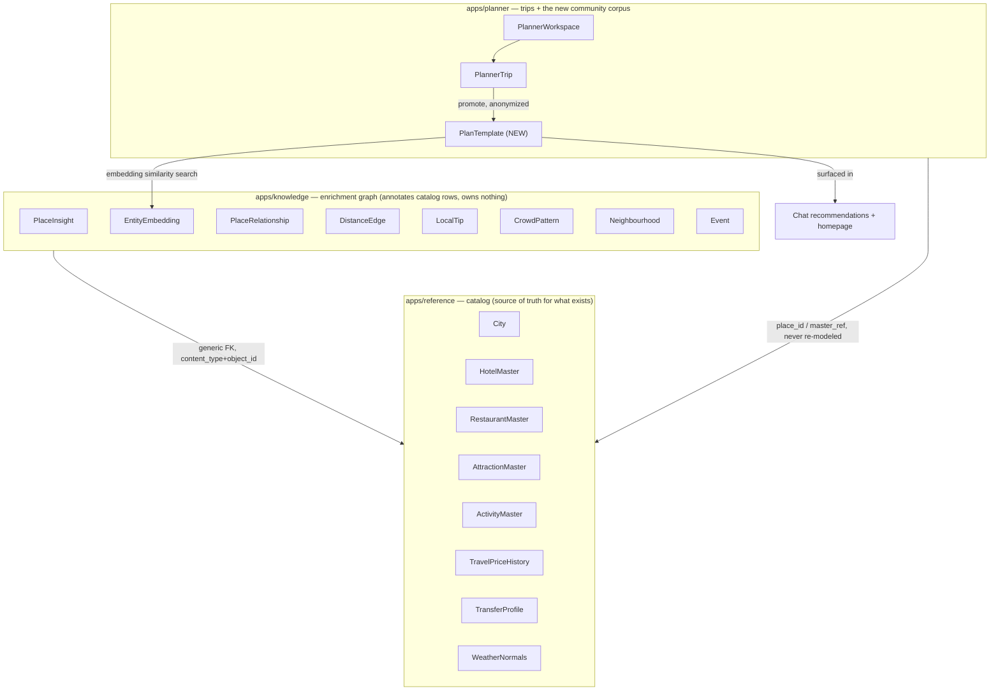
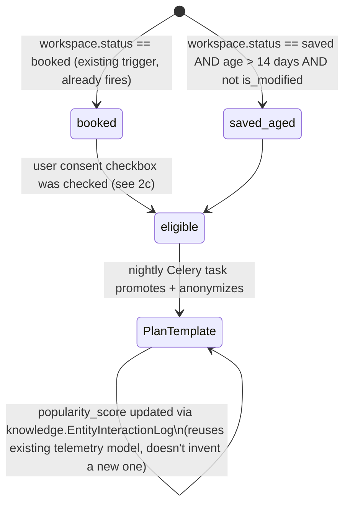

# NeuralNomad Planner — Master Plan v2 (Consolidation + Community Corpus + UI Rebuild)

> Written 2026-07-11 after a full-repo audit (backend models/services/routes, frontend folder
> structure, and design-token adoption). This plan **supersedes** the execution-status parts of
> `planner-redesign-plan.md` (Phases 0–7 there are already shipped — this plan does not repeat
> them) and **absorbs** `travel-knowledge-engine-plan.md` / `travel-intelligence-implementation-roadmap.md`
> (still valid for the `knowledge` app's enrichment work, referenced not repeated). It replaces
> `apps/travel_intelligence` outright — see §2.

---

## 0. What's actually wrong (verdict, not vibes)

You said "reference and knowledge tables are two different kinds of tables doing the same
thing." I checked every model, service, and route in all three apps. That specific fear is
**not true** — `reference` (catalog: cities, hotels, restaurants, prices) and `knowledge`
(enrichment: embeddings, insights, telemetry, relationship graph) were deliberately designed not
to overlap; `knowledge` rows attach to `reference` rows by generic FK, they never re-model them.

What *is* true, and is almost certainly the actual source of the "lost" feeling:

1. **A third, undocumented app — `apps/travel_intelligence`** — duplicates both sides at once:
   it has its own `RecommendedTrip*` schema that mirrors `PlannerTrip`'s JSON shape, and its own
   `seed_master_knowledge()` that writes into `reference` tables independently of the two
   write-paths that already exist (`places_explore.py`, `plan_generation.py`). Three
   independent ways to write the same catalog rows is the real "confusion." **This app should
   not exist as a separate thing — its job (shareable/recommended trips) becomes a feature of
   `planner` itself, which is also exactly the "save a plan to a common space" feature you want.**
2. **One confirmed, acknowledged duplicate table**: `planner.LocationDistanceCache` vs.
   `knowledge.DistanceEdge` (the latter's own docstring says it supersedes the former). Nobody
   has migrated the one caller (`distance_service.py`) yet.
3. **A live security issue, unrelated to the above**: the Google Maps key is still hardcoded/leaking
   through photo URLs and a `PlannerMap.tsx` fallback (flagged as deferred debt in the last plan
   and never actually done). This is P0, not part of the redesign narrative — see §7.
4. **The UI "doesn't look good" not because the palette is bad** — the warm-paper/ink/trust/category
   token system in `globals.css` is genuinely well designed — **but because it's used in ~10% of the
   planner's surface area.** 1,478 hardcoded Tailwind color classes vs. 170 token usages. A real
   shadcn/Radix component library sits unused at `components/ui/*` — zero planner files import it.
   Dark mode only covers the shadcn base tokens, not paper/ink/cat/trust, so it's currently broken
   by construction. The map panel is a separate dark theme sitting next to a warm cream timeline —
   that juxtaposition alone is most of what reads as "not good."
5. **The frontend has a real god-component** (`PlannerWorkspace.tsx`, 859 lines, 12-way panel
   routing + plan CRUD + PDF export + booking orchestration all in one file), **six near-identical
   copy-pasted state machines** (the booking canvases), **three unrelated things a user or dev
   would call "the sidebar"** with no shared visual language, and **4 empty scaffold folders**
   left over from an earlier structure. This is why it feels like "too many folders, too big files."

Everything below is organized to fix these five things, in the order that avoids building new
work on top of a soon-to-be-deleted path.

---

## 1. Target architecture (data layer)

Keep the boundary that already works; finish it; kill the one thing that doesn't belong.



**Decisions:**

| Item | Decision |
|---|---|
| `reference` ↔ `knowledge` boundary | **Keep as-is.** Don't merge. Finish wiring instead (see §6 Phase A: more read paths use `knowledge` data — crowd levels, local tips — in hover cards and generation). |
| `apps/travel_intelligence` | **Delete the app.** Its `RecommendedTrip*` tables and `seed_master_knowledge()` write-path are replaced by `PlanTemplate` (§2) built directly on `PlannerTrip`. Its homepage route becomes `planner`'s new `templates/` endpoint. |
| `planner.LocationDistanceCache` vs `knowledge.DistanceEdge` | **Migrate `distance_service.py` onto `DistanceEdge`**, backfill once, drop `LocationDistanceCache`. |
| `reference.GooglePlaceCache` | **Delete.** Confirmed zero references anywhere. |
| `reference.VisaRequirement` / `reference.Currency` | **Delete** in favor of `apps.visa.VisaData` / `apps.forex.ForexData`, which are already what the UI actually reads. These were already marked "unused, dupe" in the prior plan and never removed. |

---

## 2. The vision: a common space that gets smarter with every plan

This is the part you actually asked for and it's genuinely a good idea — it also happens to be
the correct replacement for `apps/travel_intelligence`, so it isn't extra scope, it's a
consolidation.

### 2a. New model: `PlanTemplate` (lives in `apps/planner`, not a new app)

A `PlanTemplate` is a **derived, anonymized snapshot** of a real `PlannerTrip`. It reuses the
existing block-schema-v2 JSON shape (`cities`/`days`) verbatim — no new itinerary schema, which is
the mistake `travel_intelligence` made.

```
PlanTemplate
  source_trip        FK → PlannerTrip, nullable (null once source is deleted; template survives)
  origin             "community_derived" | "admin_curated"
  trust_tier         "verified_booked" | "completed_saved" | "curated"   # promotion tier, not price tier
  destination_city    FK → reference.City
  season_bucket       enum (derived from dates: winter/shoulder/summer/monsoon...)
  duration_nights     int
  budget_tier         mirrors TripDraftState.budget_tier
  interest_tags        list (mirrors TripDraftState.interests)
  cities / days        JSON — same block-schema-v2 shape as PlannerTrip, PII-stripped
  stats                { total_blocks, verified_price_pct, avg_daily_km }  # for ranking, not display copy
  use_count            incremented every time a chat session's recommendation gets accepted
  popularity_score      same EnrichmentMixin-style score reference already uses
```

**What gets stripped on promotion (PII-safety, non-negotiable):** user FK, traveler names/notes,
exact dates (kept only as season bucket), `PlanBlockCommitment`/payment data, chat history,
`TravelerProfile.facts`. What's kept: place_ids/master_refs (so it re-resolves to live
reference/knowledge data, never stale copy-pasted text), the sequencing, the timing pattern,
the aggregate cost tier.

### 2b. Promotion pipeline (when does a trip become a template)



- Reuses the Celery worker already stood up for `apps/planner/tasks.py` (price watches) — add
  `promote_eligible_trips` as a sibling task, no new infra.
- `trust_tier="verified_booked"` outranks `"completed_saved"` outranks `"curated"` (admin-seeded,
  for destinations with zero community data yet — this is the *only* thing that carries over
  conceptually from `travel_intelligence`'s admin-curated path).

### 2c. Consent, not silent harvesting

**Assumption flagged for you to redirect if wrong:** default to *opt-in, not opt-out*. Add one
checkbox to the existing Save/Book flow (`PlannerHeader.tsx`'s Save button already exists per the
prior plan) — "Help future travelers by sharing an anonymized version of this plan" — default
**checked** for booked trips (highest signal, lowest risk since payment data is stripped anyway),
default **unchecked** for merely-saved trips (lower confidence a plan is "good"). One
`PlannerWorkspace.contribute_to_corpus` boolean field. No new consent-management app needed — this
is a fast, defensible default; change it if you want opt-out instead.

### 2d. Where it surfaces

1. **Chat recommendations** — when `TripDraftState` has enough slots filled (destination + dates
   + interests), `conversation_engine.py` queries `PlanTemplate` by
   `destination_city + season_bucket + budget_tier` similarity (simple filter first; embedding
   similarity via `knowledge.EntityEmbedding` as a stretch goal, not required for v1) and injects
   1-2 "travelers like you also did X" suggestion chips — reuses the existing `suggested_replies`
   mechanism from the already-shipped SSE chat, doesn't need a new widget type.
2. **Homepage** — replaces `travel_intelligence`'s `recommended-trips/` route with
   `planner/templates/` — same response shape (block-schema-v2), so
   `recommended-trips-section.tsx` on the frontend needs a URL change, not a rewrite.
3. **Generation pipeline** — `plan_generation.py`'s "composing" phase (already DB-first) can use a
   matching `PlanTemplate`, when one exists for the destination, as a prior for day-shape/pacing —
   optional enhancement, not required for v1, flagged as a Phase E stretch item so Phase D isn't
   blocked on it.

### 2e. Why this is the right shape (not just "another table")

- It closes the loop you actually described: *"if a user creates a plan it should save in a
  common space so it can be used for recommendation for other users"* — that is precisely
  `PlanTemplate` + the promotion pipeline + the chat/homepage surfacing.
- It deletes rather than adds net complexity: `apps/travel_intelligence`'s entire schema and its
  independent reference-seeding function go away in the same change.
- It has no separate "recommendation engine" microservice — it's a filtered query plus existing
  telemetry, reusing infrastructure (`Celery`, `EntityInteractionLog`, `EnrichmentMixin.popularity_score`)
  that's already half-wired and currently going to waste.

---

## 3. Frontend structure — from 76 files/12k lines of drift to a legible tree

### 3a. Delete first (zero risk, immediate "less mess")
- Empty scaffold dirs: `features/planner/{api,data,selectors,types}/` — never filled, pure noise.
- `plan-canvas/utils/routeOptimizer.ts` (427 lines) — comment in `ItineraryTimeline.tsx` already
  says real optimization moved server-side; keep only the ~20 lines that compute the "saves ~Xm"
  display estimate, delete the rest.
- `@deprecated MockTripData` alias in `plan-canvas/types.ts:98`.
- The abandoned "detour recommendation disabled per user request" comment block in
  `PlannerWorkspace.tsx:478` — either finish it or delete it, don't leave commented-dead intent.

### 3b. Split the god component
`PlannerWorkspace.tsx` (859 lines) becomes:
```
workspace/
  PlannerWorkspace.tsx            # composition only: renders panel-router + plan state provider
  hooks/usePanelRouter.ts         # NEW — activePanel state + the 12-way switch, extracted
  hooks/usePlanState.ts           # NEW — plan CRUD, save/verify/watch, extracted from the god file
  services/bookingTransition.ts   # NEW — the inlined onConfirmBooking closure, extracted to a testable function
  hooks/usePdfExport.ts           # NEW — export logic extracted
```
Each piece becomes independently testable and the file most likely to need touching for any
future feature stops being 859 lines of everything.

### 3c. Collapse the six duplicated booking-canvas state machines
Flight/Hotel/Train/Bus/Cab/Checkout each hand-roll the same
`params/results/loading/selectedTags/pendingItem/pendingAction/isSearchExpanded` state and the
same `handleConfirmReplace`. Extract:
```
helper-canvases/shared/hooks/useCanvasSearch.ts   # NEW — the shared state machine, parameterized by search fn + result mapper
```
This is the single highest-leverage line-count reduction available (six ~250-line files each
lose ~120 lines of duplicated plumbing) and it's a pure refactor — no behavior change, so it's
safe to do without a design review.

### 3d. Give the three "sidebars" one shared identity
Today: `sidebar/PlannerSidebar.tsx` (trip list), `chat/DockedChat.tsx` (docked chat), and the
`activePanel` right-hand panel inside `PlannerWorkspace.tsx` (map/insights/12 helper canvases) —
three different surfaces, three different visual languages, all colloquially "the sidebar." Fix:

- Name them explicitly and consistently: **Nav Rail** (left, trip list — `PlannerSidebar.tsx`
  stays here, gets its collapsed-view duplication fixed by reusing `SidebarItem`/`WorkspaceSection`
  in a `compact` prop instead of a second hand-written JSX tree), **Chat Dock** (right, collapsible
  — `DockedChat.tsx`), **Detail Panel** (right, canvas host — today's `activePanel` switch, now
  living in `usePanelRouter.ts` from §3b).
- Introduce one shared `layout/PanelShell.tsx` primitive (header slot, collapse/expand affordance,
  consistent width/animation) that all three render through. This is what makes them *read* as one
  system instead of three accidents, without forcing them to literally be the same component.
- Rename colliding `types.ts` files: `workspace/types.ts` → `workspace/tripContext.types.ts`,
  `plan-canvas/types.ts` → `plan-canvas/itinerary.types.ts`.

---

## 4. Design system — enforce, don't reinvent

The palette is not the problem; adoption is. Do not design a new color system.

| Fix | Detail |
|---|---|
| **Dark mode completeness** | Extend the `.dark` block in `globals.css` to cover `paper-*/ink-*/cat-*/trust-*`, not just the shadcn base tokens — currently these are hardcoded light-only, so dark mode is broken by construction. |
| **Adopt the existing component library** | `components/ui/{button,card,badge,tabs,sheet,dropdown-menu}.tsx` already exist on Radix + CVA and are used *nowhere* in the planner. Route every hand-rolled button/card/tab/badge in the 59 planner files through them. This alone fixes the "buttons feel different everywhere" problem. |
| **Kill the 1,478 hardcoded color classes** | Sweep `slate-*/blue-*/indigo-*/emerald-*/rose-*/orange-*/sky-*` → map each to the token that already models that exact concept: `cat-stay` (indigo, for hotels — `HotelCanvas.tsx` invents its own indigo today), `cat-food` (orange, restaurants), `cat-attraction` (violet — note `AttractionsCanvas.tsx` currently uses emerald for attractions and emerald for activities too, an actual collision to fix), `cat-transport` (sky — `TransitNode.tsx` hand-rolls the exact same sky palette instead of using the token), `trust-verified/estimated/suggested`. Do this file-by-file with before/after screenshots (matches the approach the prior plan's Phase 4 already started but only got ~10% through). |
| **Reconcile the three visual registers** | The map (`PlannerMap.tsx`) is a separate dark `slate-900` theme sitting beside the warm-paper timeline, and helper canvases are stark `bg-white` — three contrast registers on one screen is most of "doesn't look good" independent of any single color choice. Restyle the map chrome (control buttons, panels — not the map tiles themselves) to `paper-*/ink-*` tokens so it belongs to the same surface family; restyle helper-canvas shells from `bg-white` to `bg-paper-1`/`bg-paper-2`. |
| **Apply the type ramp that was already built and never used** | `.text-display/.text-title/.text-body/.text-caption/.text-micro` exist in `globals.css`, used zero times. Replace the ~190 arbitrary `text-[Npx]` declarations with the appropriate ramp class. |
| **One icon system** | `lucide-react` is already the standard elsewhere; strip the emoji-as-icon usages (`📍`, `🏛️`, `🚘`, etc.) mixed into the same buttons as Lucide icons. |
| **App chrome consistency** | `app/layout.tsx` and `components/layout/navbar.tsx` hardcode their own slate/blue palette instead of the `bg-background/text-foreground/primary` tokens Tailwind config already defines for exactly this — fix so the planner doesn't look like a different product from the header that wraps it. |

---

## 5. Phased roadmap

Ordered so nothing new gets built on a path that's about to be deleted, and the most visible fix
(design system) doesn't wait on the riskiest one (data model changes).

| Phase | Scope | Size | Why this order |
|---|---|---|---|
| **P0 — Security** | Rotate the leaked Google Maps key; confirm no other keys leak via photo-proxy URLs or client bundles. | XS | Live exposure, unrelated to everything else, do it today regardless of what else is scheduled. |
| **A — Dedupe & cleanup** | Delete `apps/travel_intelligence`'s independent schema/seeding (after §2 lands — see dependency note below), migrate `distance_service.py` off `LocationDistanceCache` onto `DistanceEdge`, delete `GooglePlaceCache`, mark `reference.VisaRequirement`/`Currency` for deletion, delete the 4 empty frontend dirs + dead code (§3a). | S | Removes the actual sources of "duplicate tables" confusion before anything else touches them. |
| **B — Design system enforcement** | Dark-mode token completeness, adopt `components/ui/*`, sweep hardcoded colors → tokens, apply type ramp, unify icons, reconcile map/canvas/timeline visual registers, fix app-chrome tokens (§4). | L | Purely frontend, no data-model dependency, highest visible payoff — this is "make it look good." Safe to run in parallel with Phase C. |
| **C — Frontend structure** | Split `PlannerWorkspace.tsx` (§3b), extract `useCanvasSearch` (§3c), unify Nav Rail/Chat Dock/Detail Panel under `PanelShell` + fix sidebar collapsed-view duplication (§3d), rename colliding `types.ts` files. | M | Pure refactor, no behavior change, makes Phase B's file-by-file sweep easier to land cleanly (smaller files). |
| **D — Community Plan Corpus** | `PlanTemplate` model + migration, promotion Celery task, consent checkbox on save/book, chat recommendation surfacing, homepage `templates/` endpoint replacing `travel_intelligence`'s route. | L | The new feature you actually asked for; depends on Phase A having already removed the competing schema so there's exactly one "shareable trip" concept. |
| **E — Knowledge-layer read paths (stretch)** | Surface `knowledge.LocalTip`/`CrowdPattern`/`Neighbourhood` in `RichHoverCard`; embedding-similarity ranking for `PlanTemplate` matches instead of flat filters. | M | Enhancement on top of D + the already-shipped rich-hover work; not required for the core vision to work. |

**Dependency note on Phase A vs D**: deleting `apps/travel_intelligence` before `PlanTemplate`
exists would drop the homepage recommendations to zero for a window. If that's not acceptable,
flip the order — build `PlanTemplate` + seed it once from the existing `RecommendedTrip*` rows
(one-time migration script, not ongoing dual-write), then delete `travel_intelligence`. Recommend
this flipped order in practice; noted here so the sequencing choice is explicit rather than buried.

---

## 6. Explicit non-goals (this round)

- No rewrite of the DOM-based itinerary timeline into a graph/canvas UI — already rejected once
  (`planner-redesign-plan.md` §9), still not warranted.
- No new microservice for recommendations — `PlanTemplate` is a Django model + a Celery task,
  deliberately not a separate system.
- No change to the block-schema-v2 JSON shape, commitments state machine, or provenance
  trust-grammar — these are sound and every new piece here (`PlanTemplate`) reuses them as-is.
- Live weather forecast API, seat maps/fare families, payments, real-time transit schedules — still
  out of scope, unchanged from the prior plan.

---

## 7. Critical files for this round

| File | Role in this plan |
|---|---|
| `backend/apps/travel_intelligence/` | Entire app — deprecate then delete (Phase A/D). |
| `backend/apps/planner/services/distance_service.py` | Migrate onto `knowledge.DistanceEdge` (Phase A). |
| `backend/apps/planner/models.py` | Add `PlanTemplate`, `PlannerWorkspace.contribute_to_corpus` (Phase D). |
| `backend/apps/planner/tasks.py` | Add `promote_eligible_trips` sibling task (Phase D). |
| `frontend/src/features/planner/workspace/PlannerWorkspace.tsx` | Split into hooks/services (Phase C). |
| `frontend/src/features/planner/workspace/helper-canvases/booking/canvases/*` | Extract `useCanvasSearch` (Phase C). |
| `frontend/src/features/planner/sidebar/`, `chat/DockedChat.tsx` | Unify under `PanelShell` (Phase C). |
| `frontend/src/app/globals.css`, `tailwind.config.ts` | Dark-mode token completeness (Phase B). |
| `frontend/src/components/ui/*` | Adopt across all planner surfaces (Phase B). |
| `frontend/src/components/home/recommended-trips-section.tsx` | Point at new `planner/templates/` endpoint (Phase D). |

---

## 8. Verification per phase

- **P0**: confirm new key in place, old key revoked in Google Cloud Console, no client bundle or
  API response contains it (`grep` build output + photo-proxy response headers).
- **A**: `distance_service.py` reads/writes only `DistanceEdge`; `LocationDistanceCache` table
  empty/dropped; `GooglePlaceCache` model removed, migration applied; frontend empty dirs gone,
  `tsc --noEmit` and `next build` still pass after dead-code removal.
- **B**: side-by-side before/after screenshots per major surface (timeline, map, each helper
  canvas, sidebar); toggle OS dark mode and confirm paper/ink/cat/trust colors flip correctly;
  grep count of hardcoded Tailwind color classes in `features/planner` trends toward zero.
- **C**: `PlannerWorkspace.tsx` under ~200 lines; each booking canvas under ~150 lines after
  `useCanvasSearch` extraction; manually swap items in each canvas to confirm no behavior
  regression from the refactor.
- **D**: book a trip with consent checked → confirm a `PlanTemplate` row appears after the nightly
  task runs (or trigger manually in dev) with PII fields absent; start a new chat for the same
  destination/season → confirm a suggestion chip references the template; homepage renders
  templates from the new endpoint.
