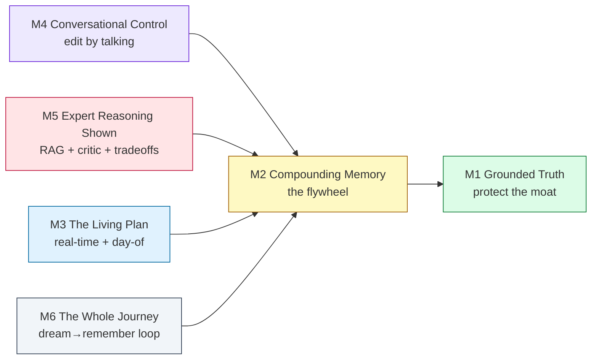

# NeuralNomad Planner — North-Star Audit & 10-Year Vision

_Audit date: 2026-07-18 · Static, code-level read of the current working tree (uncommitted refactor); no app, tests, LLM, or providers were run. Findings are `file:line`-anchored to the code as it stands today. This is a **design/spec document** — it proposes no code. Every build item is an **owner-gated phase**._

> **Codex fence.** A separate initiative (the canonical reference-data redesign, `docs/reference-data-redesign-plan.md`, Phase 1) owns `backend/apps/reference/**`, `canonical_models.py`, the reference migrations, and `docs/reference-data-*`. **This document proposes no change to any of those.** Where the planner *reads* reference data, that read-contract is noted so a future planner phase respects it (see §7).

---

## 1. Context & method

The owner asked two things: (1) a **complete, real-user audit of the entire planner** — how chat works, how the plan is generated, what each is missing, what should change in the helper canvases and in generation, and especially the **dynamic post-generation editing** they named ("change an item, add a rest block, return to my hotel at night"); and (2) a plan to make **an AI travel planner no competitor can beat for a decade.**

This is a step beyond the completed bug-repair audit (`docs/planner-complete-current-audit-and-repair-plan.md`, R3–R13 done, all verified). That audit asked *"is it correct?"*. This one asks *"is it complete, and is it a decade ahead?"*.

**Method.** Six parallel code-level reads across the planner's six dimensions — chat/conversation, plan generation, plan-canvas & helper-canvas UI, intelligence/memory, real-time/agentic, and lifecycle breadth. Every load-bearing claim was re-verified against source. Code is the only source of truth; memory-index docs were used only as a map of intent.

### The central thesis

> **NeuralNomad already has a rare, honest moat, and most of what "unbeatable" needs is built-but-orphaned or flag-gated-off — not missing.**

This reframes the whole roadmap. The shortest path to a decade-defining planner is, in order: **(1) protect and deepen the moat, (2) connect the intelligence that already exists, (3) flip on the live edges, (4) build the genuinely-absent frontier** (a taste model, group planning, a day-of companion, post-trip capture, multi-modal input).

What is already rare and must be protected at all costs:

- **Grounded truth + provenance discipline.** AI proposes strategy; deterministic services own facts, IDs, validation, and persistence. Estimates never masquerade as verified. The system degrades honestly ("Live flight status isn't wired yet") instead of fabricating. This is the product's signature and its defensibility.
- **Proposal-based agency.** Autonomous background loops (`tasks.py` trip-watch every 15 min, price-watch every 30 min) *propose* changes as `PlanProposal` rows; they never silently mutate a user's plan.
- **A real memory flywheel + self-critique.** `TravelerProfile` learns across trips; a refinement loop re-composes a weak plan against its own scorecard.

Almost everything below builds on these, never against them.

---

## 2. A real user's walkthrough (Kolkata → Goa, 6 days, 2 adults)

Narrated turn by turn, calling out every wall a real user hits. Evidence is in Part A.

1. **Intake feels fast and smart.** The chat asks few, well-chosen questions (destination → dates → who's coming → style → logistics), silently absorbs "actually make it 3 people," and can answer "is October rainy in Goa?" without derailing. *Wall:* it never asks whether anyone is **vegetarian**, whether the trip should be **wheelchair-easy**, or the **kids' ages** — so the plan it later claims respects dietary needs "everywhere" is guessing (§A1).
2. **Generation is grounded and rich.** A real, named itinerary appears — verified venues, a "why this" line on each, provenance badges, a couple of alternatives, honest "estimate" pricing. *Wall:* the days are packed with sights and meals but there is **no downtime**, **no "back to the hotel tonight"**, and no signal that Day 3 has six stops in four hours (§A2).
3. **Reading the plan is pleasant.** A clean day-by-day timeline, drag to reorder, undo. *Wall:* the hotel card says **"No live rate yet"** — lodging never enters the budget bar or checkout total; to compare two hotels on price the user can't, and to compare two restaurants side by side they **pin them and nothing appears** (the compare tray is dead code) (§A3).
4. **Trying to change it by talking fails silently.** The user types *"swap my Goa hotel"* / *"add lunch on day 2"* / *"move the fort to day 4"* / *"make day 3 relaxed."* They get a friendly reply — and **nothing changes.** The one capability meant to handle this is a dead stub (§A3, `edit_plan.py`). Only "move dinner to 8pm," "stay 2 more days," and "drop the last day" actually work.
5. **Booking reserves, but doesn't buy.** Checkout is honest ("no payment collected here"); it reserves items in the plan. *Wall:* there is **no real purchase, no PNR, no payment**; wallet "passes" are decorative (§A5).
6. **The trip arrives and the app goes quiet.** On travel day there is only a static "Day Brief." *Wall:* **no now/next, no live location, no delay/gate alerts, no re-planning** — even though the data model literally has a `MODE_TRAVELING` state nothing renders (§A5, §A6).
7. **The trip ends and is forgotten.** `completed`/`archived` states exist but nothing reads them — **no recap, no journal, no expense reconciliation, no reviews.** The one thing that *does* happen is invisible: the backend quietly learns the user's pace and budget for next time (§A6).

The through-line: **the plan is a beautiful one-shot artifact, not a living, conversational, lifelong companion.** Closing that gap is the vision.

---

## 3. Part A — Current-state audit

Legend: **EXISTS(active)** = wired and runs by default · **EXISTS(dormant)** = built but flag-gated, write-only, or never invoked · **MISSING**.

### A1 · Chat / conversation

**What exists (active, and good).** A two-LLM, route-in-between design: an extraction LLM fills slots (`conversation_engine.py` extract call), a **deterministic** router picks the next widget (`widget_orchestrator.determine_next_widget`), then a reply LLM speaks *for that already-chosen widget* — so the words and the card can never describe different steps. Persona "Priya," a disciplined "Three-Beat" turn (acknowledge ≤1 clause → one concrete fact → exactly one question). The cluster ladder (`intelligence/clusters.py` `INTENT_LADDERS`) is lean: a full trip is at most **3 cluster asks** (party, trip_style, logistics) + nearby-cities + a review card, with auto-skip when free-text already answered a cluster. Answer-only and browse-only turns are correctly detected and never mutate the draft.

**What a user feels is missing.**

| Gap | Evidence | Why it matters |
|---|---|---|
| Full trips never ask **dining/dietary** | `dining` cluster exists only in the `food_and_dining` intent (`clusters.py` `INTENT_LADDERS`); on a full trip `dietary` is reachable only via the optional, skippable `fine_tune` card | The plan claims to honor dietary needs everywhere; on a full trip it was never told them |
| **Accessibility/mobility** is not first-class | only via the self-drive sub-flow (gated 40–900 km road) or optional `fine_tune` | A wheelchair user is never proactively asked |
| **Per-category budget** absent | one amount → 3-tier bucket (`fieldOptions.ts` `getBudgetTier`) | No transport-vs-stay-vs-food split for the generator to honor |
| **Children as a count, not ages** | `ClusterWidget.tsx` child counter; ages never asked | Ages drive activity/hotel suitability |
| **Interests** = fixed 7 chips; **purpose** = 6 chips, never verbally asked | `ClusterWidget.tsx`; `visit_purpose` is flagged the most impactful optional field yet gets no spoken ask | The plan can't reflect who the traveler actually is |
| "Streaming" is **word-chunked**, not token streaming | `views.py` `_stream_chat_response` | Cosmetic, but not true low-latency streaming |
| Empty-state prompts hardcoded | `PlannerChat.tsx` 6 static cards | No personalization at the front door |

### A2 · Plan generation

**What exists (active, and strong).** A 7-phase pipeline (`plan_generation.run_pipeline`): skeleton LLM (structure only, forbidden from naming venues) → resolve cities against reference → build a real per-category candidate pool → compose LLM (sequences candidate **ids** only; server re-joins to real rows) → transit hints → transport pricing → finalize (weather normals, scorecard, budget cap). Each item carries a rich payload: `why` (never empty), `ai_tip`, up to 2 alternatives, provenance/freshness/confidence, rating, image, master-ref grounding. A genuine **self-critique refinement loop** re-composes once if the 9-dimension scorecard falls below threshold and keeps the result only if strictly better.

**What a user feels is missing.**

- **No rest / downtime / free-time block.** `_CATEGORY_TO_BLOCK` (`plan_generation.py`) knows only attraction/activity/food/hotel/transport. The generator packs days; it can't schedule a relaxed afternoon.
- **No guaranteed meals.** `food` blocks appear only when the compose LLM happens to place them; there is no lunch/dinner spacing guarantee.
- **No end-of-day return-to-hotel anchor.** The hotel is one overnight block; the plan never routes back to it at night.
- **Pacing is computed but hidden.** `validation.py` already produces travel-time and over-packed-day warnings — they are reasons-only and never surfaced on the day/card.

### A3 · Plan canvas + helper canvases

**What exists (active, and polished).** City→day→item timeline (`ItineraryTimeline.tsx`), drag reorder within a day and across days (plus an accessible "Move to…" picker), soft-delete with a 5s undo, inline time edit, add-item menu, undo/redo, route optimization as a reviewed proposal. Helper canvases are genuinely strong: the **Hotel** canvas computes a deterministic **Trip Fit** score and **itinerary impact** ("8m walk to India Gate"); the four detail panels were recomposed into one shared decision flow (`shared/detail-panel/*`); transport offers a per-leg **compare** view.

**The confirmed, load-bearing gaps.**

- **Conversational editing is a dead stub — the single highest-impact defect.** `capabilities/edit_plan.py:10` does `workspace.planner_trips.filter(is_active=True)`. That relation does not exist — the real reverse accessor is `workspace.trip` (a `OneToOneField`, `models.py:346-349`), there is no `is_active` field on `PlannerTrip`, and `.filter()` is invalid on a one-to-one anyway. The `hasattr` guard is therefore always false → `trip=None` → the function **returns `None`**. Even its non-taken branch only returns a *simulated* `"I have updated the plan"` envelope (`edit_plan.py:19-24`) that edits nothing. The router (`capabilities/router.py`) wires the verbs users actually type — `change|remove|add|swap|replace|update|delete|cancel` — straight into this no-op. The only chat edits that work are three narrow regex intents in `chat_edit_intents.py`: retime one block, extend stay by N empty days, remove the **last** day. "Swap my hotel," "add lunch," "move the fort to day 4," "make day 3 relaxed" all get a reply and change nothing.
- **Compare side-by-side is built but never rendered.** `HotelCompareTray.tsx`, `SightCompareTray.tsx`, `RestaurantCompareTray.tsx` exist; pin/compare state is tracked (`HotelCanvas.tsx`); the detail panels receive `isCompared`/`onCompareToggle` as **unused underscore props** (`RestaurantDetailPanel.tsx`, `HotelDetailSections.tsx`). No tray is mounted anywhere. Users can pin but never see a comparison.
- **Hotels carry no nightly price.** A permanent "No live rate yet" notice (`HotelCanvas.tsx`); Trip Fit weights price only by $–$$$$ tier. Lodging is therefore absent from the budget bar and Checkout total and cannot be compared on money.
- **Explore list cards under-inform.** One fact chip per card (`AttractionSuggestionCard.tsx`, `RestaurantSuggestionCard.tsx`); price, hours, dietary, accessibility live only inside the detail panel — so choosing from a list means opening each one.
- **Forex domestic advisory is hardcoded to Manali/Himachal** (`ForexCanvas.tsx`) and shown for any domestic destination; the visa canvas correctly region-gates, forex does not.
- **Activities reuse the Attractions canvas** (`PlannerWorkspace.tsx`) — no distinct activity flow (duration/difficulty/equipment appear only as detail chips).
- **No rest/return-to-hotel affordance; no multi-select/bulk edit** — every edit is one item at a time.

### A4 · Intelligence / memory

**What exists (active, and genuinely rare).** Per-trip `ai_preferences` that store *why*, not just *what* (`intelligence/preferences.py`); a durable `TravelerProfile` cross-trip flywheel with provenance discipline (`stated` > `confirmed` > `inferred`, never silently downgraded); recency and rejection penalties in ranking; a real self-critique loop; narrow edit-learning (`diff_engine.py` → `preference_learner.py`); a linear multi-objective candidate ranker.

**The decisive gaps — high-leverage assets that are built but orphaned.**

- **The pgvector / RAG stack is orphaned from planning.** `knowledge/services/embeddings.py` is a real vector stack — Gemini embeddings, pgvector + HNSW index, change-detected re-embedding, `semantic_search` via cosine distance over hotels/restaurants/attractions/activities. **Verified:** `semantic_search` is referenced in exactly two files — its own definition and the reference search API (`reference/views.py`). The itinerary generator's candidate pool is built by rating-sorted Google Places, **never** by semantic retrieval. This is the single biggest piece of built-but-unused intelligence.
- **The rich trade-off reasoner fires only reactively.** `recommendation_engine.py` produces `StructuredRecommendation` with multi-dimensional confidence, alternatives, tradeoffs, assumptions, and expected impact — the codebase's best reasoning object. It is wired to exactly one surface: the "Explain" button (`views.py`). It never drives block selection and never says "I considered A, chose B because…" during planning.
- **No taste model, no episodic memory, no group modeling.** `TravelerProfile.facts` is a flat `{key,value}` list — no taste vector (though the vector infra exists), no per-trip narrative memory, and party is just an integer (grep for consensus/group_vote/voting across `apps/planner` returns nothing).
- **Dormant/dead learning loops.** `PlannerIntentFlow` is written by `_record_successful_flow` but has **no reader** (write-only dead). `PlannerQuestionBank` has a reader but is flag-gated off (`PLANNER_QUESTION_BANK_ENABLED` default False).
- **Two disconnected confidence systems** (`intelligence/confidence.py` planning-readiness vs `recommendation_engine.py` per-rec multi-dim) and **two profile vocabularies** (`_record_traveler_facts` writes keys disjoint from the keys `ConstraintEngine` reads — a documented, half-healed seam and a latent "captured-then-dropped" bug source).

### A5 · Real-time / agentic / lifecycle

**What exists (active, and honest scaffolding).** A real SSE push channel (`views.live` + `useLiveWorkspaceEvents.ts`, Redis pub/sub with a DB-poll fallback); deployed Celery beat loops (`docker-compose.yml` ships `celery_worker` + `celery_beat`); a proposal-based agent grammar; a real commitment money-state machine (priced→held→booked→ticketed, forward-only, append-only history, `commitments.py` / `PlanBlockCommitment`); a 5-tier provenance-aware routing ladder (live → cache → verified DB → hub-geometry estimate). Autonomous loops genuinely run: **trip-watch every 15 min** re-evaluates insights + route optimization and files proposals; **price-watch every 30 min** files price-drop proposals. Post-trip fact-learning fires on book/complete.

**The gaps.**

- **Live edges are stubs or flag-gated off.** `flight_status` / `train_running_status` are honest "not wired yet" stubs (`capabilities/live.py`); live weather is real only ≤13 days out (`weather_service.py`), else climate normals; live providers + real booking need `LIVE_PROVIDERS_ENABLED` + `RAPIDAPI_KEY` (default off) — the commitment ledger has **no payment gateway and never calls a provider booking API**, so checkout reserves, it does not purchase.
- **The `Notification` model has zero live producers.** Types exist (`notifications/models.py`: trip_reminder/booking_update/visa_alert/price_drop) but **verified:** the only creator is a seed script (`seed_notifications.py`); price-watch files a `PlanProposal`, not a `Notification`. The channel is unwired.
- **No day-of companion.** Only a static Day Brief (`AIInsightsPanel.tsx`); no geolocation, live ETA, or navigation. Wallet passes are decorative (non-scannable QR). No offline. No auto-rebook (a deliberate safety stance).

### A6 · Lifecycle breadth

**What exists.** Home/discovery (mood browsing, `app/page.tsx` + `homepage` app), the deep planner, booking (`app/bookings`, `book-now`, vault), travel-prep (forex/visa), a notifications feed, settings.

**Missing whole stages.**

- **TRAVEL / day-of — MISSING.** The model defines `MODE_TRAVELING` and a `'traveling'` frontend lifecycle, but **nothing renders them.** No now/next, live location, delay/gate alerts, in-trip reschedule, or offline mode.
- **REMEMBER / post-trip — MISSING.** `completed`/`archived` states are dead-ends. No recap, journal, photo timeline, expense reconciliation, or user reviews. The only post-trip action (fact-learning) is invisible.
- **Collaboration / group — MISSING.** `PlannerWorkspace.user` is a single FK; no collaborators, share links, co-edit, comments, voting, or shared/split budgets. The only "sharing" is a PDF download.
- **Multi-modal input — MISSING.** `ChatInput.tsx` is a plain textarea; no photo/screenshot/voice/PDF → plan.
- **True i18n — MISSING; currency half-wired.** English + INR hardcoded; a `preferred_currency` setting exists but the planner hardcodes `'INR'`.
- **Onboarding — MISSING.** Users land cold; the intended `app/copilot` entry is a 27-line dead stub.
- **Constraints-first discovery — MISSING.** Inspiration is card browsing; there is no "N days, ₹X, these dates → where can I go / surprise me" engine before a destination is chosen.

---

## 4. Part B — The 10-year moat architecture

Six pillars. For each, the builds are tagged **[connect]** (wire what already exists — fast, high-leverage) or **[build]** (genuinely new).

Every other pillar feeds **M2** (the memory flywheel), which deepens **M1** (trust). That loop — *the more you use it, the more it knows you, and the more it can be trusted* — is the thing a competitor cannot copy by shipping features.

### M1 — Grounded Truth Engine (protect & deepen)
- **[connect]** Unify the two confidence systems (`intelligence/confidence.py` planning-readiness + `recommendation_engine.py` per-rec multi-dim) into **one trust model** the user sees consistently everywhere.
- **[keep]** Make "an estimate never looks verified" the product's explicit, marketed signature — the honesty *is* the moat.

### M2 — Compounding Personal Memory (the flywheel; uncopyable)
- **[connect+build]** A per-user **taste vector**, built from embeddings (the pgvector stack already exists) of the places a user keeps, books, and rejects. Retrieve candidates by cosine similarity to *this user's* taste, not global rating.
- **[build]** Learn **± category / cuisine / vibe affinities** from every edit, acceptance, and rejection (today only 3 conservative `EditSignal` kinds exist, and rejection is mere suppression).
- **[build]** **Episodic trip memory** — "last Goa trip you loved the north beaches, skipped nightlife" — retrievable into a new plan.
- **[connect]** Unify the two profile vocabularies so nothing is "captured then dropped."

### M3 — The Living Plan (real-time + day-of)
- **[build]** Generate **rest/downtime, guaranteed meals, and an end-of-day return-to-hotel anchor**; **[connect]** surface the pacing warnings `validation.py` already computes.
- **[connect+build]** Wire **live disruption feeds** (replace the flight/train status stubs) into the existing 15-min ambient loop so it files **re-routing proposals**, not just seeded-data insights.
- **[build]** A **day-of companion mode** (now/next, geolocation, live ETA, check-in) on the existing SSE + Day-Brief base; render the `MODE_TRAVELING` state that already exists.
- **[connect]** Wire the dormant **`Notification` producer** to the watch loops; **[build]** offline passes; **[build]** opt-in auto-apply for provably-safe changes.

### M4 — Total Conversational Control (edit by talking)
- **[connect+build]** Replace the dead `edit_plan` stub with a real **language → `plan_mutations` bridge** — full verb coverage (swap / add place / add meal / add rest / return-to-hotel / move across days / remove any day / relax a day), each a revision-safe accept/undo proposal reusing the existing guards.
- **[build]** **Multi-modal input** — photo / screenshot / voice / PDF → plan.

### M5 — Expert Reasoning, Shown
- **[connect]** Surface `recommendation_engine.py` trade-offs **during** planning ("considered A, chose B because…"), not just on the Explain button.
- **[connect]** **RAG-grounded candidate retrieval** — feed `semantic_search` into `_build_candidate_pool` so selection is semantic against trip intent + the M2 taste vector, then rank.
- **[build]** A real **LLM critic/verifier** pass (extend the deterministic self-critique loop) and **constraint-solver** optimization beyond today's fixed linear scalarization.

### M6 — The Whole Journey (dream→plan→book→travel→remember, one loop)
- **[build]** **Constraints-first discovery** ("N days, ₹X, these dates → where can I go / surprise me").
- **[build/business-gated]** **Real booking + payment** (flip live providers; wire a gateway + provider purchase).
- **[build]** **Post-trip REMEMBER** — recap, journal, expense reconciliation, reviews — each feeding M2.
- **[build]** **Group / collaborative planning** — the biggest social frontier: multi-user workspaces, share links, co-edit, voting, per-traveler preferences, split budgets, "balance her beaches with his history."

---

## 5. UX / UX vision (the concrete design the owner asked for)

### 5.1 Editing the plan by talking — the intent → mutation matrix

Every verb maps to an **existing** server mutation (`plan_mutations.py` / route optimizer / proposal accept), surfaced as an accept/undo proposal with revision-CAS + commitment-hierarchy guards already in place. The work is the language→mutation bridge, not the mutation engine.

| The user says… | Maps to | Exists today? |
|---|---|---|
| "move dinner to 8pm" | retime block | ✅ `chat_edit_intents.propose_retime_from_chat` |
| "stay 2 more days" / "drop the last day" | add/remove trailing day | ✅ `chat_edit_intents` |
| "swap my Goa hotel" / "change dinner to Italian" | `select_item` swap | ⚠️ engine exists (`plan_mutations.select_item`); **no chat path** |
| "add a museum on day 2" / "add lunch" | `patch_trip` add block | ⚠️ engine exists; **no chat path** |
| "move the fort to day 4" | `patch_trip` cross-day move | ⚠️ engine exists; **no chat path** |
| "give me a relaxed afternoon" / "add a rest block" | insert rest block (new category) | ❌ new block type + chat path |
| "send me back to the hotel after dinner" | insert return-to-hotel anchor | ❌ new block type + chat path |
| "remove day 3" (a middle day) | remove + renumber | ❌ deliberately excluded today |
| "make day 3 more relaxed" | thin the day + insert rest | ❌ composite intent |

### 5.2 The rest / return-to-hotel block family

A new **non-bookable block family** alongside the bookable categories:

- **Rest / downtime** — "Free afternoon near the hotel." Renders as a **light, low-emphasis card** (distinct from a bookable place card), no price, no provenance badge, an optional soft suggestion ("nap, pool, or wander the lanes").
- **Meal anchor** — a first-class lunch/dinner slot the generator guarantees and the user can fill or leave open.
- **Return-to-hotel anchor** — an evening "**Back to _{hotel}_**" node that closes the day; the transfer logic (which today only looks at the *next day's* first stop) gains a "last stop → tonight's hotel" case, so evening return logistics become visible and the day reads like a real day.

Contract touch-points (all planner-owned): `_CATEGORY_TO_BLOCK` (`plan_generation.py`), `planTransform.ts`, `AddTypeMenu.tsx`, `GenericNode.tsx` rendering.

### 5.3 Canvas decision-info spec — "what do I need to choose this?"

The principle: **the list card should carry the 2–3 facts a user actually decides on; the detail panel carries the rest.** Per surface:

- **Hotel:** promote **nightly price** onto the card (today missing) and into Trip Fit / budget / checkout; keep Trip Fit + "8m walk to India Gate." Mount the **compare tray** (already built) so 2–3 hotels sit side by side on price, rating, distance, and Trip Fit.
- **Attraction / activity / restaurant:** the card shows **open-now + walk-time + price/free** (today only one of these); the detail panel keeps the recomposed decision flow. Mount the compare trays.
- **Transport:** compare already exists per leg; add a **price/comfort** toggle beside duration and let the user add the chosen mode directly (today it bounces to a single-mode canvas first).
- **Forex:** region-gate the domestic advisory (today hardcoded to Manali).

### 5.4 Intake that reflects the traveler

Fold the missing asks into the existing lean ladder **without raising the ask-count**, by reusing auto-skip and the `fine_tune` review card: proactively surface **dietary** and **accessibility** on full trips (not just food-only trips), offer **per-category budget** as an optional split, capture **children's ages**, and widen **interests/purpose** with a free-text escape hatch. The Three-Beat discipline stays; these ride existing cards or the review card, not new mandatory steps.

---

## 6. Prioritized, owner-gated roadmap

Dependency-ordered, front-loading the owner's four stated priorities (conversational editing, rest/return-to-hotel, canvas decision info, chat intake). Each phase, when greenlit, gets its own scoped plan with likely files, both-sides contracts, risk, and the acceptance evidence below. **No code is written by this document.**

| Phase | Theme (pillar) | Core builds | Acceptance evidence |
|---|---|---|---|
| **0** | Foundations & honesty unblockers | Revive the dead `edit_plan` stub; add the **rest/meal/return-to-hotel block taxonomy** to the shared contract; unify the two confidence systems; wire `Notification` producers to the watch loops; reconcile the two booking systems | `manage.py check` + type-check clean; a `Notification` row is created by a real price-drop; the block taxonomy round-trips through `planTransform` |
| **1** | Conversational control (M4) | Real language→`plan_mutations` bridge, full verb coverage, each an accept/undo proposal | Type "swap my hotel" / "add lunch on day 2" / "move the fort to day 4" → the plan changes and is undoable |
| **2** | Living plan on the page (M3 + canvas info) | Generate rest/meals/return-to-hotel; surface pacing; **mount the compare trays**; **hotel nightly price**; richer explore cards; region-gate forex; distinct activity flow | Hotel card shows a per-night figure that flows to the Checkout total; two hotels compare side by side; a day shows an evening return-to-hotel node |
| **3** | Expert reasoning shown (M5) | Trade-off reasoning during planning; **RAG into the candidate pool**; LLM critic pass | Generation logs a semantic-retrieval step; a block shows a "considered A, chose B because…" rationale inline |
| **4** | Compounding memory (M2) | Per-user taste vector + cosine retrieval; ± affinity learning; episodic memory; unify profile vocabularies; revive-or-remove `PlannerIntentFlow`/`QuestionBank` | A second trip visibly reflects learned taste (not just recency suppression) |
| **5** | Chat intake completeness (M4 depth) | Dining/dietary, accessibility, per-category budget, children's ages, richer interests/purpose into the full-trip ladder | A vegetarian, wheelchair-using traveler is asked, and the plan honors both, on a plain full trip |
| **6** | Living plan in the world (M3 real-time) | Live flight/train status → re-routing proposals; **day-of companion mode**; offline passes; flip live providers + real payment (business-gated) | On travel day the app shows now/next + live ETA; a simulated delay files a re-route proposal |
| **7** | The whole journey (M6) | Constraints-first discovery; post-trip REMEMBER; **group/collaborative planning**; runtime i18n/multi-currency; onboarding | A second user co-edits a shared workspace; a completed trip produces a recap that updates the taste model |

**Why this order.** Phase 0 unblocks everything (a shared block taxonomy is a prerequisite for both generating and adding rest/return-to-hotel, and reviving `edit_plan` is a near-free, high-impact bug fix). Phases 1–2 and 5 deliver the owner's four priorities and the most visible "feels complete" wins. Phases 3–4 convert already-built-but-orphaned intelligence into the compounding flywheel — the decade-defining moat. Phases 6–7 close the lifecycle into a lifelong companion.

---

## 7. Coordination note — the Codex fence

**Do not touch (Codex-owned, reference-data redesign):** `backend/apps/reference/**`, `backend/apps/reference/canonical_models.py`, reference migrations (`0012`+), `docs/reference-data-*`.

**Planner ↔ reference read-contract a future phase must respect.** The planner *consumes* reference data through stable seams — `KnowledgeEngine.resolve` / candidate-pool construction, `journey_resolver` hub/route lookups, `ClimateNormal`/`WeatherNormals`, and the canonical `Venue`/release model. A future planner phase (especially M2/M5's RAG + taste work, which reads `EntityEmbedding` and venue rows) must **read** these contracts and adapt to whatever the reference redesign lands, never fork or modify them. When the two initiatives need to meet (e.g. semantic retrieval over canonical venues), that is a contract conversation with the reference owner — handled at phase-planning time, not assumed here.

---

_End of audit. This document changes no project state beyond its own creation and the handoff update. The owner's next action is to pick the first phase (Phase 0 is the recommended, lowest-risk unblocker) and greenlight a scoped implementation plan for it._
