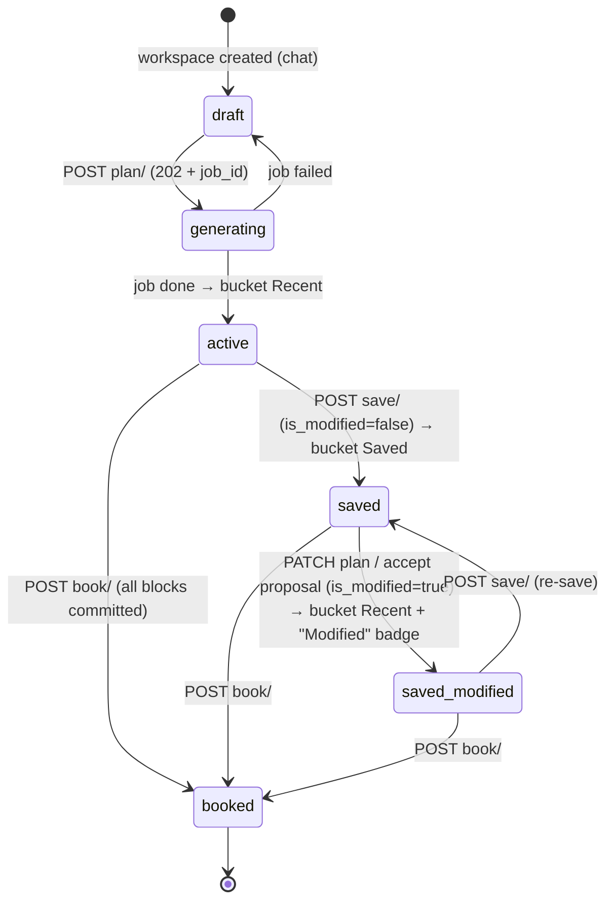
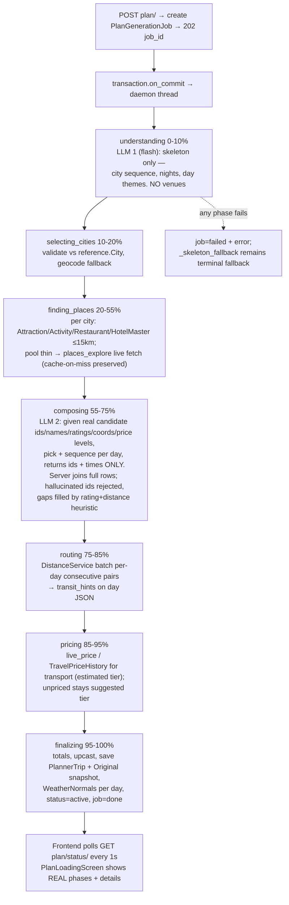
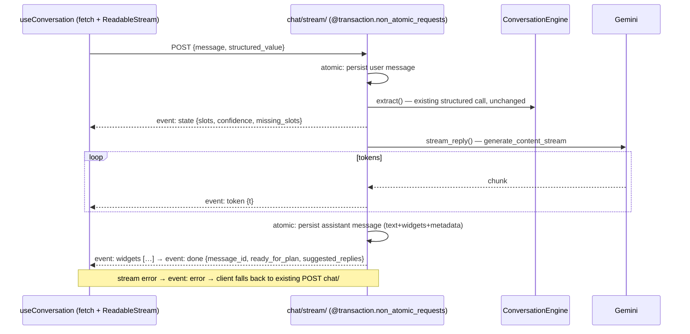

# NeuralNomad Planner Page — Complete Redesign Plan

> Master plan for the full planner reimagining. Self-contained: usable from any future context window.
> Created 2026-07-10. Decisions confirmed with user (see §2).

---

## 1. Context — why this redesign

The planner works end-to-end but has six user-facing problems:

1. **Sidebar** groups trips by lifecycle (traveling/planning/upcoming/past) instead of the wanted **Recent / Saved / Booked** storage model. Backend `PlannerWorkspace.status` already defines `saved`/`booked` but *nothing ever sets them* — no save endpoint, no plan-level book endpoint.
2. **Helper canvases** vary wildly in data quality. Flights/trains/buses reference tables hold only endpoints + duration; all richness is mock inventory. A complete RapidAPI live-provider layer (Skyscanner, Booking.com, IRCTC, Redbus) exists in `backend/apps/bookings/providers/` but is **silently disabled**: `registry.py:26` reads `settings.RAPIDAPI_KEY` which is in `.env` but never wired into Django settings → every search returns mocks.
3. **Plan workspace**: Trip Overview card is bulky; distances are computed lazily; **replacing an item loses data** (`PlannerWorkspace.tsx:483` does `day.items[idx] = newItem`, discarding times/notes/`aiTip`/`_aiInsights`/`_rawActivity`); hover info is too thin to decide on a hotel/restaurant.
4. **AI generates fake data**: `create_plan` is LLM-first — Gemini *invents* the itinerary, then an enrichment loop reconciles against reference tables (with more LLM calls fabricating coords on miss). User wants DB-first: real places from reference tables / Google Places, LLM only composes.
5. **Loading screen progress is fake** — a client-side rAF timer. Generation is one blocking synchronous request inside `ATOMIC_REQUESTS`; there is literally no progress to report today.
6. **Chat is non-streaming** request/response; user wants an "experienced planner" feel.

## 2. Confirmed decisions (user answered 2026-07-10)

| Question | Decision |
|---|---|
| Sidebar lifecycle | **One section at a time**: Recent (drafts + modified) → Saved (on Save) → Booked (on book). Editing a Saved plan returns it to Recent with a "Modified" badge until re-saved. |
| Live providers | **Wire RAPIDAPI_KEY + provider selection into settings behind a flag.** Default mock in dev; one env flip to live. Canvas UI built for the live data shape. |
| Real progress transport | **Background thread + `PlanGenerationJob` record + frontend polling (~1s).** |
| Chat | **Token-streamed replies (SSE) + intent-aware proactive flow** (suggestion chips, richer widgets). |

Also decided during design: keep the DOM timeline (no graph-canvas rewrite); keep block schema v2 / commitments / provenance trust-grammar untouched as the foundation.

## 3. Current architecture — verified reference

### Frontend (Next.js App Router, React Query, Zustand, Tailwind, framer-motion, dnd-kit)
- Routes: `app/planner/page.tsx` (new chat) · `app/planner/[workspaceId]/page.tsx` (branches `status !== 'draft'` → `PlannerWorkspace`, else `PlannerChat`).
- `features/planner/layout/PlannerLayout.tsx` → `sidebar/PlannerSidebar.tsx` (+ `sidebar/lib/groupWorkspaces.ts`).
- `workspace/PlannerWorkspace.tsx` = resizable split. Left: `plan-canvas/PlannerHeader.tsx` (Trip Overview) + `ItineraryTimeline.tsx` (City→Day→items, dnd-kit, haversine distance pills, >12 km amber "Detour"). Right: `PlannerMap.tsx` (Google Maps, hover pan/bounce) over `AIInsightsPanel.tsx`, OR an active helper canvas.
- Nodes: `plan-canvas/nodes/{GenericNode,TransportNode,TransitNode,DeletingNode,CityHeaderNode,DayHeaderNode}.tsx`. `ProvenanceBadge` on all prices (verified=emerald / estimated=amber / suggested=violet).
- Helper canvases `workspace/helper-canvases/`: booking/ (Flight, Hotel, Train, Bus, Cab, Checkout, Wallet), explore/ (Attractions dual-tab, Restaurants), travel-prep/ (Forex, Visa). Shared: CanvasHeader, SearchSummaryBar, QuickFilterBar, ReplaceConfirmBar, SuggestionCard, CurrentlyBookedCard.
- Chat: `chat/PlannerChat.tsx`, `DockedChat.tsx`, `hooks/useConversation.ts` (non-streaming POST), widget registry (destination/origin/date-range/optional-details/nearby-cities), `PlanLoadingScreen.tsx` (fake rAF progress, holds at 94%).
- Two item models: backend `TripActivity` ↔ UI `ItineraryItem`, bridged **only** in `workspace/services/planTransform.ts` (`transformTripData` / `serializePlanUpdate`) — the seam to preserve.
- Services: `services/planner.service.ts` (declares phantom endpoints that 404: `/memory/ /context/ /summary/ /recommendations/ /canvases/ /cart/ /places/`), `reference.service.ts`, `search.service.ts`, `forex.service.ts`, `visa.service.ts`.
- Styling: shadcn HSL tokens in `globals.css` exist but planner **hardcodes** warm-paper palette (`#f6f4ef` page, `#fbfaf7` panels, `#e2ddd2` borders), Inter, blue-600 actions, indigo→purple AI gradients. Orphans: `plan-canvas/PreJourneyChecklist.tsx`, `PlanStreamerLoader.tsx`, demo payload in `mockData.ts`, hardcoded Google Maps key fallback in `PlannerMap.tsx:33`.

### Backend (Django + DRF, Postgres/SQLite-dev, no Celery, Channels unused)
- `apps/planner/models.py`: `PlannerWorkspace` (status enum incl. unused saved/booked; `is_modified`), `TripDraftState` (slot filling), `PlannerChatMessage`, `PlannerTrip` (**itinerary = one `days` JSON blob**), `PlannerTripOriginal` (pristine snapshot), `PlanProposal`, `PlanBlockCommitment` (priced→held→booked→ticketed), `TravelerProfile`, `PriceWatch`, `LocationDistanceCache`, `PlannerQuestionBank`, `PlannerIntentFlow`.
- `services/conversation_engine.py`: Gemini (`google-genai`, gemini-2.5-pro, Pydantic structured output, non-streaming). Injects real `TravelPriceHistory` prices + learned QuestionBank patterns into the prompt.
- `services/conversation_service.py::create_plan`: one blocking Gemini call invents itinerary → per-activity `_enrich_and_cache_activity` (match masters → gemini-flash fabricates on miss → caches into reference tables) → `_skeleton_fallback` on failure. All inside `ATOMIC_REQUESTS=True` (`config/settings/base.py:109`).
- `services/block_schema.py` (v2 upcaster), `services/commitments.py` (`transition_blocks`, `compute_ledger`), `services/distance_service.py` (cache → Google Distance Matrix → haversine; **bug at L120-122**: sends N origins × N destinations = N² billed elements, reads diagonal, `elements[0]` fallback mispairs).
- API (`/api/planner/…`, all AllowAny + demo-user fallback): `chat/` (lazy), `workspaces/` CRUD, `{id}/chat|draft|plan (GET/POST/PATCH)|ledger|proposals(+accept/reject)`, `blocks/{bid}/verify|watch`, `blocks/transition/`, `profile/`, `distances/`.
- `apps/reference`: City/Country/State, Airport/Airline/**AirportRoute (endpoints+duration only)**, Train/Bus routes (same), MetroStation, **HotelMaster** (Places-rich, no nightly rate), **RestaurantMaster** (richest), **AttractionMaster/ActivityMaster** (rich but `ticket_price_estimate`/`suggested_duration`/`difficulty` are hardcoded placeholders), WeatherNormals (month avg temp+precip, **unused by UI**), TravelSeason, `TravelPriceHistory` (synthetic daily prices 2023–2026, richness in `details` JSON). `explore/` actions return the normalized **Suggestion envelope** (`services/suggestions.py:126` — carries photos/reviews/hours/phone/website) with live Places v1 enrichment (`services/places_explore.py`, 15 km radius, cache-on-miss threshold 5). `live-price/` → `services/live_price.py` (history=estimated → provider=verified path).
- `apps/bookings/providers/registry.py`: singleton factory; `RAPIDAPI_KEY`/`*_PROVIDER` never in settings → always Mock. Has automatic mock fallback on provider exception (keep).
- Parallel richer apps the UI already uses: `apps/visa/VisaData`, `apps/forex/` (rates + vendors). Thin dupes `reference.VisaRequirement`, `reference.Currency` unused.
- Settings: only `GOOGLE_PLACES_API_KEY` wired. `GEMINI_API_KEY`, `RAPIDAPI_KEY` in `.env` but unread.

## 4. Target design

### 4a. Plan lifecycle state machine



**Bucket rule (server-computed on serializer, mirrored client-side as fallback):**
`booked` → **Booked** · `saved && !is_modified` → **Saved** · everything else → **Recent**.

- `POST /planner/workspaces/{id}/save/` — requires trip; sets `status='saved'`, `is_modified=False`; stamps `saved_snapshot_at` in `PlannerTrip.metadata`. `PlannerTripOriginal` stays the pristine *generated* snapshot (powers future "reset to original").
- `POST /planner/workspaces/{id}/book/` — strict: every costed block must hold a `PlanBlockCommitment` ≥ `booked` (reuse `commitments` iteration). Otherwise `409 {blocking_blocks:[{block_id,title,status}]}` so CheckoutCanvas drives them through `blocks/transition/` first. Success → `status='booked'`. Optional `{"allow_partial": true}` (deferred UI).
- `PATCH plan/` + `accept_proposal` already set `is_modified=True` — bucket computation handles the rest.

### 4b. DB-first generation pipeline + real progress



- **New model `PlanGenerationJob`**: `workspace` FK, `status` (queued/running/done/failed), `phase`, `progress` 0–100, `phase_log` JSON `[{key,label,state,detail,at}]`, `error`, `started_at/finished_at`. Own table (trip row doesn't exist yet during generation).
- **Thread discipline vs `ATOMIC_REQUESTS`**: view creates job → `transaction.on_commit(spawn thread)`; thread calls `close_old_connections()` at start/end; each phase in its own `transaction.atomic()`; progress writes are autocommit `save(update_fields=…)` so the poller sees them live. Poller staleness timeout: no progress write in 90 s → surface failure.
- **Blocks gain identity**: `place_id` + `master_ref {table, id}` stored in block metadata during composing → enables rich hover + honest re-verification.
- **Polling contract** `GET /planner/workspaces/{id}/plan/status/`:
```json
{ "job_id": "…", "status": "running", "phase": "finding_places", "progress": 42,
  "phases": [
    {"key":"understanding","label":"Understanding your trip","state":"done"},
    {"key":"finding_places","label":"Finding real places in Jaipur","state":"active","detail":"18 attractions, 12 restaurants"}
  ],
  "error": null }
```
- `POST plan/?sync=1` keeps the old blocking path (tests / rollback valve).

### 4c. Chat SSE streaming



- New endpoints `POST /planner/workspaces/{id}/chat/stream/` + lazy `/planner/chat/stream/`, `StreamingHttpResponse` (`text/event-stream`, `X-Accel-Buffering: no`), `@transaction.non_atomic_requests`. EventSource can't POST → client uses `fetch` + `TextDecoder` loop.
- Engine split: `extract()` (existing `_call_gemini`, still feeds QuestionBank + price context) + new `stream_reply()` (plain streaming; on failure yields the existing fallback template as one chunk). Widget ladder stays deterministic, emitted once in the final events.
- Client: `useConversation.sendMessageStreaming()` behind `NEXT_PUBLIC_CHAT_STREAMING=1`; placeholder assistant message mutated per token; reconcile on `done.message_id`. DockedChat inherits free. Proactive chips from `suggested_replies` (deterministic from missing slots: "Set dates", "Add budget", "Surprise me").

### 4d. Replace/swap fix — frontend field-merge

New `workspace/services/blockMerge.ts::mergeReplacementItem(oldItem, newItem)`:
- **Preserve from old**: `id`, `startTime/endTime`, `details`, `aiTip`, `_aiInsights`, `isInactive`, day placement, and `_rawActivity` as base.
- **Override from new**: `title`, `subtitle`, `type`, `cost`+provenance, `price`, `image`, `rating`, `latitude/longitude`, `place_id`/`master_ref`, `blockStatus` (reset to `planned` unless canvas priced it).
- Rebuild `_rawActivity = {...old._rawActivity, ...overriddenBackendFields}` so `serializePlanUpdate` persists a complete block. Used at `PlannerWorkspace.tsx` `handleAddToPlan` (replaces the wholesale `day.items[idx] = newItem` at :483). Backend `blocks/{bid}/replace/` endpoint = deferred follow-up, not in scope.

### 4e. Instant distances
- Generation phase 5 stores per-day `transit_hints {"<fromId>:<toId>": {distance_km, duration_mins, source}}` → timeline pills render with zero client math for untouched plans.
- On reorder/replace: immediate haversine estimate → debounced (800 ms) `POST /planner/distances/` for changed pairs only → reconcile pills, merge into `transit_hints` on next PATCH.
- **Fix `distance_service.py:101-122`**: replace the N×N matrix request with one call per pair (1 billed element each vs N² today); strict `rows[i]["elements"][j]` indexing; delete the `elements[0]` mispair fallback.

### 4f. Rich hover
- New thin `GET /reference/places/details/?place_id&category` resolving to the right master table, returning the existing Suggestion envelope (`to_suggestion`). Per-category `details/` routes stay.
- New `plan-canvas/RichHoverCard.tsx` inside `AIInsightsPanel`: photo strip (`image_url`+`secondary_images`), rating+count, "Open now"/today's hours, phone, website, editorial summary, price level, provenance badge. Alternatives row stays.
- Prefetch on plan load for all blocks with `place_id` (React Query `useQueries`, `staleTime` 24 h, `requestIdleCallback`); hover instant; miss → skeleton fetch. Pre-redesign plans without `place_id` degrade to current behavior.

### 4g. Design tokens (premium feel)
Tokenize the existing warm-paper look in `globals.css` + `tailwind.config.ts` (don't invent a new palette — refine the one users see):
- Surfaces `--paper-0 #f6f4ef` / `--paper-1 #fbfaf7` / `--paper-2 #fff`, lines `--line #e2ddd2` / `--line-strong`.
- Ink scale `--ink-900/700/500/400` (warm grays). Action = blue-600 token; `--ai-gradient` indigo→purple token.
- Category tokens: `--cat-transport` sky · `--cat-stay` indigo · `--cat-food` orange · `--cat-activity` emerald · `--cat-attraction` violet.
- Trust grammar promoted to tokens (`--trust-verified/estimated/suggested`), visuals unchanged.
- Type scale (Inter): display 22/28 semibold tight · title 15/22 semibold · body 13/20 · caption 11.5/16 · micro 10/14 uppercase; `tabular-nums` on all prices.

### 4h. Trip Overview — compact two-row sticky header
- **Row 1**: inline-editable title · date-range chip · travelers chip · **Save** button · icon toolbar (Book / Optimize / Export PDF / View Passes → icons + kebab).
- **Row 2**: stat micro-chips (days · cities · total km from `transit_hints`) + slim segmented **budget bar** (committed solid / planned-estimated hatched amber / planned-suggested hatched violet, from existing `ledger/`), amounts at ends.
- Checklist leaves the header → folds into the Book flow. On scroll, condenses to a 40 px sticky bar (title + budget bar). Weather chip moves to `DayHeaderNode` ("~24° · light rain season") from `WeatherNormals` — free, no API; live forecast deferred.

## 5. Helper canvas audit (requirement 2)

| Canvas | Data gap today | This redesign | Deferred |
|---|---|---|---|
| **Flight** | `AirportRoute` = endpoints+duration; always mock | Wire SkyScrapper behind flag; new result card (airline logo, dep→arr, duration bar, stops, cabin, price + provenance); **Add to trip** / **Add to booking** split button | Seat maps, fare families |
| **Hotel** | No nightly rate in `HotelMaster` | Honest listing ("no live rate") + on-select Booking.com rate check (flag) upgrades cost → verified; photos/reviews from master | Room-level inventory |
| **Train** | No schedule/price on `TrainRoute` | `live_price` estimated path (TravelPriceHistory) with amber tier; class picker | Real IRCTC schedules |
| **Bus** | Same | Same pattern (Redbus behind flag) | Live seat layout |
| **Cab** | Flat mock estimates | Fare = `DistanceService` km × rate card; estimated tier | Live surge pricing |
| **Attractions/Activities** | `ticket_price_estimate`/duration/difficulty hardcoded | Stop showing placeholders as facts — only real fields (rating/hours/photos); price "~est." suggested tier | Ticketing API |
| **Restaurants** | Richest already | Token restyle only | Reservations |
| **Forex** | Fine (`/forex/*`) | Restyle only | Live FX rates |
| **Visa** | Fine (`apps/visa`); `reference.VisaRequirement` dup unused | Restyle; mark `VisaRequirement` for deletion | Live visa API |
| **Checkout** | Not wired to commitments | Drive `blocks/transition/` price→hold→book; finish with `POST book/` | Payments |
| **Wallet** | OK | Restyle only | — |

All canvases: every `onAddToPlan` item-builder must stamp `place_id`, coords, rating, image so blockMerge stays rich.

## 6. Phased implementation

### Phase 0 — Foundations, config, cleanup (S)
**Backend**
- `config/settings/base.py`: add `GEMINI_API_KEY`, `RAPIDAPI_KEY`, `FLIGHT/HOTEL/TRAIN/BUS/CAB_PROVIDER` (env, default mock), `LIVE_PROVIDERS_ENABLED` (bool, default False). `bookings/providers/registry.py`: mock unless flag on AND key present. ⚠ registry is an import-time singleton capturing `api_key` — read settings lazily in `get_provider` instead.
- Fix `planner/services/distance_service.py` pairing/billing (§4e).
- Flag (don't silently change): hardcoded DB password default `base.py:106`.

**Frontend**
- Delete orphans `plan-canvas/PreJourneyChecklist.tsx`, `PlanStreamerLoader.tsx`.
- Extract `BlockCost/ItineraryItem/ItineraryCity/TripViewModel` from `plan-canvas/mockData.ts` → `plan-canvas/types.ts`; delete demo payload + Himalaya copy; fix importers (`planTransform.ts` etc.).
- Remove phantom `planner.service.ts` methods (memory/context/summary/recommendations/canvases/cart/places); gate `DEV_mockScenario` behind non-prod.
- `PlannerMap.tsx:33`: remove hardcoded Maps key fallback (rotate the leaked key), require `NEXT_PUBLIC_GOOGLE_MAPS_API_KEY`.

### Phase 1 — Swap data-preservation + instant distances (M)
- New `workspace/services/blockMerge.ts` (§4d); use in `handleAddToPlan`; audit every canvas item-builder for `place_id`/coords/rating/image stamping.
- `ItineraryTimeline.tsx`: read `transit_hints` when present, else haversine; debounced `/planner/distances/` reconcile on reorder/replace.
- Test: snapshot `serializePlanUpdate` output before/after a swap.

### Phase 2 — Save / Book lifecycle + 3-section sidebar (M)
- Backend: `@action save`, `@action book` on `PlannerWorkspaceViewSet` (§4a); `get_bucket` on serializer; `next_action` copy ("Modified since last save"). No migration needed.
- Frontend: `groupWorkspaces.ts` → 3 buckets from server `bucket` (client fallback mirrors rule); `PlannerSidebar.tsx` three sections + amber "Modified" dot; `PlannerHeader.tsx` Save button; Checkout → `POST book/`; `planner.service.ts` `saveWorkspacePlan`/`bookWorkspace`.
- Contracts: `save/` → `200 {workspace}`; `book/` → `200 {workspace, trip}` | `409 {detail, blocking_blocks}`.

### Phase 3 — DB-first generation + real progress (L) — the centerpiece
- Migration: `PlanGenerationJob`.
- New `planner/services/plan_generation.py`: 7-phase pipeline (§4b), extracted from `conversation_service._generate_itinerary_with_ai` + `_enrich_and_cache_activity` (cache benefits preserved in the pool builder); stamps `place_id`/`master_ref`/`transit_hints`/`weather_normal`; `_skeleton_fallback` terminal.
- `views.py plan` POST → job + on_commit thread + `202 {job_id}`; `@action plan/status`; `?sync=1` legacy path.
- Frontend: `useConversation.createPlan` → poll `plan/status/` (React Query `refetchInterval: 1000`); `PlanLoadingScreen.tsx` deletes rAF timer, renders server phases + detail lines + error/Retry.
- Risks: SQLite dev + threads (WAL / serialize writes; prod is Postgres); silent thread death → 90 s staleness timeout; composing LLM must be validated against candidate ids.

### Phase 4 — Design system + Trip Overview redesign (M, frontend only)
- Tokens in `globals.css` + `tailwind.config.ts` (§4g).
- `PlannerHeader.tsx` two-row sticky compact header + segmented budget bar (§4h).
- Migrate sidebar, node components, `AIInsightsPanel`, canvas shared primitives to tokens + type scale. Component-by-component with before/after screenshots.

### Phase 5 — Rich hover + weather chip (M)
- Backend: `GET /reference/places/details/` unified resolver; `weather-normals` lookup already exists as a viewset.
- Frontend: `RichHoverCard.tsx` in `AIInsightsPanel`; `workspace/hooks/usePlaceDetails.ts` batch prefetch; `DayHeaderNode` weather chip.

### Phase 6 — Canvas audit + live providers + flight canvas redesign (L)
- Flip `LIVE_PROVIDERS_ENABLED` in staging; implement per-canvas table (§5); Add-to-trip (block→`planned`) vs Add-to-booking (block→`priced` via `blocks/transition/` + quote → Checkout) everywhere.
- Keep automatic mock fallback in `registry.search`; normalize mock/live response shapes in provider classes + contract tests.

### Phase 7 — Chat streaming + proactive planner (M)
- Backend: `chat/stream/` SSE endpoints, engine `extract()/stream_reply()` split (§4c).
- Frontend: `sendMessageStreaming` + token rendering in `PlannerChat`/`DockedChat`; suggestion chips; `NEXT_PUBLIC_CHAT_STREAMING` flag with auto-fallback.
- Risks: buffering (set `X-Accel-Buffering: no`, flush per event); reconcile on `done.message_id` if stream dies post-persist.

## 7. Critical files
| File | Role |
|---|---|
| `backend/apps/planner/services/conversation_service.py` | `create_plan` → pipeline extraction (Phase 3 heart) |
| `backend/apps/planner/views.py` | save/book/plan-status/stream endpoints (Phases 2,3,7) |
| `backend/apps/planner/services/distance_service.py` | pairing bugfix (Phase 0) |
| `backend/config/settings/base.py` | key/provider wiring unblocking everything live (Phase 0) |
| `backend/apps/bookings/providers/registry.py` | flag-gated provider selection (Phases 0,6) |
| `frontend/src/features/planner/workspace/PlannerWorkspace.tsx` | handleAddToPlan merge fix, canvas wiring (Phases 1,6) |
| `frontend/src/features/planner/workspace/services/planTransform.ts` | block ↔ view-model bridge — every block-shape change flows through here |
| `frontend/src/features/planner/chat/PlanLoadingScreen.tsx` | real progress UI (Phase 3) |
| `frontend/src/features/planner/sidebar/lib/groupWorkspaces.ts` | 3-bucket rewrite (Phase 2) |

## 8. Verification (per phase)
- **Phase 0**: `python manage.py shell` → `provider_registry.get_provider('flight')` returns Mock with flag off, SkyScrapper with flag+key on; distances endpoint returns correct pairs for a 3-pair batch (compare vs haversine sanity).
- **Phase 1**: in the UI, swap a hotel via HotelCanvas → the replaced node keeps its times/notes/tips; reload page → PATCHed block still complete. Snapshot test on `serializePlanUpdate`.
- **Phase 2**: save → workspace appears under Saved; edit plan → moves to Recent with Modified badge; re-save → back to Saved; book with unpriced blocks → 409 + blocking list; book after checkout → Booked section. API tests for save/book actions.
- **Phase 3**: create plan → 202; poll shows phases advancing with real details; generated blocks carry `place_id`/`master_ref` resolving to real reference rows; kill the thread mid-run → staleness timeout surfaces failure; `?sync=1` still works. Extend `tests/test_conversation_api.py` with a mocked-Gemini pipeline test.
- **Phases 4-5**: visual before/after screenshots; hover any block with `place_id` → photos/hours/phone instantly.
- **Phase 6**: with flag off, all canvases work on mocks; with flag on in staging, flight search returns live shapes rendered by the new card.
- **Phase 7**: streamed reply renders token-by-token; kill stream mid-reply → client falls back and the persisted message appears on refetch.

## 9. Out of scope / deferred
Live weather forecast API · backend `blocks/{bid}/replace/` authority endpoint · partial booking UI · seat maps / fare families / room inventory · reservations/ticketing APIs · payments · metro routing · deleting dup tables (`reference.VisaRequirement`, `reference.Currency`) — marked only · graph-canvas timeline (explicitly rejected; DOM timeline stays).
