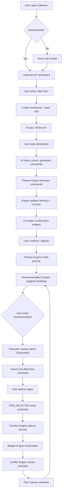
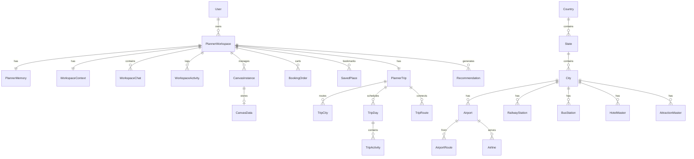

# NeuralNomad AI Planner — Architecture & Implementation Plan (v2)

---

## Architectural Principles

These principles govern every design decision.

| # | Principle | Meaning |
|---|-----------|---------|
| 1 | **Single Responsibility** | Each module does exactly one thing |
| 2 | **Event Driven** | Modules communicate through workspace events, never directly |
| 3 | **Plugin Based** | Execution canvases are plugins — register without modifying the engine |
| 4 | **AI Agnostic** | AI providers only generate commands. The Planner Engine executes them. Swap Gemini → GPT without touching business logic |
| 5 | **Database First** | Store knowledge locally. Avoid unnecessary API calls |
| 6 | **API Second** | Use APIs only for live information (prices, availability, weather forecasts) |
| 7 | **Reusable Components** | Shared canvas framework — every canvas follows the same lifecycle |
| 8 | **Shared Canvas Framework** | StandardCanvas, CanvasSearchBar, ResultCard are shared, not duplicated |
| 9 | **Incremental Loading** | Load canvases lazily, fetch data on demand |
| 10 | **Workspace Persistence** | Every workspace state is persisted — user can leave and resume |
| 11 | **Offline Friendly** | Reference data cached client-side for fast searches |
| 12 | **Production Ready** | Error handling, loading states, edge cases from day one |

---

## 1. Product Understanding

NeuralNomad Planner is **an AI-powered Travel Workspace** — not a chatbot. The chat is merely the input interface; the real product is the **dynamic, canvas-based workspace** that builds, optimizes, and manages an entire trip lifecycle.

### Core Separation: Intelligence vs Execution

```
User
  ↓
AI Chat (language understanding only)
  ↓
Planner Engine (the brain — all intelligence lives here)
  ↓
Plan Canvas (visual representation of the engine's state)
  ↓
Execution Canvas (deterministic search/filter/select)
```

| Layer | Role | AI Involved? | Business Logic? |
|-------|------|:---:|:---:|
| **AI Chat** | Understands natural language, infers intent | ✅ | ❌ |
| **Planner Engine** | The brain — context, timeline, budget, routes, conflicts, commands | ❌ (reasoning via rules) | ✅ |
| **Plan Canvas** | Visual representation of the Planner Engine state | ❌ | ❌ |
| **Execution Canvases** | Flight/Hotel/Train/Bus/Visa/Forex/Restaurant/Attraction/Activity/Cab/Booking | ❌ | ❌ |

> [!IMPORTANT]
> **Business logic should NEVER exist inside React components.** The Plan Canvas reads state from the Planner Engine. Execution canvases receive commands and publish events. All intelligence lives in the backend Planner Engine.

### Planner Engine Responsibilities

The Planner Engine owns:

| Responsibility | Description |
|---------------|-------------|
| **Context Management** | Stores and manages structured trip parameters |
| **Intent Understanding** | Translates AI commands into engine actions |
| **Recommendation Engine** | Generates smart suggestions based on trip state |
| **Timeline Engine** | Builds, recalculates, and maintains chronological event stream |
| **Budget Engine** | Tracks estimated vs actual spending in real-time |
| **Route Intelligence** | Calculates distances, travel times, optimal routes via Google Maps |
| **Conflict Detection** | Identifies impossible schedules, overlaps, missing bookings |
| **Memory** | Structured trip context — not reconstructed from chat history |
| **Command Generation** | Produces structured commands for execution canvases |

### What Already Exists (Reuse)

| Asset | Status | Action |
|-------|--------|--------|
| [accounts](file:///d:/Projects/NeuralNomad/backend/apps/accounts) (JWT + Google OAuth) | ✅ Complete | **Reuse as-is** |
| [BaseModel](file:///d:/Projects/NeuralNomad/backend/apps/common/models.py) (UUID PK, soft delete) | ✅ Complete | **Reuse as-is** |
| [auth.store.ts](file:///d:/Projects/NeuralNomad/frontend/src/store/auth.store.ts) | ✅ Complete | **Reuse as-is** |
| [api.ts](file:///d:/Projects/NeuralNomad/frontend/src/services/api.ts) (Axios client with JWT) | ✅ Complete | **Reuse as-is** |

### What Will Be Created New

| Asset | Action |
|-------|--------|
| Backend `apps/planner/` (models, views, services, providers) | **Build from scratch** |
| Backend `apps/reference/` (all static reference data tables) | **Build from scratch** |
| Frontend `features/planner/` (all planner UI) | **Build from scratch** |
| Frontend `services/planner.service.ts` | **Create new** (not reusing existing) |
| Frontend `services/planner.types.ts` | **Create new** (not reusing existing) |
| Frontend `hooks/use-planner.ts` | **Create new** (not reusing existing) |

---

## 2. Architecture Proposal

### System Architecture

```
┌──────────────────────────────────────────────────────────────────────┐
│                         PLANNER PAGE (Fullscreen)                     │
│  ┌─────────┐  ┌──────────────┐  ┌──────────────────────────────┐    │
│  │ Sidebar  │  │  Chat Panel  │  │     Workspace Panel          │    │
│  │  (18%)   │  │    (32%)     │  │        (50%)                 │    │
│  │          │  │              │  │                               │    │
│  │ New Plan │  │ Widget-based │  │  ┌────────┐  ┌────────────┐  │    │
│  │ Drafts   │  │ Interactive  │  │  │  Plan  │  │ Execution  │  │    │
│  │ Saved    │  │ Chat UI      │  │  │ Canvas │  │  Canvas    │  │    │
│  │ Booked   │  │              │  │  │        │  │            │  │    │
│  └─────────┘  └──────────────┘  └──────────────────────────────┘    │
└──────────────────────────────────────────────────────────────────────┘
                                    │
              ┌─────────────────────┼──────────────────────┐
              ▼                     ▼                      ▼
         REST API             AI Provider            Maps Provider
        (Django DRF)         (Gemini API)          (Google Maps API)
              │                    │                      │
              ▼                    │                      │
         PostgreSQL                │                      │
        ┌──────────────┐           │                      │
        │ WORKSPACE    │◄──────────┘                      │
        │  Planner     │◄─────────────────────────────────┘
        │  Execution   │
        │  Reference   │
        │  Booking     │
        └──────────────┘
```

### Layered Architecture

```
┌─────────────────────────────────────────────────────┐
│           Presentation Layer (Next.js)              │
│   PlannerShell → Sidebar / Chat / Workspace         │
│   Plan Canvas reads state, Execution Canvases       │
│   are plugins. NO business logic here.              │
├─────────────────────────────────────────────────────┤
│         State Management Layer                       │
│   Zustand (UI chrome) + React Query (server state)  │
├─────────────────────────────────────────────────────┤
│           API Service Layer                          │
│   planner.service.ts (NEW — REST calls)             │
├─────────────────────────────────────────────────────┤
│          Backend API Layer (DRF ViewSets)            │
│   Thin controllers — delegate to services            │
├─────────────────────────────────────────────────────┤
│        ★ Planner Engine (Backend Services) ★         │
│   ContextManager / TimelineEngine / BudgetEngine    │
│   RouteService / ConflictDetector / RecommendEngine │
│   MemoryManager / CommandExecutor                    │
├─────────────────────────────────────────────────────┤
│        Provider Abstraction Layer                    │
│   AIProvider (Gemini/OpenAI) / MapsProvider (Google) │
├─────────────────────────────────────────────────────┤
│         Workspace Event Bus                          │
│   Events flow between engine modules                 │
├─────────────────────────────────────────────────────┤
│            Data Layer (PostgreSQL)                    │
│   Planner Models + Reference Module + Booking        │
└─────────────────────────────────────────────────────┘
```

---


## Design Philosophy & UX Rules

This is how NeuralNomad should look.

**Not** Booking.com (Search, Hotels, Flights, Cards)
**Not** Notion (White page, Cards)
**Not** Linear (Developer dashboard)

Instead, imagine something between:
**Apple Intelligence + Google Travel + Arc Browser + Airbnb + Notion**

### Planner Homepage
──────────────────────────────────────────────────────────────
**NeuralNomad**
☀ Good Morning, Yash
Where would you like to go next?
━━━━━━━━━━━━━━━━━━━━━━━━━━━━━━━━━━━━━━━━━━━━━━━━━━━━━━
+ Start Planning

Recent Trips
Japan | Thailand | Goa | Bali
━━━━━━━━━━━━━━━━━━━━━━━━━━━━━━━━━━━━━━━━━━━━━━━━━━━━━━
*Beautiful travel illustrations, Large whitespace, Premium cards, Animated background gradient*

### Planner Workspace
I imagine something like this:
┌────────────┬───────────────────┬─────────────────────────────┐
│            │                   │                             │
│ Sidebar    │ AI Planner        │      Journey Canvas         │
│            │                   │                             │
│━━━━━━━━━━━ │━━━━━━━━━━━━━━━━━━ │━━━━━━━━━━━━━━━━━━━━━━━━━━━━ │
│            │                   │                             │
│ ✈ Japan    │ Let's build       │ Tokyo                       │
│            │ your trip.        │                             │
│ Goa        │ 📅 Widget         │ Preparation                 │
│            │                   │ Flight                      │
│ Bali       │ Budget Slider     │ Hotel                       │
│            │                   │ Activities                  │
│            │                   │ Restaurant                  │
│            │                   │                             │
│            │                   │ Beautiful Timeline          │
└────────────┴───────────────────┴─────────────────────────────┘
But much more elegant.

### Plan Canvas
This should NOT look like cards stacked together. I imagine:
━━━━━━━━━━━━━━━━━━━━━━━━━━━━━━━━━━━━━━━━━━━━━━━
**Tokyo**
15–22 April | ₹82,000 | ★★★★☆
━━━━━━━━━━━━━━━━━━━━━━━━━━━━━━━━━━━━━━━━━━━━━━━
**Preparation**
○ Passport  ○ Visa  ○ Forex
━━━━━━━━━━━━━━━━━━━━━━━━━━━━━━━━━━━━━━━━━━━━━━━
**Travel Day**
✈ Kolkata ↓ Tokyo
━━━━━━━━━━━━━━━━━━━━━━━━━━━━━━━━━━━━━━━━━━━━━━━
**Day 1**
🏨 Hotel
🍣 Lunch
🏯 Temple
🌸 Park
🍜 Dinner
━━━━━━━━━━━━━━━━━━━━━━━━━━━━━━━━━━━━━━━━━━━━━━━
*Everything feels like a story.*

### Flight Canvas
I wouldn't make it look like MakeMyTrip. I'd make it much cleaner.
━━━━━━━━━━━━━━━━━━━━━━━━━━━━━━━
**✈ Recommended**
IndiGo | ₹11,200 | Nonstop | 2h 20m | ★★★★★
**Why?**
Shortest travel time | Best value | Morning departure
[ Add to Trip ]
━━━━━━━━━━━━━━━━━━━━━━━━━━━━━━━
Search | Filters | Results

### Hotel Canvas
Large photography. Large cards.
━━━━━━━━━━━━━━━━━━━━━━━━━━━━━━━
**Grand Hyatt** | ★★★★★ | ₹8,200
Pool | Spa | Breakfast
━━━━━━━━━━━━━━━━━━━━━━━━━━━━━━━
*Beautiful image*
━━━━━━━━━━━━━━━━━━━━━━━━━━━━━━━
**Why AI recommends it**
Close to attractions | Near metro | Budget friendly
━━━━━━━━━━━━━━━━━━━━━━━━━━━━━━━
[ Add ]

### Timeline
This is the heart. Not: 9AM Hotel, 10AM Temple.
Instead:
Preparation ↓ Airport ↓ Flight ↓ Arrival ↓ Taxi ↓ Hotel ↓ Lunch ↓ Museum ↓ Dinner ↓ Hotel ↓ Next Morning
Everything connected. Like Apple Calendar.

### Maps
Never a separate page.
Instead: Timeline ↓ Animated route ↓ Distance ↓ Arrival ↓ Travel Time
Always visible.

### Recommendation Cards
Imagine:
━━━━━━━━━━━━━━━━━━━━━━━━━━━━━━
**AI Suggestion**
━━━━━━━━━━━━━━━━━━━━━━━━━━━━━━
✈
This flight saves
3 hours and ₹2,800
compared to other options.
━━━━━━━━━━━━━━━━━━━━━━━━━━━━━━
[Compare] [Add]
━━━━━━━━━━━━━━━━━━━━━━━━━━━━━━

### Empty State
Never 'No trips'. Instead, an illustration:
━━━━━━━━━━━━━━━━━━
Ready for your next adventure?
Tell me where you want to go.
━━━━━━━━━━━━━━━━━━
Start Planning

### Animation
This is where premium comes. Nothing should instantly appear.
Everything slides, fades, expands, breathes. Like Apple, Arc, Linear.

### Color System
I'd create one premium palette. The background should remain warm white with subtle elevation so these accents stand out without overwhelming the interface.

| Canvas | Accent |
|--------|--------|
| Planner | Sky Blue |
| Flight | Royal Blue |
| Hotel | Orchid Purple |
| Train | Burnt Orange |
| Bus | Amber |
| Cab | Emerald |
| Attractions | Coral Orange |
| Activities | Teal |
| Restaurant | Rose |
| Visa | Indigo |
| Forex | Mint Green |
| Booking | Blue → Purple Gradient |


## 3. UI Layout Proposal

### Three-Panel Layout

```
┌──────────┬───────────────┬──────────────────────────────────┐
│          │               │                                   │
│ Sidebar  │  Chat Panel   │       Workspace Panel             │
│  ~18%    │    ~32%       │          ~50%                     │
│          │               │                                   │
│ ┌──────┐ │ ┌───────────┐ │  ┌─────────────┬──────────────┐  │
│ │New   │ │ │ AI Chat   │ │  │ Plan Canvas │ Flight Canvas│  │
│ │Plan  │ │ │ Messages  │ │  │  (Primary)  │ (Secondary)  │  │
│ │      │ │ │ + Widgets │ │  │             │              │  │
│ ├──────┤ │ │           │ │  │ Timeline    │ Search       │  │
│ │Drafts│ │ │ Calendar  │ │  │ Budget      │ Results      │  │
│ │      │ │ │ Buttons   │ │  │ Routes      │ Compare      │  │
│ ├──────┤ │ │ Sliders   │ │  │ Conflicts   │ Select       │  │
│ │Saved │ │ │ Cards     │ │  │ Map         │              │  │
│ │      │ │ │           │ │  │             │              │  │
│ ├──────┤ │ ├───────────┤ │  └─────────────┴──────────────┘  │
│ │Booked│ │ │ Input Bar │ │                                   │
│ └──────┘ │ └───────────┘ │                                   │
└──────────┴───────────────┴──────────────────────────────────┘
```

**Collapse Behavior:**
- Sidebar collapses → Chat + Workspace expand
- Chat collapses → Workspace expands to full width
- Workspace always shows Plan Canvas as primary
- Max 2 canvases visible simultaneously (split view)

---

### Canvas Lifecycle

Every execution canvas follows the same lifecycle:

```
Preview → Expanded → Focused
```

| State | Behavior | When |
|-------|----------|------|
| **Preview** | Small recommendation card embedded inside Plan Canvas | Default — shows top recommendation for that canvas type |
| **Expanded** | Split screen beside Plan Canvas (50/50 or 60/40) | User clicks preview or AI opens canvas via command |
| **Focused** | Canvas occupies the entire workspace area | User clicks "maximize" or complex search requires full attention |

This lifecycle is **shared by every execution canvas** — implemented once in `StandardCanvas` and inherited.

### Chat Panel Widgets (not plain text)

| Widget Type | Example |
|-------------|---------|
| `text` | "I'll help you plan your Goa trip!" |
| `destination_card` | Card with image, weather, best time to visit |
| `date_picker` | Interactive calendar for selecting travel dates |
| `budget_slider` | Slider with presets (Budget / Mid-range / Luxury) |
| `traveler_selector` | +/- buttons for Adults, Children, Infants |
| `option_buttons` | "Beach vacation" / "Heritage tour" / "Adventure" |
| `checklist` | Multi-select interests and preferences |
| `confirmation_card` | Summary card with "Confirm" / "Edit" actions |
| `recommendation_card` | Flight/Hotel suggestion with "Add to Trip" |
| `quick_actions` | Contextual action buttons |

---

## 4. User Flow

### Primary Flow: New Trip Planning



---

### Planner Modes

The workspace operates in multiple modes. Each mode changes available actions while reusing the same workspace architecture.

| Mode | Description | Available Actions |
|------|-------------|-------------------|
| **Planning** | Building the trip — default mode | Full chat, all canvases, drag-drop, recommendations |
| **Exploring** | Browsing options without committing | Search canvases, save places, compare options |
| **Booking** | Checking out selected items | Booking canvas active, payment flow, confirmation |
| **Review** | Trip fully planned, reviewing before booking | Read-only timeline, conflict check, final adjustments |
| **Traveling** | Trip is active (dates match current date) | Live updates, check-in reminders, navigation |
| **Completed** | Trip finished | Summary view, photos, ratings, trip journal |

Mode is stored in `PlannerWorkspace.mode` and drives UI state.

---

## 5. Communication Architecture

### Workspace Event System

All planner modules communicate through events. Execution canvases **never directly update each other**. Instead they publish events.

```
Hotel Selected
    ↓
Workspace Event: ITEM_SELECTED
    ↓
Timeline Engine → adds hotel check-in/check-out events
    ↓
Budget Engine → recalculates total spending
    ↓
Conflict Engine → checks for overlapping bookings
    ↓
Recommendation Engine → adjusts suggestions (e.g., "book airport transfer")
    ↓
Plan Canvas Refresh → UI updates
```

#### Event Types

```python
class WorkspaceEventType:
    # Context events
    CONTEXT_UPDATED = 'context.updated'
    DATES_CHANGED = 'dates.changed'
    BUDGET_CHANGED = 'budget.changed'
    TRAVELERS_CHANGED = 'travelers.changed'

    # Canvas events
    CANVAS_OPENED = 'canvas.opened'
    CANVAS_CLOSED = 'canvas.closed'
    CANVAS_FOCUSED = 'canvas.focused'

    # Item events
    ITEM_SELECTED = 'item.selected'       # User selected flight/hotel/etc
    ITEM_REMOVED = 'item.removed'
    ITEM_MODIFIED = 'item.modified'

    # Timeline events
    ACTIVITY_ADDED = 'activity.added'
    ACTIVITY_REMOVED = 'activity.removed'
    ACTIVITY_MOVED = 'activity.moved'
    ACTIVITY_REORDERED = 'activity.reordered'

    # Plan events
    PLAN_RECALCULATED = 'plan.recalculated'
    ROUTE_UPDATED = 'route.updated'
    CONFLICT_DETECTED = 'conflict.detected'
    CONFLICT_RESOLVED = 'conflict.resolved'

    # Recommendation events
    RECOMMENDATION_GENERATED = 'recommendation.generated'
    RECOMMENDATION_ACCEPTED = 'recommendation.accepted'
    RECOMMENDATION_DISMISSED = 'recommendation.dismissed'
```

#### Backend Event Bus Implementation

```python
# Synchronous event bus within a request lifecycle
class WorkspaceEventBus:
    def publish(self, workspace_id, event_type, payload):
        """Publish event → all registered handlers execute in sequence"""
        for handler in self._handlers[event_type]:
            handler(workspace_id, payload)

    def subscribe(self, event_type, handler):
        """Register a handler for an event type"""
        self._handlers[event_type].append(handler)
```

Handlers are registered at app startup. Each engine subscribes to relevant events:
- `TimelineEngine` subscribes to `ITEM_SELECTED`, `ACTIVITY_MOVED`, `DATES_CHANGED`
- `BudgetEngine` subscribes to `ITEM_SELECTED`, `ITEM_REMOVED`, `ITEM_MODIFIED`
- `ConflictDetector` subscribes to `ACTIVITY_ADDED`, `ACTIVITY_MOVED`, `DATES_CHANGED`
- `RecommendationEngine` subscribes to `PLAN_RECALCULATED`, `CONTEXT_UPDATED`

This event-driven architecture keeps the planner modular and allows future plugins without tight coupling.

---

### Command Architecture

Commands are the structured messages generated by the AI provider and executed by the Planner Engine.

#### Command Principles

> [!IMPORTANT]
> 1. **Commands are AI-independent.** The Planner Engine executes commands. AI providers only generate them.
> 2. **The command format must remain stable** even if Gemini is replaced with GPT or another provider.
> 3. **Commands are deterministic.** Given the same command and workspace state, the result is always the same.

#### Command Types

```typescript
type CommandType =
  | 'SET_CONTEXT'           // Update trip parameters
  | 'SET_DATES'             // Set travel dates
  | 'SET_TRAVELERS'         // Set traveler count
  | 'SET_BUDGET'            // Set budget range
  | 'ADD_DESTINATION'       // Add city to itinerary
  | 'REMOVE_DESTINATION'    // Remove city
  | 'SET_TRAVEL_STYLE'      // Set travel style preference
  | 'SET_INTERESTS'         // Set interest categories
  | 'OPEN_CANVAS'           // Open an execution canvas
  | 'SEARCH_FLIGHTS'        // Pre-fill flight search
  | 'SEARCH_HOTELS'         // Pre-fill hotel search
  | 'SEARCH_TRAINS'         // Pre-fill train search
  | 'SEARCH_BUSES'          // Pre-fill bus search
  | 'ADD_ACTIVITY'          // Add activity to timeline
  | 'REMOVE_ACTIVITY'       // Remove from timeline
  | 'MOVE_ACTIVITY'         // Reorder in timeline
  | 'ADD_TO_CART'           // Add booking to cart
  | 'CHECK_VISA'            // Open visa canvas
  | 'CHECK_FOREX'           // Open forex canvas
  | 'RECALCULATE_PLAN'      // Trigger route recalculation
  | 'GENERATE_RECOMMENDATIONS'
  | 'SET_MODE'              // Switch workspace mode
```

#### Command Flow

```
1. User sends message via ChatInput
2. Backend ChatService receives message
3. ChatService calls AIProvider (Gemini) with:
   - Current message
   - Conversation history (last N messages)
   - PlannerMemory (structured context — NOT raw chat)
   - Current plan state summary
4. AI returns structured response:
   {
     "response_text": "...",
     "widgets": [...],
     "commands": [
       { "type": "SET_DATES", "payload": { ... } },
       { "type": "SEARCH_FLIGHTS", "payload": { ... } }
     ]
   }
5. Planner Engine CommandExecutor processes each command:
   - SET_DATES → ContextManager updates → publishes DATES_CHANGED event
   - SEARCH_FLIGHTS → Creates CanvasInstance with pre-filled data
6. Event handlers cascade:
   - TimelineEngine recalculates
   - BudgetEngine updates estimates
   - ConflictDetector checks
7. Response saved to WorkspaceChat with widgets JSON
8. Frontend receives response, renders widgets, refreshes canvases
```

---

## 6. AI Memory System

The AI should read structured memory rather than reconstructing context from old messages.

### PlannerMemory Model

```python
class PlannerMemory(BaseModel):
    """Structured trip context — the AI reads this, not old chat messages."""
    workspace = models.OneToOneField('PlannerWorkspace', on_delete=models.CASCADE)

    # Trip context
    destination = models.JSONField(default=dict)        # {city, country, region}
    origin = models.JSONField(default=dict)             # {city, country, airport_code}
    dates = models.JSONField(default=dict)              # {start, end, flexible}
    travelers = models.JSONField(default=dict)          # {adults, children, infants}
    budget = models.JSONField(default=dict)             # {total, currency, style}

    # Preferences
    transportation_preference = models.JSONField(default=list)  # ["flight", "train"]
    hotel_preference = models.JSONField(default=dict)           # {stars, type, amenities}
    interests = models.JSONField(default=list)                  # ["beach", "culture"]
    food_preference = models.JSONField(default=dict)            # {diet, cuisine}
    accessibility = models.JSONField(default=dict)              # {wheelchair, etc}

    # Status
    visa_status = models.JSONField(default=dict)        # {required, applied, approved}
    booking_summary = models.JSONField(default=dict)    # {flights: 2, hotels: 1, ...}
    current_phase = models.CharField(max_length=50)     # "planning_transport"

    # AI context
    conversation_summary = models.TextField(blank=True) # AI-generated summary of chat
    last_ai_action = models.JSONField(default=dict)     # What AI did last
```

The `MemoryManager` service updates this after every chat interaction, so the AI always has structured context without scanning message history.

---

## 7. Database Design

### Four-Layer Workspace Model

```
Workspace
│
├── Planner Layer
│     PlannerWorkspace
│     PlannerMemory
│     WorkspaceContext
│     WorkspaceChat
│     WorkspaceActivity
│     PlannerTrip
│     TripCity
│     TripDay
│     TripActivity (Timeline Events)
│     TripRoute
│     Recommendation
│
├── Execution Layer
│     CanvasInstance
│     CanvasData
│     BookingOrder (Cart)
│     SavedPlace
│
├── Reference Layer (apps/reference/)
│     Country, State, City
│     Airport, Airline, AirportRoute
│     RailwayStation, TrainRoute
│     BusStation, BusRoute
│     MetroStation
│     HotelMaster, RestaurantMaster
│     AttractionMaster, ActivityMaster
│     VisaRequirement
│     Currency
│     HolidayCalendar
│     GooglePlaceCache
│     WeatherNormals
│     TravelSeason, TimeZoneInfo
│
└── Booking Layer (existing apps/bookings/)
      Booking (confirmed bookings)
      SearchInventory (live inventory ONLY)
```

### ER Diagram



---

### Planner Layer Models (in `apps/planner/models.py`)

All models extend [BaseModel](file:///d:/Projects/NeuralNomad/backend/apps/common/models.py).

| Model | Key Fields | Purpose |
|-------|-----------|---------|
| **PlannerWorkspace** | `user (FK)`, `title`, `status` (draft/active/completed/archived/booked), `mode` (planning/exploring/booking/review/traveling/completed), `last_activity_at` | Top-level workspace container |
| **PlannerMemory** | `workspace (1:1)`, `destination`, `origin`, `dates`, `travelers`, `budget`, `interests`, `food_preference`, `transportation_preference`, `hotel_preference`, `accessibility`, `visa_status`, `booking_summary`, `current_phase`, `conversation_summary` — all JSON fields | Structured AI memory |
| **WorkspaceContext** | `workspace (1:1)`, `origin_location`, `destination_location`, `start_date`, `end_date`, `adults`, `children`, `infants`, `budget`, `travel_style`, `interests (JSON)`, `metadata (JSON)` | Trip parameters (user-facing) |
| **WorkspaceChat** | `workspace (FK)`, `role` (user/assistant/system), `message`, `widgets (JSON)`, `commands (JSON)` | Chat messages with widget metadata + structured commands |
| **WorkspaceActivity** | `workspace (FK)`, `event_type`, `event_data (JSON)`, `description` | Event audit trail |
| **PlannerTrip** | `workspace (1:1)`, `title`, `summary`, `total_budget`, `spent_budget`, `currency_code`, `metadata (JSON)` | The journey plan |
| **TripCity** | `trip (FK)`, `city (FK to City reference)`, `name`, `country`, `latitude`, `longitude`, `order`, `nights`, `arrival_date`, `departure_date` | Multi-city routing |
| **TripDay** | `trip (FK)`, `city (FK to TripCity)`, `day_number`, `date`, `title`, `day_type` (preparation/travel/exploration/return/complete) | Day containers |
| **TripActivity** | `day (FK)`, `title`, `category`, `location_name`, `latitude`, `longitude`, `start_time`, `end_time`, `duration_minutes`, `distance_km`, `travel_time_minutes`, `transport_mode`, `estimated_cost`, `currency_code`, `booking_order (FK nullable)`, `status`, `order`, `notes`, `weather_info (JSON)`, `metadata (JSON)` | Timeline events |
| **TripRoute** | `trip (FK)`, `from_activity (FK)`, `to_activity (FK)`, `distance_km`, `duration_minutes`, `transport_mode`, `polyline`, `route_data (JSON)` | Route segments |
| **Recommendation** | See enhanced model below | AI suggestions |
| **CanvasInstance** | `workspace (FK)`, `canvas_type` (enum), `lifecycle_state` (preview/expanded/focused), `is_active`, `display_order` | Canvas tracking |
| **CanvasData** | `canvas_instance (1:1)`, `data (JSON)` | Canvas persistent state |
| **BookingOrder** | `workspace (FK)`, `item_type`, `source_canvas`, `title`, `provider`, `price`, `currency_code`, `status`, `metadata (JSON)` | Cart items |
| **SavedPlace** | `workspace (FK)`, `place_cache (FK to GooglePlaceCache nullable)`, `name`, `category`, `address`, `latitude`, `longitude`, `rating`, `metadata (JSON)` | Bookmarked locations |

### Enhanced Recommendation Model

Instead of AI returning plain text, recommendations are rich structured objects:

```python
class Recommendation(BaseModel):
    workspace = models.ForeignKey('PlannerWorkspace', on_delete=models.CASCADE)

    # Identity
    type = models.CharField(max_length=50)       # flight, hotel, activity, visa, transfer, etc.
    canvas_type = models.CharField(max_length=50) # which canvas to open
    title = models.CharField(max_length=255)
    description = models.TextField()

    # Intelligence
    confidence = models.FloatField(default=0.8)   # 0.0 - 1.0
    priority = models.IntegerField(default=5)     # 1 = highest
    reason = models.TextField()                    # Why this is recommended
    estimated_cost = models.DecimalField(max_digits=10, decimal_places=2, null=True)
    estimated_time = models.IntegerField(null=True)  # minutes
    impact = models.CharField(max_length=50)       # high/medium/low
    dependencies = models.JSONField(default=list)  # IDs of other recommendations this depends on

    # Actions
    actions = models.JSONField(default=list)       # [{label, command_type, payload}]
    data = models.JSONField(default=dict)          # Additional structured data

    # Status
    is_dismissed = models.BooleanField(default=False)
    is_accepted = models.BooleanField(default=False)
```

Now recommendation cards become **reusable UI components** with rich context.

### Timeline as Event Stream

> [!NOTE]
> **Philosophy:** The timeline is an event stream, not a static itinerary.
> - Every movement is an event
> - Every booking is an event
> - Every activity is an event
> - Every note is an event
>
> Timeline recalculation simply **recalculates events** rather than rebuilding the itinerary. When one event moves, the engine cascades time changes to all dependent events.

---

### Reference Layer Models (NEW `apps/reference/`)

> [!IMPORTANT]
> The planner separates **knowledge** (stored locally, rarely changes) from **live information** (requires API calls).

#### Knowledge Database (Reference Tables)

| Model | Key Fields | Description |
|-------|-----------|-------------|
| **Country** | `name`, `iso_code`, `iso_code_3`, `currency_code`, `phone_code`, `continent`, `timezone_default` | Country master |
| **State** | `country (FK)`, `name`, `code` | State/province |
| **City** | `state (FK)`, `country (FK)`, `name`, `latitude`, `longitude`, `population`, `is_major`, `timezone` | City master |
| **Airport** | `city (FK)`, `iata_code`, `icao_code`, `name`, `display_name`, `latitude`, `longitude`, `timezone`, `is_international` | Airport master |
| **Airline** | `iata_code`, `name`, `logo_url`, `country (FK)`, `alliance`, `is_low_cost` | Airline master |
| **AirportRoute** | `from_airport (FK)`, `to_airport (FK)`, `airlines (M2M)`, `avg_duration_minutes`, `avg_price`, `distance_km` | Known flight routes |
| **RailwayStation** | `city (FK)`, `code`, `name`, `station_type` (junction/terminal/halt), `latitude`, `longitude`, `zone` | Station master |
| **TrainRoute** | `from_station (FK)`, `to_station (FK)`, `train_name`, `train_number`, `avg_duration`, `distance_km`, `days_of_week`, `classes (JSON)` | Known train services |
| **BusStation** | `city (FK)`, `name`, `code`, `station_type`, `latitude`, `longitude` | Bus station master |
| **BusRoute** | `from_station (FK)`, `to_station (FK)`, `operator`, `avg_duration`, `distance_km`, `bus_type` | Known bus services |
| **MetroStation** | `city (FK)`, `name`, `line`, `line_color`, `order`, `latitude`, `longitude` | Metro/subway stations |
| **HotelMaster** | `city (FK)`, `name`, `stars`, `hotel_type`, `address`, `latitude`, `longitude`, `amenities (JSON)`, `price_range`, `rating`, `review_count`, `images (JSON)` | Hotel knowledge base |
| **RestaurantMaster** | `city (FK)`, `name`, `cuisine_type`, `price_level`, `address`, `latitude`, `longitude`, `rating`, `is_vegetarian_friendly`, `opening_hours (JSON)` | Restaurant knowledge base |
| **AttractionMaster** | `city (FK)`, `name`, `category`, `description`, `address`, `latitude`, `longitude`, `rating`, `entry_fee`, `duration_minutes`, `opening_hours (JSON)`, `best_time`, `images (JSON)` | Attraction knowledge base |
| **ActivityMaster** | `city (FK)`, `name`, `category`, `description`, `duration_minutes`, `price_range`, `difficulty_level`, `latitude`, `longitude`, `provider`, `booking_required` | Activity knowledge base |
| **VisaRequirement** | `from_country (FK)`, `to_country (FK)`, `visa_required`, `visa_type`, `processing_days`, `fee`, `fee_currency`, `validity`, `required_documents (JSON)`, `exemptions (JSON)`, `official_link`, `notes` | Visa rules matrix |
| **Currency** | `code`, `name`, `symbol`, `country (FK)`, `decimal_places` | Currency master |
| **HolidayCalendar** | `country (FK)`, `name`, `date`, `type` (national/regional/religious), `is_public` | Public holidays |
| **GooglePlaceCache** | `google_place_id`, `name`, `address`, `latitude`, `longitude`, `rating`, `types (JSON)`, `photos (JSON)`, `opening_hours (JSON)`, `phone`, `website`, `cached_at` | Cached Google Places data |
| **WeatherNormals** | `city (FK)`, `month`, `avg_temp_high`, `avg_temp_low`, `avg_rainfall_mm`, `avg_humidity`, `weather_description` | Historical weather averages |
| **TravelSeason** | `city (FK)`, `season_type` (peak/shoulder/off-peak), `start_month`, `end_month`, `description`, `crowd_level` | Tourism seasonality |
| **TimeZoneInfo** | `name`, `utc_offset`, `dst_offset`, `abbreviation` | Timezone reference |

#### What Remains as Live API Data

| Data | Source | Why Not Local |
|------|--------|---------------|
| Flight prices & availability | SearchInventory / future Amadeus API | Changes by the minute |
| Hotel availability & pricing | SearchInventory / future Booking API | Changes daily |
| Seat/room availability | API only | Real-time data |
| Current weather forecast | Weather API | Live data |
| Live traffic conditions | Google Maps API | Real-time data |
| Current exchange rates | Forex API | Changes frequently |

> This architecture reduces API usage dramatically while making searches much faster. Execution canvases search **local reference data first**, then enrich with live data only when needed.

---

## 8. Folder Structure

### Backend

```
backend/
├── apps/
│   ├── planner/                         # ★ Planner Engine + Models
│   │   ├── __init__.py
│   │   ├── admin.py
│   │   ├── apps.py
│   │   ├── models.py                    # Planner layer models (13 models)
│   │   ├── serializers.py
│   │   ├── permissions.py               # IsWorkspaceOwner
│   │   ├── urls.py
│   │   ├── views.py                     # Thin ViewSets
│   │   ├── engine/                      # ★ Planner Engine
│   │   │   ├── __init__.py
│   │   │   ├── context_manager.py       # Manages workspace context + memory
│   │   │   ├── timeline_engine.py       # Builds/recalculates timeline events
│   │   │   ├── budget_engine.py         # Budget tracking & recalculation
│   │   │   ├── route_service.py         # Distance/time via Google Maps
│   │   │   ├── conflict_detector.py     # Schedule conflict detection
│   │   │   ├── recommendation_engine.py # Generates smart recommendations
│   │   │   ├── memory_manager.py        # Maintains structured AI memory
│   │   │   ├── command_executor.py      # Parses & executes commands
│   │   │   └── event_bus.py             # Workspace event pub/sub
│   │   ├── services/                    # Application services
│   │   │   ├── __init__.py
│   │   │   ├── workspace_service.py     # Workspace CRUD + lifecycle
│   │   │   ├── chat_service.py          # Orchestrates AI call → commands
│   │   │   └── plan_service.py          # Trip/journey CRUD
│   │   ├── providers/                   # External service abstractions
│   │   │   ├── __init__.py
│   │   │   ├── base.py                  # Abstract AIProvider, MapsProvider
│   │   │   ├── gemini_provider.py       # Gemini implementation
│   │   │   ├── openai_provider.py       # OpenAI stub (future)
│   │   │   └── google_maps_provider.py  # Google Maps Distance/Directions
│   │   ├── commands/                    # Command definitions
│   │   │   ├── __init__.py
│   │   │   ├── registry.py             # Command type registry
│   │   │   └── handlers.py             # Individual command handlers
│   │   └── migrations/
│   │
│   ├── reference/                       # ★ Reference Data Module (NEW)
│   │   ├── __init__.py
│   │   ├── admin.py                     # Admin for all reference tables
│   │   ├── apps.py
│   │   ├── models/                      # Split models by category
│   │   │   ├── __init__.py
│   │   │   ├── geography.py             # Country, State, City, TimeZoneInfo
│   │   │   ├── transport.py             # Airport, Airline, AirportRoute,
│   │   │   │                            # RailwayStation, TrainRoute,
│   │   │   │                            # BusStation, BusRoute, MetroStation
│   │   │   ├── accommodation.py         # HotelMaster
│   │   │   ├── dining.py               # RestaurantMaster
│   │   │   ├── attractions.py           # AttractionMaster, ActivityMaster
│   │   │   ├── travel_info.py           # VisaRequirement, Currency,
│   │   │   │                            # HolidayCalendar, TravelSeason
│   │   │   └── cache.py                # GooglePlaceCache, WeatherNormals
│   │   ├── serializers.py
│   │   ├── views.py                     # Autocomplete + search endpoints
│   │   ├── urls.py
│   │   ├── seed/                        # Seed data scripts
│   │   │   ├── seed_countries.py
│   │   │   ├── seed_cities.py
│   │   │   ├── seed_airports.py
│   │   │   ├── seed_stations.py
│   │   │   ├── seed_hotels.py
│   │   │   ├── seed_attractions.py
│   │   │   └── seed_visa.py
│   │   └── migrations/
│   │
│   ├── accounts/                        # ✅ Reuse as-is
│   ├── bookings/                        # ✅ Reuse (Booking + SearchInventory for LIVE data only)
│   ├── attractions/                     # Will be superseded by reference/AttractionMaster
│   ├── visa/                            # Will be superseded by reference/VisaRequirement
│   ├── forex/                           # Keep for live rates
│   └── ...
```

### Frontend

```
frontend/src/
├── app/planner/
│   ├── layout.tsx                        # Fullscreen planner layout
│   └── page.tsx                          # Mounts PlannerShell
│
├── features/planner/                     # ★ ALL planner UI (NEW)
│   ├── layout/
│   │   ├── PlannerShell.tsx              # Three-panel orchestrator
│   │   ├── PlannerSidebar.tsx            # Left sidebar
│   │   ├── ChatPanel.tsx                 # Middle panel
│   │   └── WorkspacePanel.tsx            # Right panel
│   │
│   ├── chat/
│   │   ├── ChatInput.tsx                 # Input bar + voice/file/quick actions
│   │   ├── ChatMessage.tsx               # Single message container
│   │   ├── ChatHeader.tsx
│   │   ├── WidgetRenderer.tsx            # Routes widget JSON → component
│   │   └── widgets/
│   │       ├── TextWidget.tsx
│   │       ├── DestinationCard.tsx
│   │       ├── DatePickerWidget.tsx
│   │       ├── BudgetSlider.tsx
│   │       ├── TravelerSelector.tsx
│   │       ├── OptionButtons.tsx
│   │       ├── ChecklistWidget.tsx
│   │       ├── ConfirmationCard.tsx
│   │       ├── RecommendationCard.tsx
│   │       └── QuickActions.tsx
│   │
│   ├── canvas/
│   │   ├── CanvasLayoutEngine.tsx        # Single/dual/focused canvas manager
│   │   ├── CanvasHeader.tsx              # Canvas header with title + lifecycle controls
│   │   ├── canvas.registry.ts           # Plugin registry → lazy component map
│   │   │
│   │   ├── plan/                         # Plan Canvas (reads engine state)
│   │   │   ├── PlanCanvas.tsx
│   │   │   ├── Timeline.tsx
│   │   │   ├── TimelineItem.tsx          # Drag-droppable
│   │   │   ├── BudgetTracker.tsx
│   │   │   ├── RouteMap.tsx              # Mapbox
│   │   │   ├── ConflictAlert.tsx
│   │   │   └── TripSummary.tsx
│   │   │
│   │   ├── flight/FlightCanvas.tsx       # Each canvas is a self-contained plugin
│   │   ├── hotel/HotelCanvas.tsx
│   │   ├── train/TrainCanvas.tsx
│   │   ├── bus/BusCanvas.tsx
│   │   ├── cab/CabCanvas.tsx
│   │   ├── attraction/AttractionCanvas.tsx
│   │   ├── activity/ActivityCanvas.tsx
│   │   ├── restaurant/RestaurantCanvas.tsx
│   │   ├── visa/VisaCanvas.tsx
│   │   ├── forex/ForexCanvas.tsx
│   │   ├── booking/BookingCanvas.tsx
│   │   │
│   │   └── shared/                       # Shared canvas framework
│   │       ├── StandardCanvas.tsx        # Base layout + lifecycle behavior
│   │       ├── CanvasSearchBar.tsx
│   │       ├── ResultCard.tsx
│   │       └── AddToTripButton.tsx
│   │
│   ├── store/
│   │   └── planner.store.ts              # Zustand: UI chrome only
│   │
│   └── hooks/
│       └── useCanvasPersistence.ts        # Local state ↔ CanvasData API
│
├── services/
│   ├── planner.service.ts                # ★ NEW (not reusing old)
│   ├── planner.types.ts                  # ★ NEW (not reusing old)
│   └── reference.service.ts              # ★ NEW — reference data API calls
│
├── hooks/
│   └── use-planner.ts                    # ★ NEW (not reusing old)
│
└── store/
    └── auth.store.ts                     # ✅ Reuse as-is
```

---

## 9. Canvas Plugin Architecture

Execution canvases are plugins. They register themselves without modifying the Planner Engine.

```
Canvas Registry
    ↓
┌─────────┬─────────┬─────────┬─────────┬─────────┐
│ Flight  │  Hotel  │  Train  │   Bus   │   Cab   │
├─────────┼─────────┼─────────┼─────────┼─────────┤
│  Visa   │  Forex  │Restaurant│Activity│Attraction│
├─────────┼─────────┼─────────┼─────────┼─────────┤
│ Booking │ [Future]│ [Future]│ [Future]│ [Future] │
└─────────┴─────────┴─────────┴─────────┴─────────┘
```

### Registry Implementation

```typescript
// canvas.registry.ts
import { lazy } from 'react';

export interface CanvasDefinition {
  type: string;
  label: string;
  icon: string;
  component: React.LazyExoticComponent<any>;
  searchable: boolean;           // Has search functionality
  referenceTable?: string;       // Which reference table to query
}

export const canvasRegistry: Record<string, CanvasDefinition> = {
  flight:     { type: 'flight',     label: 'Flights',      icon: 'Plane',       component: lazy(() => import('./flight/FlightCanvas')),         searchable: true,  referenceTable: 'airport_routes' },
  hotel:      { type: 'hotel',      label: 'Hotels',       icon: 'Hotel',       component: lazy(() => import('./hotel/HotelCanvas')),           searchable: true,  referenceTable: 'hotel_master' },
  train:      { type: 'train',      label: 'Trains',       icon: 'TrainFront',  component: lazy(() => import('./train/TrainCanvas')),           searchable: true,  referenceTable: 'train_routes' },
  bus:        { type: 'bus',        label: 'Buses',        icon: 'Bus',         component: lazy(() => import('./bus/BusCanvas')),               searchable: true,  referenceTable: 'bus_routes' },
  cab:        { type: 'cab',        label: 'Cabs',         icon: 'Car',         component: lazy(() => import('./cab/CabCanvas')),               searchable: true },
  attraction: { type: 'attraction', label: 'Attractions',  icon: 'Landmark',    component: lazy(() => import('./attraction/AttractionCanvas')), searchable: true,  referenceTable: 'attraction_master' },
  activity:   { type: 'activity',   label: 'Activities',   icon: 'Activity',    component: lazy(() => import('./activity/ActivityCanvas')),     searchable: true,  referenceTable: 'activity_master' },
  restaurant: { type: 'restaurant', label: 'Restaurants',  icon: 'UtensilsCrossed', component: lazy(() => import('./restaurant/RestaurantCanvas')), searchable: true, referenceTable: 'restaurant_master' },
  visa:       { type: 'visa',       label: 'Visa',         icon: 'FileCheck',   component: lazy(() => import('./visa/VisaCanvas')),             searchable: false, referenceTable: 'visa_requirement' },
  forex:      { type: 'forex',      label: 'Forex',        icon: 'Coins',       component: lazy(() => import('./forex/ForexCanvas')),           searchable: false },
  booking:    { type: 'booking',    label: 'Booking',      icon: 'ShoppingCart', component: lazy(() => import('./booking/BookingCanvas')),       searchable: false },
};

// Future plugins register here without touching engine code
export function registerCanvas(definition: CanvasDefinition) {
  canvasRegistry[definition.type] = definition;
}
```

Future canvases (e.g., "Insurance Canvas", "SIM Card Canvas") register themselves via `registerCanvas()` without modifying the Planner Engine.

---

## 10. API Design

### Endpoints

Base: `/api/planner/`

| Group | Method | Endpoint | Description |
|-------|--------|----------|-------------|
| **Workspaces** | GET | `/workspaces/` | List user's workspaces |
| | POST | `/workspaces/` | Create workspace |
| | GET | `/workspaces/{id}/` | Get workspace detail |
| | PATCH | `/workspaces/{id}/` | Update workspace (title, status, mode) |
| | DELETE | `/workspaces/{id}/` | Delete workspace |
| | GET | `/workspaces/{id}/summary/` | Full summary (context + canvases + counts) |
| **Memory** | GET | `/workspaces/{id}/memory/` | Get structured AI memory |
| | PATCH | `/workspaces/{id}/memory/` | Update memory fields |
| **Context** | GET | `/workspaces/{id}/context/` | Get trip parameters |
| | PATCH | `/workspaces/{id}/context/` | Update trip parameters |
| **Chat** | GET | `/workspaces/{id}/chat/` | List chat messages |
| | POST | `/workspaces/{id}/chat/` | Send message → AI → commands → response |
| **Canvases** | GET | `/workspaces/{id}/canvases/` | List canvas instances |
| | POST | `/workspaces/{id}/canvases/` | Create/activate canvas |
| | PATCH | `/workspaces/{id}/canvases/{type}/` | Update lifecycle state |
| | GET | `/workspaces/{id}/canvases/{type}/data/` | Get canvas data |
| | PATCH | `/workspaces/{id}/canvases/{type}/data/` | Update canvas data |
| **Cart** | GET | `/workspaces/{id}/cart/` | List booking orders |
| | POST | `/workspaces/{id}/cart/` | Add to cart → publishes ITEM_SELECTED event |
| | PATCH | `/workspaces/{id}/cart/{orderId}/` | Update cart item |
| | DELETE | `/workspaces/{id}/cart/{orderId}/` | Remove → publishes ITEM_REMOVED event |
| **Places** | GET | `/workspaces/{id}/places/` | List saved places |
| | POST | `/workspaces/{id}/places/` | Save a place |
| | DELETE | `/workspaces/{id}/places/{placeId}/` | Unsave |
| **Plan** | GET | `/workspaces/{id}/plan/` | Get full trip plan |
| | PATCH | `/workspaces/{id}/plan/` | Update plan metadata |
| | POST | `/workspaces/{id}/plan/recalculate/` | Recalculate routes & times |
| | PATCH | `/workspaces/{id}/plan/activities/{activityId}/` | Update activity |
| | POST | `/workspaces/{id}/plan/activities/reorder/` | Drag-drop reorder |
| **Recommendations** | GET | `/workspaces/{id}/recommendations/` | Get recommendations |
| | PATCH | `/workspaces/{id}/recommendations/{recId}/` | Accept/dismiss |

Base: `/api/reference/`

| Group | Method | Endpoint | Description |
|-------|--------|----------|-------------|
| **Geography** | GET | `/countries/` | Country list + search |
| | GET | `/states/?country={id}` | States by country |
| | GET | `/cities/?country={id}&search={q}` | City autocomplete |
| **Transport** | GET | `/airports/?search={q}` | Airport autocomplete |
| | GET | `/airlines/` | Airline list |
| | GET | `/airport-routes/?from={code}&to={code}` | Known flight routes |
| | GET | `/railway-stations/?search={q}` | Station autocomplete |
| | GET | `/train-routes/?from={code}&to={code}` | Known train services |
| | GET | `/bus-stations/?search={q}` | Bus station autocomplete |
| | GET | `/bus-routes/?from={id}&to={id}` | Known bus services |
| | GET | `/metro-stations/?city={id}` | Metro stations |
| **Accommodation** | GET | `/hotels/?city={id}&search={q}` | Hotel search |
| **Dining** | GET | `/restaurants/?city={id}&search={q}` | Restaurant search |
| **Attractions** | GET | `/attractions/?city={id}&search={q}` | Attraction search |
| | GET | `/activities/?city={id}&search={q}` | Activity search |
| **Travel Info** | GET | `/visa-requirements/?from={id}&to={id}` | Visa check |
| | GET | `/currencies/` | Currency list |
| | GET | `/holidays/?country={id}` | Holidays |
| | GET | `/weather/?city={id}&month={m}` | Weather normals |
| | GET | `/travel-seasons/?city={id}` | Season info |

> [!IMPORTANT]
> All workspace-nested endpoints enforce `workspace.user == request.user` via `IsWorkspaceOwner`. The Chat POST is the **only** endpoint that triggers AI. Reference endpoints are **read-only** and can be public (no auth required for browsing).

---

## 11. Component Hierarchy

```
app/planner/page.tsx
  └── PlannerShell
        ├── PlannerSidebar
        │     ├── NewPlanButton
        │     ├── WorkspaceList (Draft)
        │     ├── WorkspaceList (Saved)
        │     └── WorkspaceList (Booked)
        │
        ├── ChatPanel
        │     ├── ChatHeader (mode indicator)
        │     ├── ChatMessages (scrollable)
        │     │     └── ChatMessage[]
        │     │           └── WidgetRenderer
        │     │                 └── [TextWidget | DatePicker | BudgetSlider | ...]
        │     └── ChatInput
        │
        └── WorkspacePanel
              └── CanvasLayoutEngine (manages lifecycle states)
                    ├── PlanCanvas (always primary — reads engine state)
                    │     ├── TripSummary + ModeIndicator
                    │     ├── BudgetTracker
                    │     ├── ConflictAlert[]
                    │     ├── Timeline
                    │     │     └── TimelineItem[] (drag & drop, event stream)
                    │     ├── RouteMap
                    │     └── RecommendationPreviews (preview lifecycle)
                    │
                    └── [ExecutionCanvas] (expanded/focused lifecycle)
                          └── StandardCanvas (shared framework)
                                ├── CanvasHeader + lifecycle controls
                                ├── CanvasSearchBar (auto-filled from command)
                                ├── ResultCard[] (from reference data)
                                └── AddToTripButton (publishes ITEM_SELECTED event)
```

---

## 12. Implementation Roadmap

### Build Order: Full Backend → Full Frontend

---

### Phase 1: Reference Data Module
> **Goal:** Complete reference database with all static tables and seed data.

- [ ] Create `apps/reference/` Django app
- [ ] Define all reference models (geography, transport, accommodation, dining, attractions, travel info, cache)
- [ ] Create serializers with search/filter support
- [ ] Create views with autocomplete endpoints
- [ ] Create URL routing
- [ ] Register all models in admin
- [ ] Run migrations
- [ ] Write seed data scripts (countries, major Indian cities, airports, stations, hotels, attractions)
- [ ] Seed initial data

---

### Phase 2: Planner Models + API Shell
> **Goal:** All 13+ planner models with ViewSets and endpoints.

- [ ] Define all planner models in `apps/planner/models.py`
- [ ] Create `PlannerMemory` model for AI memory
- [ ] Create serializers
- [ ] Create `IsWorkspaceOwner` permission
- [ ] Create ViewSets (thin — delegate to services)
- [ ] Create URL routing with nested routes
- [ ] Register in admin
- [ ] Run migrations
- [ ] Wire into `config/urls.py`

---

### Phase 3: Planner Engine
> **Goal:** The brain — all backend intelligence.

- [ ] Create `engine/event_bus.py` — workspace event pub/sub
- [ ] Create `engine/context_manager.py` — context + memory management
- [ ] Create `engine/memory_manager.py` — structured AI memory
- [ ] Create `engine/timeline_engine.py` — event stream CRUD + recalculation
- [ ] Create `engine/budget_engine.py` — cost tracking
- [ ] Create `engine/route_service.py` — Google Maps distance/time calculation
- [ ] Create `engine/conflict_detector.py` — schedule conflict detection
- [ ] Create `engine/recommendation_engine.py` — smart suggestions
- [ ] Create `engine/command_executor.py` — command registry + handlers
- [ ] Register all event subscriptions

---

### Phase 4: AI Provider + Chat Service
> **Goal:** Gemini integration with provider abstraction.

- [ ] Create `providers/base.py` — abstract AIProvider interface
- [ ] Create `providers/gemini_provider.py` — Gemini structured output
- [ ] Create `providers/google_maps_provider.py` — Distance Matrix / Directions
- [ ] Create `services/chat_service.py` — orchestrates AI call → command execution
- [ ] Create `services/workspace_service.py` — workspace lifecycle
- [ ] Create `services/plan_service.py` — trip/journey CRUD
- [ ] Create `commands/registry.py` — command type definitions
- [ ] Create `commands/handlers.py` — individual command handlers
- [ ] Test end-to-end: chat message → AI response → commands → engine updates

---

### Phase 5: Frontend Layout Shell
> **Goal:** Three-panel layout with collapsible panels.

- [ ] Create `features/planner/store/planner.store.ts` (Zustand)
- [ ] Create new `services/planner.service.ts`
- [ ] Create new `services/planner.types.ts`
- [ ] Create new `services/reference.service.ts`
- [ ] Create new `hooks/use-planner.ts`
- [ ] Create `PlannerShell.tsx` — three-panel orchestrator
- [ ] Create `PlannerSidebar.tsx`
- [ ] Create `ChatPanel.tsx`
- [ ] Create `WorkspacePanel.tsx`
- [ ] Update `app/planner/layout.tsx`
- [ ] Update `app/planner/page.tsx`

---

### Phase 6: Chat System + Plan Canvas
> **Goal:** Interactive AI chat + timeline view.

- [ ] Create `ChatInput.tsx`, `ChatMessage.tsx`, `ChatHeader.tsx`
- [ ] Create `WidgetRenderer.tsx` + all widget components
- [ ] Create `CanvasLayoutEngine.tsx` with lifecycle management
- [ ] Create `canvas.registry.ts` (plugin registry)
- [ ] Create `PlanCanvas.tsx` — reads engine state
- [ ] Create `Timeline.tsx` + `TimelineItem.tsx` (drag & drop via @dnd-kit)
- [ ] Create `BudgetTracker.tsx`
- [ ] Create `RouteMap.tsx` (Mapbox)
- [ ] Create `ConflictAlert.tsx`
- [ ] Create `TripSummary.tsx`

---

### Phase 7: Execution Canvases + Polish
> **Goal:** All execution canvases + premium design.

- [ ] Create shared canvas framework (`StandardCanvas`, `CanvasSearchBar`, `ResultCard`, `AddToTripButton`)
- [ ] Create `FlightCanvas` (queries AirportRoute + SearchInventory)
- [ ] Create `HotelCanvas` (queries HotelMaster + SearchInventory)
- [ ] Create `TrainCanvas` (queries TrainRoute + SearchInventory)
- [ ] Create `BusCanvas` (queries BusRoute + SearchInventory)
- [ ] Create `CabCanvas`
- [ ] Create `AttractionCanvas` (queries AttractionMaster)
- [ ] Create `ActivityCanvas` (queries ActivityMaster)
- [ ] Create `RestaurantCanvas` (queries RestaurantMaster)
- [ ] Create `VisaCanvas` (queries VisaRequirement)
- [ ] Create `ForexCanvas` (queries live forex data)
- [ ] Create `BookingCanvas` (checkout view)
- [ ] Canvas lifecycle transitions (preview → expanded → focused)
- [ ] Micro-animations and transitions
- [ ] Dark mode theming
- [ ] Error handling and loading states
- [ ] Responsive collapse behavior

---

## Verification Plan

### Backend Verification
```bash
# Run migrations
cd backend && python manage.py makemigrations && python manage.py migrate

# Seed reference data
python manage.py shell < apps/reference/seed/seed_countries.py

# Test API endpoints via Swagger
# http://localhost:8000/api/docs/
```

### Frontend Verification
```bash
# Type checking
cd frontend && npx tsc --noEmit
```

### Manual Verification
- Create workspace → verify DB record
- Send chat message → verify AI response with widgets + commands
- Verify Planner Engine processes commands and updates memory
- Verify event cascade (ITEM_SELECTED → timeline → budget → conflicts)
- Verify canvas lifecycle (preview → expanded → focused)
- Verify reference data search (airports, stations, hotels)
- Verify drag-drop timeline reordering
- Verify panel collapse behavior
